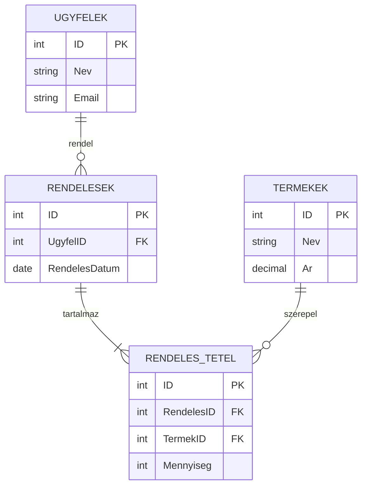
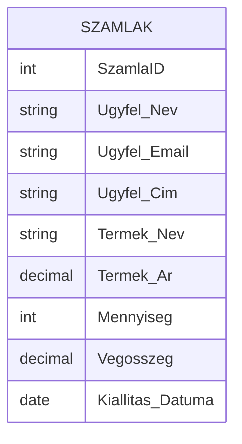
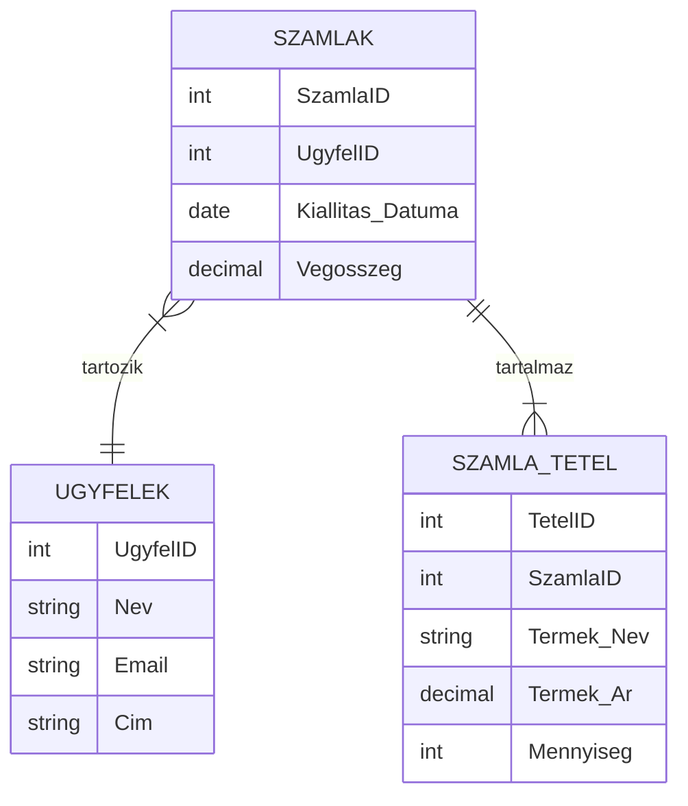
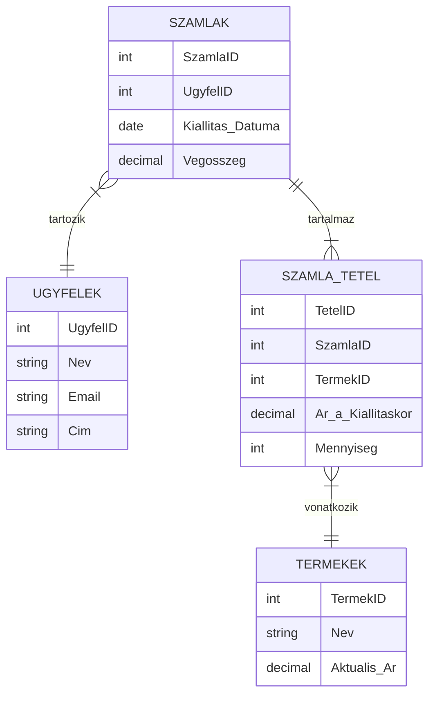
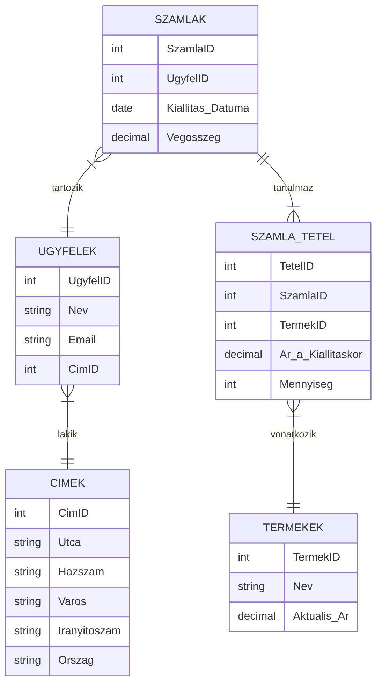

# 1.2 Adatbázis tervezés elméleti alapjai

A következőkben egy elméleti összefoglalót olvashatsz az adatbázis tervezéssel kapcsolatban. Az SQL kódok mintaként szerepelnek, a projekthez tartozó tényleges adatbázis tervezéssel később foglalkozunk.

## Az adatbázisok szerepe az alkalmazásokban

Az adatbázisok kulcsfontosságú szerepet töltenek be a modern alkalmazásokban, különösen az olyan üzleti szoftverekben, mint amilyen a rendeléskezelő rendszerünk. De miért is olyan fontosak? Gondolj csak bele, mennyi adatot kell kezelnie egy vállalkozásnak: ügyféladatok, termékek, árak, számlák - és ez csak a jéghegy csúcsa! Az adatbázisok teszik lehetővé, hogy ezeket az információkat hatékonyan tároljuk, kezeljük és visszakeressük.

Íme néhány kulcsfontosságú szerep, amit az adatbázisok betöltenek az alkalmazásokban:

1. **Adattárolás és -szervezés**: Az adatbázisok strukturált módon tárolják az információkat, ami lehetővé teszi, hogy könnyen hozzáférjünk és kezeljük azokat. A rendeléskezelő rendszerben például külön táblákban tárolhatjuk az ügyfeleket, termékeket és számlákat, mindegyiket a saját egyedi mezőivel.

2. **Adatintegritás biztosítása**: Az adatbázisok segítenek megőrizni az adatok pontosságát és konzisztenciáját. Például megakadályozhatják, hogy ugyanazt a számlaszámot kétszer használjuk, vagy hogy töröljünk egy olyan ügyfelet, akinek még vannak aktív számlái.

3. **Hatékony adatkezelés**: Az adatbázis-kezelő rendszerek (DBMS) optimalizált algoritmusokat használnak az adatok tárolására és visszakeresésére. Ez azt jelenti, hogy akár több millió rekord között is gyorsan megtalálhatjuk a keresett információt.

4. **Párhuzamos hozzáférés**: Az adatbázisok lehetővé teszik, hogy több felhasználó egyidejűleg férjen hozzá és módosítsa az adatokat, anélkül, hogy azok megsérülnének vagy inkonzisztenssé válnának.

5. **Biztonság**: Az adatbázisok fejlett biztonsági mechanizmusokat kínálnak az érzékeny adatok védelmére. Beállíthatunk például különböző hozzáférési szinteket, így biztosítva, hogy minden felhasználó csak azokhoz az adatokhoz férjen hozzá, amelyekre szüksége van.

6. **Skálázhatóság**: A jól tervezett adatbázisok képesek növekedni a vállalkozásoddal együtt. Ahogy nő az ügyfelek és tranzakciók száma, az adatbázis hatékonyan tud alkalmazkodni a megnövekedett terheléshez.

7. **Adatelemzés támogatása**: Az adatbázisokban tárolt strukturált adatok kiválóan alkalmasak elemzésre és riportkészítésre. A rendeléskezelő rendszerünkben például könnyen készíthetünk kimutatásokat a bevételekről vagy a legnépszerűbb termékekről.

Láthatod, hogy az adatbázisok nem csupán adattárolók, hanem az alkalmazások szerves részei, amelyek biztosítják a megbízható és hatékony működést. A rendeléskezelő rendszerünk fejlesztése során te is megtapasztalhatod, hogyan válnak az adatbázisok a szoftver "szívévé és agyává", lehetővé téve a komplex üzleti folyamatok kezelését és az értékes üzleti információk kinyerését.

## MS-SQL server rövid bemutatása és egyéb potenciális adatbázisszerverek említésszintű felsorolása

A rendeléskezelő rendszerünk fejlesztése során a Microsoft SQL Servert (MS SQL Server) fogjuk használni az adatbázis szervereként. De mielőtt belemerülnénk a részletekbe, érdemes röviden áttekinteni, mi is az a Microsoft SQL Server, és milyen alternatívái léteznek a piacon.

### MS SQL Server

Az MS SQL Server a Microsoft által fejlesztett relációs adatbázis-kezelő rendszer (RDBMS). Ez egy robusztus, megbízható és széles körben használt megoldás, különösen a Windows-alapú vállalati környezetekben. Íme néhány kulcsfontosságú jellemzője:

1. **Teljesítmény**: Az MS SQL Server kiváló teljesítményt nyújt nagy adatbázisok kezelésében és komplex lekérdezések végrehajtásában.

2. **Biztonság**: Fejlett biztonsági funkciókkal rendelkezik, beleértve a titkosítást, a részletes hozzáférés-szabályozást és az auditálást.

3. **Skálázhatóság**: Jól skálázható, képes kezelni a növekvő adatmennyiséget és felhasználói terhelést.

4. **Integráció**: Kiválóan integrálódik más Microsoft technológiákkal, mint például a .NET keretrendszer, amit mi is használni fogunk a projektünkben.

5. **Üzleti intelligencia**: Beépített eszközökkel rendelkezik az adatelemzéshez és riportkészítéshez.

6. **Fejlesztői eszközök**: A SQL Server Management Studio (SSMS) egy hatékony grafikus felületet biztosít az adatbázisok kezeléséhez és a lekérdezések írásához.

Az MS SQL Server különösen jó választás a mi projektünkhöz, mivel jól illeszkedik a Windows Forms és .NET technológiákhoz, amelyeket használni fogunk.

### Egyéb potenciális adatbázisszerverek

Bár mi az MS SQL Servert fogjuk használni, érdemes tudnod, hogy számos más adatbázis-kezelő rendszer létezik. Íme néhány népszerű alternatíva:

1. **MySQL**: Nyílt forráskódú RDBMS, amely különösen népszerű webfejlesztési projektekben.

2. **PostgreSQL**: Szintén nyílt forráskódú, fejlett funkcionalitású RDBMS, amely egyre nagyobb népszerűségnek örvend.

3. **Oracle Database**: Vállalati szintű RDBMS, amely különösen nagy és komplex adatbázisok kezelésére alkalmas.

4. **MongoDB**: Egy népszerű NoSQL adatbázis, amely dokumentum-orientált megközelítést alkalmaz.

5. **SQLite**: Egy könnyűsúlyú, fájl-alapú relációs adatbázis, amely ideális beágyazott rendszerekhez és mobil alkalmazásokhoz.

6. **MariaDB**: A MySQL egy nyílt forráskódú "fork"-ja, amely kompatibilis a MySQL-lel, de további fejlesztésekkel rendelkezik.

7. **IBM Db2**: Nagyvállalati RDBMS, amely különösen jól skálázható és teljesítményorientált.

Mindegyik adatbázis-kezelő rendszernek megvannak a maga erősségei és gyengeségei, és a választás gyakran függ a projekt specifikus követelményeitől, a fejlesztői csapat tapasztalatától és a meglévő infrastruktúrától. A mi esetünkben az MS SQL Server kiváló választás, mivel jól illeszkedik a .NET ökoszisztémához és megfelelő teljesítményt nyújt a rendeléskezelő rendszerünk igényeihez.

## A relációs adatbázisok alapfogalmai

Most, hogy megismerted az adatbázisok szerepét és a különböző adatbázis-kezelő rendszereket, mélyedjünk el a relációs adatbázisok alapfogalmaiban. Ezek az ismeretek elengedhetetlenek lesznek a rendeléskezelő rendszerünk adatbázisának tervezéséhez és implementálásához.

### Táblák

A táblák a relációs adatbázisok alapvető építőkövei. Egy tábla adatok strukturált gyűjteménye, amely sorokból és oszlopokból áll. Gondolhatsz rá úgy, mint egy Excel táblázatra.

A rendeléskezelő rendszerünkben például külön táblákban tárolhatjuk az ügyfeleket, termékeket és rendeléseket. Íme egy egyszerű példa az "Ügyfelek" táblára:

```
Ügyfelek tábla
+----+---------------+---------------------+
| ID | Név           | Email               |
+----+---------------+---------------------+
| 1  | Kovács János  | kovacs@example.com  |
| 2  | Nagy Éva      | nagy.eva@example.com|
+----+---------------+---------------------+
```

Minden tábla egy adott entitástípust reprezentál (pl. ügyfél, termék, rendelés), és minden sor a tábla egy-egy példányát vagy rekordját jelenti.

### Oszlopok

Az oszlopok (más néven mezők vagy attribútumok) határozzák meg a tábla struktúráját. Minden oszlop egy adott típusú adatot tárol, és minden rekordnak értéket kell tartalmaznia az adott oszlopban (ez az érték lehet NULL is, ha megengedett).

A fenti példában az "Ügyfelek" tábla három oszlopot tartalmaz: ID, Név és Email.

### Adattípusok MS-SQL környezetben

Az MS SQL Server számos adattípust kínál, amelyek segítenek pontosan definiálni, milyen típusú adatot tárolhatunk egy adott oszlopban. Íme néhány gyakran használt adattípus:

1. **INT**: Egész számok tárolására (-2,147,483,648 és 2,147,483,647 között).
   Példa: Ügyfél ID, Termék ID

2. **VARCHAR(n)**: Változó hosszúságú karakterlánc, maximum n karakter hosszúságig.
   Példa: Ügyfél neve, Email cím

3. **DECIMAL(p,s)**: Pontos tizedes számok tárolására, ahol p a teljes számjegyek száma, s pedig a tizedesjegyek száma.
   Példa: Termék ára

4. **DATE**: Dátum tárolására (év, hónap, nap).
   Példa: Számla kiállításának dátuma

5. **BIT**: Logikai érték tárolására (0 vagy 1, igaz vagy hamis).
   Példa: Aktív-e az ügyfél?

6. **NVARCHAR(n)**: Hasonló a VARCHAR-hoz, de Unicode karaktereket is tud tárolni.
   Példa: Ügyfél neve (ha nemzetközi ügyfelekkel dolgozunk)

7. **DATETIME**: Dátum és idő együttes tárolására.
   Példa: Számla kiállításának pontos időpontja

A megfelelő adattípus kiválasztása fontos, mert befolyásolja az adatbázis teljesítményét, a tárolt adatok pontosságát és az adatbázis méretét.

### Elsődleges kulcs

Az elsődleges kulcs egy olyan oszlop (vagy oszlopok kombinációja), amely egyedileg azonosít minden rekordot a táblában. Az elsődleges kulcsnak az alábbi tulajdonságokkal kell rendelkeznie:

1. **Egyediség**: Minden rekordnak különböző értékkel kell rendelkeznie az elsődleges kulcs oszlopban.
2. **Nem lehet NULL**: Az elsődleges kulcs értéke nem lehet üres.
3. **Változatlanság**: Az elsődleges kulcs értéke ideális esetben nem változik a rekord élettartama során.

A legtöbb esetben egy automatikusan növekvő egész számot (gyakran "ID"-nek nevezve) használunk elsődleges kulcsként. Az MS SQL Serverben ezt az `IDENTITY` tulajdonsággal érhetjük el.

Példa az elsődleges kulcs definiálására:

```sql
CREATE TABLE Ugyfelek (
    ID INT IDENTITY(1,1) PRIMARY KEY,
    Nev VARCHAR(100),
    Email VARCHAR(100)
);
```

Ebben a példában az `ID` oszlop az elsődleges kulcs, amely automatikusan növekszik minden új rekord hozzáadásakor.

Az elsődleges kulcs koncepciója kulcsfontosságú a relációs adatbázisokban, mivel lehetővé teszi a rekordok egyértelmű azonosítását és a táblák közötti kapcsolatok létrehozását.

Ezek az alapfogalmak - táblák, oszlopok, adattípusok és elsődleges kulcsok - alkotják a relációs adatbázisok alapját. A rendeléskezelő rendszerünk fejlesztése során ezekre az ismeretekre építve fogjuk megtervezni és implementálni az adatbázisunkat, biztosítva, hogy hatékonyan és megbízhatóan tudja tárolni és kezelni az üzleti adatainkat.

## Constraintek alkalmazása, default value

A constraintek (megszorítások) és alapértelmezett értékek fontos eszközök az adatbázis tervezésében, amelyek segítenek biztosítani az adatok integritását és konzisztenciáját.

### Constraintek

A constraintek szabályokat határoznak meg, amelyeket az adatbázisnak be kell tartania. Íme néhány gyakran használt constraint típus:

1. **PRIMARY KEY**: Már beszéltünk róla. Egyedi azonosítót biztosít minden rekordnak.

2. **FOREIGN KEY**: Kapcsolatot teremt két tábla között. Később részletesebben is tárgyaljuk.

3. **UNIQUE**: Biztosítja, hogy az adott oszlopban minden érték egyedi legyen.

4. **CHECK**: Egy feltételt határoz meg, amelynek teljesülnie kell.

5. **NOT NULL**: Megköveteli, hogy az adott oszlop minden sora tartalmazzon értéket.

Példa constraintek alkalmazására:

```sql
CREATE TABLE Termekek (
    ID INT IDENTITY(1,1) PRIMARY KEY,
    Nev VARCHAR(100) NOT NULL,
    Ar DECIMAL(10,2) CHECK (Ar > 0),
    Cikkszam VARCHAR(20) UNIQUE
);
```

Ebben a példában:
- Az `ID` elsődleges kulcs.
- A `Nev` nem lehet NULL.
- Az `Ar` pozitív szám kell, hogy legyen.
- A `Cikkszam` egyedi kell, hogy legyen minden termékhez.

### Default Value (Alapértelmezett érték)

Az alapértelmezett érték automatikusan bekerül egy új rekord adott mezőjébe, ha nem adunk meg explicit értéket. Ez hasznos lehet például dátumok, státuszok vagy alapértelmezett beállítások esetén.

Példa alapértelmezett érték beállítására:

```sql
CREATE TABLE Rendelesek (
    ID INT IDENTITY(1,1) PRIMARY KEY,
    RendelesDatum DATE DEFAULT GETDATE(),
    Statusz VARCHAR(20) DEFAULT 'Feldolgozás alatt'
);
```

Ebben a példában, ha nem adunk meg explicit dátumot vagy státuszt egy új rendelés létrehozásakor, automatikusan az aktuális dátum és a 'Feldolgozás alatt' státusz kerül beállításra.

## Táblák közötti kapcsolatok, idegen kulcs

A relációs adatbázisok erejét a táblák közötti kapcsolatok adják. Ezek a kapcsolatok teszik lehetővé, hogy komplex adatstruktúrákat építsünk fel és hatékonyan kezeljünk.

### Kapcsolattípusok

1. **Egy-az-egyhez (1:1)**: Ritka kapcsolattípus, ahol az egyik tábla egy rekordja pontosan egy rekordhoz kapcsolódik a másik táblában, és fordítva.

2. **Egy-a-többhöz (1:N)**: A leggyakoribb kapcsolattípus. Az egyik tábla egy rekordja több rekordhoz kapcsolódhat a másik táblában, de fordítva nem.

3. **Több-a-többhöz (M:N)**: Amikor mindkét tábla egy rekordja több rekordhoz kapcsolódhat a másik táblában. Ezt általában egy köztes táblával valósítjuk meg.

Nézzünk egy példát a rendeléskezelő rendszerünkből:



Ebben a diagramban:
- Egy ügyfélhez több rendelés tartozhat (1:N kapcsolat)
- Egy rendeléshez több rendelési tétel tartozhat (1:N kapcsolat)
- Egy termék több rendelési tételben is szerepelhet (1:N kapcsolat)

### Idegen kulcs (Foreign Key)

Az idegen kulcs egy olyan mező egy táblában, amely egy másik tábla elsődleges kulcsára hivatkozik. Ez teremti meg a kapcsolatot a táblák között.

Példa idegen kulcs létrehozására:

```sql
CREATE TABLE Rendelesek (
    ID INT IDENTITY(1,1) PRIMARY KEY,
    UgyfelID INT,
    RendelesDatum DATE DEFAULT GETDATE(),
    FOREIGN KEY (UgyfelID) REFERENCES Ugyfelek(ID)
);
```

Ebben a példában az `UgyfelID` egy idegen kulcs, amely az `Ugyfelek` tábla `ID` mezőjére hivatkozik. Ez biztosítja, hogy csak létező ügyfelekhez lehessen rendeléseket rögzíteni.

## Normalizálás

A normalizálás egy folyamat, amelynek során úgy strukturáljuk az adatbázisunkat, hogy minimalizáljuk a redundanciát és függőségi problémákat. A normalizálás során különböző normálformákat (NF) alkalmazunk. Nézzük meg, hogyan alkalmazhatjuk ezeket a normálformákat a rendeléskezelő rendszerünk adatbázisára.

Kezdjük egy nem normalizált táblával:



### Első normálforma (1NF)

Az 1NF megköveteli, hogy:
1. Minden oszlop atomi (tovább nem bontható) értéket tartalmazzon
2. Ne legyenek ismétlődő oszlopcsoportok

Problémák a jelenlegi táblával:
- Az ügyfél adatai ismétlődhetnek különböző rendeléseknél
- Egy rendeléshez több termék is tartozhat, amit jelenleg nem tudunk kezelni

1NF-re hozva:



> Megjegyzés: Fenti ábra egy egyed-kapcsolat model (entity relationship model) varjúláb jelöléssel. A gyűrű a nullát, kötőjel az egyet, szarkalábak a többet jelöli. [Bővebben itt olvashatsz róla.](https://www.freecodecamp.org/news/crows-foot-notation-relationship-symbols-and-how-to-read-diagrams)

### Második normálforma (2NF)

A 2NF megköveteli, hogy:
1. A tábla 1NF-ben legyen
2. Minden nem kulcs attribútum teljes funkcionális függőségben legyen a teljes elsődleges kulcstól

Probléma: A `Termek_Nev` és `Termek_Ar` a termékhez tartozik, nem a rendelés tételéhez. Emellett fontos, hogy a termék ára a rendelés létrehozásakor érvényes árat tükrözze, ne a jelenlegi árat.

2NF-re hozva:



### Harmadik normálforma (3NF)

A 3NF megköveteli, hogy:
1. A tábla 2NF-ben legyen
2. Ne legyenek tranzitív függőségek (azaz egy nem kulcs attribútum ne függjön más nem kulcs attribútumoktól)

Probléma: Az `Ugyfelek` táblában a `Cim` több komponensből állhat, ami függhet például a várostól vagy az országtól.

3NF-re hozva:



Ebben a példában láthatod, hogyan fejlődött az adatbázis struktúrája a normalizálás során:

1. Az 1NF során szétválasztottuk az ismétlődő adatokat külön táblákba, lehetővé téve több tétel kezelését egy rendelésre vonatkozóan.
2. A 2NF során kiküszöböltük a részleges függőségeket a `TERMEKEK` tábla bevezetésével, és biztosítottuk, hogy a rendelés tételeinél a kiállításkori árat tároljuk.
3. A 3NF során a tranzitív függőségeket szüntettük meg a `CIMEK` tábla létrehozásával, amely lehetővé teszi a címadatok strukturált és konzisztens tárolását.

Ez a normalizált struktúra számos előnnyel jár a rendeléskezelő rendszered számára:

- Elkerüli az adatredundanciát, így csökkenti a tárhelyigényt és az inkonzisztencia kockázatát.
- Lehetővé teszi a termékárak változását anélkül, hogy ez befolyásolná a már lezárt rendelések összegeit.
- Könnyebbé teszi a rendszer bővítését, például új mezők vagy funkciók hozzáadását.

Fontos megjegyezni, hogy bár a normalizálás segít elkerülni számos adatkezelési problémát, a gyakorlatban néha kompromisszumokat kell kötnünk a teljesítmény érdekében. Például, ha nagyon gyakran kell lekérdezned egy rendelés összes adatát (beleértve az ügyfél és termék részleteket), akkor a sok JOIN művelet lassíthatja a lekérdezéseket. Ilyen esetekben megfontolhatod denormalizált nézetek vagy indexelt nézetek használatát a gyakori lekérdezések optimalizálására.

A rendeléskezelő rendszered tervezése során a normalizálás elveit követve olyan adatbázis-struktúrát hozhatsz létre, amely rugalmas, könnyen karbantartható, és jól skálázható a jövőbeli igényekhez.