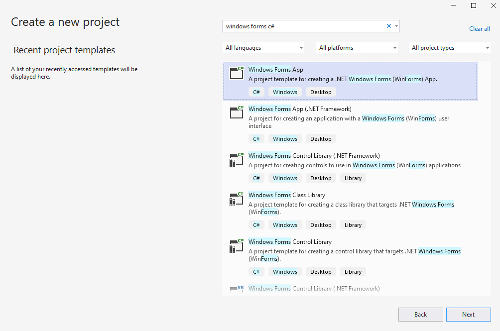
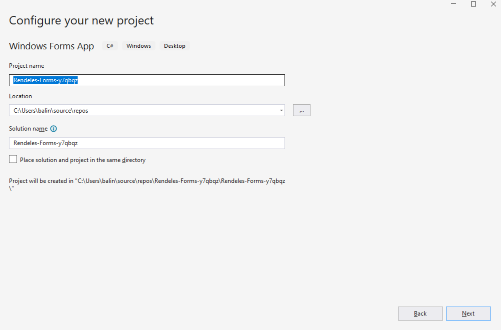
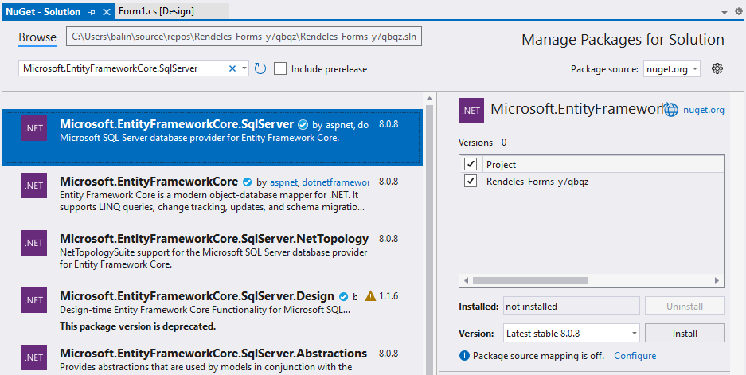
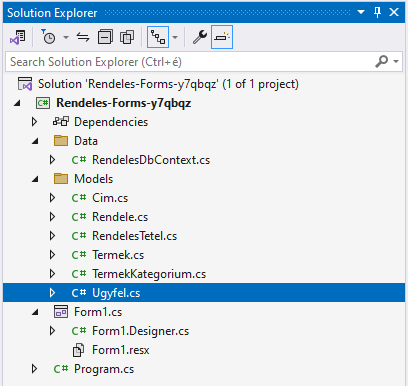

# 2.1 Windows Forms projekt létrehozása és Scaffold-Db használata

Ebben az alfejezetben létrehozzuk a rendeléskezelő rendszerünk alapját képező Windows Forms projektet, és összekapcsoljuk azt az előző fejezetben megtervezett adatbázisunkkal. Ez a lépés kulcsfontosságú a fejlesztési folyamatunkban, hiszen itt kezdjük el összekapcsolni az adatbázis-réteget a felhasználói felülettel.

## Windows Forms projekt létrehozása .NET 8 környezetben Visual Studio segítségével

Először is hozzuk létre a Windows Forms projektünket. Kövesd az alábbi lépéseket:

1. Indítsd el a Visual Studio 2022-t.
2. Kattints a "Create a new project" (Új projekt létrehozása) gombra.
3. A keresőmezőbe írd be: "Windows Forms C#"
4. Válaszd ki a "Windows Forms App (.NET)" sablont C# nyelvvel. Fontos, hogy ne a .NET Framework verziót válaszd! 

5. Kattints a "Next" (Tovább) gombra.
6. Add meg a projekt nevét: "Rendeles_Forms_{NEPTUN}"
7. Válassz egy megfelelő helyet a projektnek a számítógépeden. 

8.  Kattints a "Next" gombra.
9.  A következő ablakban válaszd ki a ".NET 8.0 (Long-term support)" opciót.
10. Kattints a "Create" (Létrehozás) gombra.

## NuGet csomagok telepítése

Most, hogy megvan az alap projektünk, telepítenünk kell néhány NuGet csomagot, amelyek segítenek nekünk az adatbázissal való kommunikációban és a modellek generálásában. De mi is az a NuGet? A NuGet a .NET fejlesztők számára készült csomagkezelő rendszer, amely lehetővé teszi külső könyvtárak és eszközök egyszerű integrálását a projektjeinkbe. Gondolhatsz úgy rá, mint egy online könyvtárra, ahonnan hasznos kódcsomagokat "kölcsönözhetsz" a projektedhez. A csomagok telepítéséhez nem csak a grafikus felületet használhatod, hanem a Package Manager Console-t is. Például a `Install-Package Microsoft.EntityFrameworkCore.SqlServer` parancs beírásával is telepítheted az Entity Framework Core SQL Server provider-t. 

Most pedig kövesd ezeket a lépéseket a szükséges csomagok telepítéséhez:

1. A Visual Studio-ban kattints jobb gombbal a Solution Explorer-ben a projekted nevére.
2. Válaszd a "Manage NuGet Packages" (NuGet csomagok kezelése) opciót.
3. A "Browse" fülön keresd meg és telepítsd a következő csomagokat:

   - Microsoft.EntityFrameworkCore.SqlServer
   - Microsoft.EntityFrameworkCore.Tools
   - Microsoft.EntityFrameworkCore.Design

4. Mindegyik csomagnál válaszd ki a legújabb stabil verziót, amely kompatibilis a .NET 8-cal.

Ezek a csomagok lehetővé teszik számunkra, hogy használjuk az Entity Framework Core-t, ami egy modern objektum-relációs leképező (ORM) keretrendszer. De miért van szükségünk ezekre a konkrét csomagokra? Az EntityFrameworkCore.SqlServer csomag tartalmazza az SQL Server adatbázishoz való kapcsolódáshoz szükséges kódokat. Az EntityFrameworkCore.Tools és EntityFrameworkCore.Design csomagok pedig olyan eszközöket biztosítanak, amelyek segítenek az adatbázis-műveletek végrehajtásában és a modellek generálásában, amit a következő lépésekben fogunk használni. Ezek a csomagok együttesen teszik lehetővé, hogy hatékonyan és biztonságosan kommunikáljunk az adatbázisunkkal, anélkül hogy minden SQL lekérdezést nekünk kellene megírnunk.

## ConnectionString felépítése

A ConnectionString az a karakterlánc, amely tartalmazza az adatbázishoz való kapcsolódáshoz szükséges információkat. Ezt fogjuk használni a Scaffold-Db folyamat során és később az alkalmazásunkban is. Kövessük az alábbi lépéseket a ConnectionString megszerzéséhez:

1. A Visual Studio-ban nyisd meg a Server Explorer ablakot (View > Server Explorer).
2. Jobb klikk a "Data Connections" elemre, majd válaszd az "Add Connection" opciót.
3. A megjelenő ablakban válaszd ki az adatbázis szervert.
4. Válaszd ki a megfelelő adatbázist (RendelesDB).
5. Kattints a "Test Connection" gombra, hogy ellenőrizd a kapcsolatot.
6. Ha sikeres a kapcsolódás, kattints az "OK" gombra.

Most, hogy hozzáadtuk az adatbázis kapcsolatot, megszerezhetjük a ConnectionString-et:

7. A Server Explorer-ben kattints jobb gombbal az újonnan létrehozott adatbázis kapcsolatra.
8. Válaszd a "Properties" opciót.
9. A Properties ablakban keresd meg a "Connection String" sort.
10. Másold ki a teljes Connection String értéket.

A Connection String általában így néz ki:

```
Data Source=(localdb)\MSSQLLocalDB;Initial Catalog=RendelesDB;Integrated Security=True;Connect Timeout=30;Encrypt=False;Trust Server Certificate=False
```

Nézzük meg, mit jelentenek az egyes részei:

- `Data Source=(localdb)\MSSQLLocalDB`: Ez határozza meg az adatbázis szervert. Ebben az esetben a lokális fejlesztői adatbázist használjuk.
- `Initial Catalog=RendelesDB`: Ez az adatbázis neve, amihez kapcsolódni szeretnénk.
- `Integrated Security=True`: Ez azt jelenti, hogy a Windows bejelentkezésünket használjuk az authentikációhoz.
- `Connect Timeout=30`: Ennyi másodpercig próbál kapcsolódni, mielőtt hibát dobna.
- `Encrypt=False`: Nem használunk titkosítást a kapcsolathoz.
- `Trust Server Certificate=False`: Nem bízunk meg automatikusan a szerver tanúsítványában.

Ez a Connection String tartalmazza az összes szükséges információt az adatbázisunkhoz való kapcsolódáshoz. A következő lépésben ezt fogjuk felhasználni a Scaffold-Db folyamat során.

## ScaffoldDB használata

Most jön a varázslat része! A Scaffold-Db segítségével automatikusan generálhatunk C# osztályokat az adatbázisunk tábláiból. Ez jelentősen felgyorsítja a fejlesztési folyamatot és csökkenti a hibalehetőségeket.

Kövesd ezeket a lépéseket:

1. Nyisd meg a Package Manager Console-t (Tools > NuGet Package Manager > Package Manager Console)
2. Írd be a következő parancsot, behelyettesítve a korábban kimásolt Connection String-et:

```
Scaffold-DbContext "Data Source=(localdb)\MSSQLLocalDB;Initial Catalog=RendelesDb;Integrated Security=True;Connect Timeout=30;Encrypt=False;Trust Server Certificate=False" Microsoft.EntityFrameworkCore.SqlServer -OutputDir Models -ContextDir Data -Context RendelesDbContext -DataAnnotations -Force -NoPluralize
```

Ez a parancs a következőket csinálja:
- Használja a megadott Connection String-et az adatbázishoz való kapcsolódáshoz
- Microsoft SQL Server adatbázist feltételez
- Az osztályokat a Models mappába generálja
- A DbContext osztályt a Data mappába helyezi
- RendelesDbContext néven hozza létre a DbContext osztályt
- Használja a Data Annotations attribútumokat a modellek definiálásához
- A -Force kapcsoló azt jelenti, hogy ha már léteznek fájlok, azokat felülírja
- A -NoPluralize megelőzi, hogy az angol nyelvtan szerinti többesszámra végződő szavak módosítva legyenek.

## Generált eredmény áttekintése

A Scaffold-DbContext parancs lefutása után a Visual Studio Solution Explorer-ében látni fogod, hogy létrejött két új mappa:

1. Models: Itt találod az egyes adatbázis tábláknak megfelelő C# osztályokat (pl. Ugyfel.cs, Termek.cs, stb.)
2. Data: Itt található a RendelesDbContext.cs fájl, ami az Entity Framework Core DbContext osztálya.



Nyisd meg és nézd át ezeket a fájlokat. Látni fogod, hogy az osztályok tulajdonságai megfelelnek az adatbázis táblák oszlopainak, és a kapcsolatok is megfelelően vannak reprezentálva. A -DataAnnotations kapcsolónak köszönhetően az osztályok és tulajdonságok különböző attribútumokkal vannak ellátva. Nézzük meg például az Ugyfel.cs fájlt:

```csharp
[Table("UGYFEL")]
[Index("Email", Name = "UQ_UGYFEL_Email", IsUnique = true)]
public partial class Ugyfel
{
    [Key]
    [Column("UgyfelID")]
    public int UgyfelId { get; set; }

    [StringLength(100)]
    public string Nev { get; set; } = null!;

    [StringLength(255)]
    public string Email { get; set; } = null!;

    [StringLength(20)]
    public string? Telefonszam { get; set; }

    [Column("LakcimID")]
    public int? LakcimId { get; set; }

    [ForeignKey("LakcimId")]
    [InverseProperty("Ugyfels")]
    public virtual Cim? Lakcim { get; set; }

    [InverseProperty("Ugyfel")]
    public virtual ICollection<Rendele> Rendeles { get; set; } = new List<Rendele>();
}
```

Lássuk részletesen, mit jelentenek ezek az attribútumok:

1. Osztály szintű attribútumok:
   - `[Table("UGYFEL")]`: Megadja, hogy ez az osztály az UGYFEL nevű adatbázis táblának felel meg.
   - `[Index("Email", Name = "UQ_UGYFEL_Email", IsUnique = true)]`: Jelzi, hogy az Email mezőre egyedi index van definiálva az adatbázisban.

2. Tulajdonság szintű attribútumok:
   - `[Key]`: Jelzi, hogy ez a mező a tábla elsődleges kulcsa.
   - `[Column("UgyfelID")]`: Megadja az adatbázis oszlop pontos nevét, ha az eltér a C# property nevétől.
   - `[StringLength(100)]`: Meghatározza a string mező maximális hosszát.
   - `[ForeignKey("LakcimId")]`: Jelzi, hogy ez egy idegen kulcs, ami a LakcimId mezőre hivatkozik.
   - `[InverseProperty("Ugyfels")]`: Megadja a kapcsolat másik oldalát reprezentáló tulajdonság nevét a kapcsolódó entitásban.

Ezek az attribútumok segítenek pontosan leképezni az adatbázis struktúrát C# kódra, és számos hasznos metaadatot biztosítanak az Entity Framework Core számára.

Fontos megjegyezni néhány további részletet:

- A `= null!` kifejezés a string tulajdonságoknál (pl. `Nev` és `Email`) egy C# 8.0-ban bevezetett nyelvi funkció, a null-forgiving operátor használatát jelzi. Ez nem azt jelenti, hogy a mező null lehet, hanem épp ellenkezőleg: biztosítjuk a fordítót, hogy bár az inicializáláskor null értéket adunk meg, a futás során ez a tulajdonság sosem lesz null. Ez összhangban van azzal, hogy ezek a mezők az adatbázisban NOT NULL megszorítással rendelkeznek. A `null!` használata segít elkerülni a fordító figyelmeztetéseit a lehetséges null referenciákról, miközben jelzi a fejlesztőknek, hogy ezeket a mezőket mindenképpen értékkel kell feltölteni használat előtt."
- A `string?` típus a `Telefonszam` mezőnél azt jelenti, hogy ez a mező opcionális, lehet null értékű.
- A `virtual` kulcsszó a navigációs tulajdonságoknál (pl. `Lakcim` és `Rendeles`) lehetővé teszi az Entity Framework Core számára a lazy loading használatát.

Ez az automatikusan generált kód kiváló alapot nyújt a további fejlesztéshez. A Data Annotations használata nemcsak az adatbázis struktúrát tükrözi pontosan, de segít a validációban és az adatok integritásának megőrzésében is az alkalmazás szintjén.

Gratulálok! Sikeresen létrehoztad a Windows Forms projektedet, összekapcsoltad az adatbázissal, és legeneráltad a szükséges modell osztályokat. Ez egy hatalmas lépés a rendeléskezelő alkalmazásunk fejlesztésében.

A következő lépésekben elkezdjük majd használni ezeket az osztályokat, hogy CRUD (Create, Read, Update, Delete) műveleteket végezzünk az adatbázisban a felhasználói felületen keresztül.
