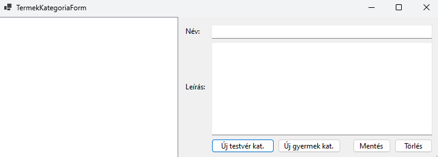
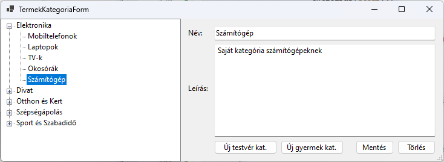

# 2.2 CRUD műveletek és DataBinding TreeView segítségével (Termékkategóriák adatainak kezelése)

Ebben a fejezetben a rendeléskezelő rendszerünk egy fontos részét fogjuk megvalósítani: a termékkategóriák kezelését. Ez a funkció lehetővé teszi, hogy a felhasználók megtekinthessék, szerkeszthessék a termékkategóriákat egy könnyen használható, fa struktúrájú felületen keresztül. A fejlesztés során megismerkedünk a Windows Forms alkalmazások több fontos koncepciójával, beleértve a többablakos alkalmazások létrehozását, a TreeView vezérlő használatát, valamint az adatkötést (data binding).

## Termék kategóriák az adatbázisban

Mielőtt belevágnánk a termékkategóriák kezelésének implementációjába, érdemes röviden áttekintenünk, hogyan is épül fel ez a struktúra az adatbázisunkban. Ez a visszatekintés segít abban, hogy jobban megértsük, miért is van szükségünk a TreeView vezérlőre a megjelenítéshez.

Emlékeztetőül, a termékkategóriákat a következő táblastruktúrával valósítottuk meg:

```sql
CREATE TABLE TERMEK_KATEGORIA (
    KategoriaID INT IDENTITY(1,1) PRIMARY KEY,
    Nev NVARCHAR(50) NOT NULL,
    Leiras NVARCHAR(MAX),
    SzuloKategoriaID INT,
    CONSTRAINT FK_TERMEK_KATEGORIA_SzuloKategoria FOREIGN KEY (SzuloKategoriaID) 
        REFERENCES TERMEK_KATEGORIA(KategoriaID)
);
```

Ez a táblastruktúra lehetővé teszi számunkra, hogy hierarchikus kapcsolatokat hozzunk létre a kategóriák között. A `SzuloKategoriaID` mező kulcsfontosságú ebben a szerkezetben: ez teremti meg a kapcsolatot egy kategória és annak szülőkategóriája között. Ha a `SzuloKategoriaID` értéke NULL, az azt jelenti, hogy az adott kategória főkategória.

Például, ha van egy "Elektronika" főkategóriánk, és alatta egy "Számítógépek" alkategória, akkor az adatbázisban ez így nézhet ki:

1. KategoriaID: 1, Nev: "Elektronika", SzuloKategoriaID: NULL
2. KategoriaID: 2, Nev: "Számítógépek", SzuloKategoriaID: 1

Ez a struktúra lehetővé teszi, hogy tetszőleges mélységű kategória hierarchiát hozzunk létre. Egy kategóriának lehet több alkategóriája, és egy alkategória tovább bontható még kisebb kategóriákra.

Most, hogy felidéztük az adatbázis struktúrát, láthatjuk, miért is ideális választás a TreeView vezérlő ennek a hierarchikus struktúrának a megjelenítésére. A TreeView természetes módon képes fa struktúrájú adatok megjelenítésére, ahol minden csomópontnak lehetnek gyermek csomópontjai. Ez tökéletesen illeszkedik a kategóriáink szerkezetéhez.


Fontos azonban megjegyezni, hogy bár a TreeView kiválóan alkalmas a hierarchikus adatok megjelenítésére, nem rendelkezik beépített adatkötési (data binding) funkcióval a BindingSource-hoz. Ez azt jelenti, hogy nem tudjuk egyszerűen hozzákötni az adatforrásunkat (például egy List<T>-t) a TreeView-hoz, és elvárni, hogy az automatikusan feltöltse és frissítse a tartalmát.

Ehelyett nekünk kell implementálnunk a TreeView feltöltését és frissítését. Ez több munkát igényel, de egyben nagyobb rugalmasságot is biztosít számunkra. Lehetőségünk van pontosan szabályozni, hogyan épül fel a fa struktúra, milyen adatokat jelenítünk meg a csomópontokban, és hogyan kezeljük a felhasználói interakciókat.

## A TermekKategoriaForm létrehozása

Most, hogy átismételtük az adatbázis struktúrát és megértettük, miért a TreeView a megfelelő választás a megjelenítésre, hozzákezdjünk a tényleges implementációhoz. Először is, hozzunk létre egy új űrlapot a termékkategóriák kezeléséhez.

1. A Visual Studio Solution Explorer-ében kattints jobb gombbal a projektre, majd válaszd az "Add" > "New Item" menüpontot.
2. A megjelenő ablakban válaszd a "Windows Form" opciót, és nevezd el "TermekKategoriaForm"-nak.
3. Kattints az "Add" gombra.

Most, hogy létrehoztuk az új űrlapot, adjuk hozzá a szükséges vezérlőelemeket:

1. Húzz egy TreeView vezérlőt az űrlapra, és nevezd el "treeViewKategoriak"-nak.
2. Adj hozzá két TextBox vezérlőt: egyet a kategória nevének ("txtNev"), egyet pedig a leírásának ("txtLeiras").
3. Helyezz el négy Button vezérlőt az űrlapon: "Mentés", "Új testvér", "Új gyermek" és "Törlés" feliratokkal.

Az űrlap most már nagyjából így kell kinézzen:



## A főmenü létrehozása (Form1)

Mielőtt továbblépnénk a TermekKategoriaForm funkcionalitásának megvalósítására, hozzunk létre egy főmenüt az alkalmazásunkban, ahonnan el tudjuk érni az új űrlapunkat.

1. Nyisd meg a Form1.cs fájlt (ez az alkalmazásunk főablaka).
2. Adj hozzá egy Button vezérlőt az űrlaphoz `Termékkategóriák kezelése` névvel.
3. Dupla kattintással add hozzá az eseménykezelőt a gombhoz, és írd be a következő kódot:

```csharp
private void button1_Click(object sender, EventArgs e)
{
    TermekKategoriaForm termekKategoriaForm = new TermekKategoriaForm();
    termekKategoriaForm.ShowDialog();
}
```

Ez a kód létrehoz egy új TermekKategoriaForm példányt és megjeleníti azt, amikor a felhasználó a menüpontra kattint.

## DbContext példány létrehozása

Most térjünk vissza a TermekKategoriaForm-hoz. Az adatbázisműveletekhez szükségünk lesz egy DbContext példányra. Adjuk hozzá a következő mezőt az osztályhoz:

```csharp
private RendelesDbContext _context;
```

Majd inicializáljuk ezt a konstruktorban:

```csharp
public TermekKategoriaForm()
{
    InitializeComponent();
    _context = new RendelesDbContext();
    LoadKategoriak();
}
```

## Kategóriák rekurzív betöltése

Most implementáljuk a `LoadKategoriak` metódust, amely betölti a kategóriákat az adatbázisból és megjeleníti őket a TreeView-ban.

Ez a metódus először lekérdezi az összes kategóriát az adatbázisból, majd kiválasztja azokat, amelyeknek nincs szülőkategóriájuk (azaz a főkategóriákat). Ezután minden főkategóriához létrehoz egy TreeNode-ot a `CreateTreeNode` metódus segítségével.

<details><summary>Mintakód megjelenítése</summary>

```csharp
private void LoadKategoriak()
{
    // Az összes kategória lekérdezése az adatbázisból
    var kategoriak = (from k in _context.TermekKategoria
                      select k).ToList();

    // TreeView tartalmának törlése
    treeViewKategoriak.Nodes.Clear();

    // Főkategóriák hozzáadása a TreeView-hoz
    var fokategoriak = from k in kategoriak
                       where k.SzuloKategoriaId == null
                       select k;

    foreach (var kategoria in fokategoriak)
    {
        var node = CreateTreeNode(kategoria, kategoriak);
        treeViewKategoriak.Nodes.Add(node);
    }
}
```
</details><br/>

Ez a metódus létrehoz egy TreeNode-ot az adott kategóriához, majd megkeresi annak összes alkategóriáját. Minden alkategóriához rekurzívan meghívja saját magát, így építve fel a teljes fa struktúrát.

## CreateTreeNode implementálása

Most implementáljuk a `CreateTreeNode` metódust, amely rekurzívan létrehozza a TreeNode-okat a kategóriákhoz és azok alkategóriáihoz:

<details><summary>Mintakód megjelenítése</summary>

```csharp
private TreeNode CreateTreeNode(TermekKategoria kategoria, List<TermekKategoria> osszeKategoria)
{
    // TreeNode létrehozása az aktuális kategóriához
    var node = new TreeNode(kategoria.Nev) { Tag = kategoria };

    // Alkategóriák keresése és hozzáadása
    var alkategoriak = from k in osszeKategoria
                       where k.SzuloKategoriaId == kategoria.KategoriaId
                       select k;

    foreach (var gyerekKategoria in alkategoriak)
    {
        node.Nodes.Add(CreateTreeNode(gyerekKategoria, osszeKategoria));
    }

    return node;
}
```
</details>

Figyeld meg, hogy a TreeNode `Tag` tulajdonságát használjuk arra, hogy eltároljuk az adott csomóponthoz tartozó `TermekKategoria` objektumot. Ez lehetővé teszi számunkra, hogy később könnyen hozzáférjünk a kategória adataihoz, amikor a felhasználó kiválaszt egy csomópontot.

Ez a rekurzív megközelítés elegáns és hatékony módja a hierarchikus adatok kezelésének. Lehetővé teszi számunkra, hogy tetszőleges mélységű kategória struktúrát kezeljünk anélkül, hogy előre ismernünk kellene a hierarchia mélységét.

## Kiválasztott kategória adatainak megjelenítése a textboxokban

Most, hogy sikeresen betöltöttük és megjelenítettük a kategóriákat a TreeView-ban, a következő lépés, hogy lehetővé tegyük a felhasználó számára egy kategória kiválasztását és adatainak megtekintését. Ehhez a TreeView `AfterSelect` eseményét fogjuk használni.

Először adjuk hozzá az eseménykezelőt a TreeView-hoz. Ezt megtehetjük a Properties ablakban az Events fülön, vagy egyszerűen dupla kattintással a TreeView-ra a Form Designer-ben. Ebben a kódban:
1. Ellenőrizzük, hogy a kiválasztott csomópont `Tag` tulajdonsága `TermekKategoria` típusú-e.
2. Ha igen, akkor betöltjük a kategória nevét és leírását a megfelelő TextBox-okba.

<details><summary>Mintakód megjelenítése</summary>

```csharp
private void treeViewKategoriak_AfterSelect(object sender, TreeViewEventArgs e)
{
    if (e.Node?.Tag is TermekKategoria selectedKategoria)
    {
        txtNev.Text = selectedKategoria.Nev;
        txtLeiras.Text = selectedKategoria.Leiras;
    }
}
```
</details>

## Változtatások mentése (hibakezeléssel)

Most, hogy a felhasználó látja és szerkesztheti a kiválasztott kategória adatait, implementáljuk a mentés funkciót. Ehhez a "Mentés" gomb `Click` eseményét fogjuk használni.

1. Először ellenőrizzük, hogy a kijelölt elem `TermekKategoria`-e, majd megvizsgáljuk, hogy a név mező nem üres-e. Ha üres, hibaüzenetet jelenítünk meg és kilépünk a metódusból.
2. Frissítjük a kiválasztott kategória tulajdonságait.
3. Mentjük a változtatásokat az adatbázisban a `SaveChanges()` metódussal.
4. Sikeres mentés esetén megerősítő üzenetet jelenítünk meg, és újratöltjük a kategóriákat a TreeView-ban.
5. Ha bármilyen hiba történik a folyamat során, azt egy kivételkezelő blokkban kezeljük, és hibaüzenetet jelenítünk meg a felhasználónak.

<details><summary>Mintakód megjelenítése</summary>

```csharp
private void btnMentes_Click(object sender, EventArgs e)
{
    if (!(treeViewKategoriak.SelectedNode?.Tag is TermekKategoria selectedKategoria))
    {
        return;
    }

    if (string.IsNullOrWhiteSpace(txtNev.Text))
    {
        MessageBox.Show("A név mező nem lehet üres!", "Hiba", MessageBoxButtons.OK, MessageBoxIcon.Error);
        return;
    }

    selectedKategoria.Nev = txtNev.Text;
    selectedKategoria.Leiras = txtLeiras.Text;

    try
    {
        _context.SaveChanges();
        MessageBox.Show("A változtatások sikeresen mentve!", "Siker", MessageBoxButtons.OK, MessageBoxIcon.Information);
        LoadKategoriak();
    }
    catch (Exception ex)
    {
        MessageBox.Show($"Hiba történt a mentés során: {ex.Message}", "Hiba", MessageBoxButtons.OK, MessageBoxIcon.Error);
    }
}
```
</details>

## Új testvér létrehozása

Az új testvér kategória létrehozásához implementáljuk az "Új testvér" gomb `Click` eseménykezelőjét.
1. Ellenőrizzük, hogy van-e kiválasztott kategória a TreeView-ban.
2. Ha van, létrehozunk egy új `TermekKategoria` objektumot, amelynek a `SzuloKategoriaId`-je megegyezik a kiválasztott kategória szülőjének azonosítójával. Ez biztosítja, hogy az új kategória "testvére" lesz a kiválasztott kategóriának.
3. Töröljük a név és leírás mezők tartalmát, hogy a felhasználó új adatokat adhasson meg.
4. Az `isNewItem` változót `true`-ra állítjuk, jelezve, hogy új elem létrehozása van folyamatban.

<details><summary>Mintakód megjelenítése</summary>

```csharp
private void btnUjTestver_Click(object sender, EventArgs e)
{
    if (treeViewKategoriak.SelectedNode?.Tag is TermekKategoria selectedKategoria)
    {
        newKategoria = new TermekKategoria
        {
            SzuloKategoriaId = selectedKategoria.SzuloKategoriaId
        };
        txtNev.Clear();
        txtLeiras.Clear();
        isNewItem = true;
    }
}
```
</details>

## Új gyermek kategória létrehozása

Az új gyermek kategória létrehozása hasonló az új testvér létrehozásához, de ebben az esetben a kiválasztott kategória lesz az új kategória szülője. Implementáljuk az "Új gyermek" gomb `Click` eseménykezelőjét.

Ez a kód nagyon hasonló az új testvér létrehozásához, de a fő különbség az, hogy az új kategória `SzuloKategoriaId`-je a kiválasztott kategória `KategoriaId`-je lesz.

<details><summary>Mintakód megjelenítése</summary>

```csharp
private void btnUjGyermek_Click(object sender, EventArgs e)
{
    if (treeViewKategoriak.SelectedNode?.Tag is TermekKategoria selectedKategoria)
    {
        newKategoria = new TermekKategoria
        {
            SzuloKategoriaId = selectedKategoria.KategoriaId
        };
        txtNev.Clear();
        txtLeiras.Clear();
        isNewItem = true;
    }
}
```
</details>

## Mentés funkció módosítása

Most, hogy lehetőségünk van új kategóriákat létrehozni, módosítanunk kell a mentés funkciót, hogy kezelje az új elemek hozzáadását is. Módosítsuk a `btnMentes_Click` eseménykezelőt.

1. Ellenőrizzük, hogy új elemet hozunk-e létre (`isNewItem` változó alapján).
2. Ha új elem, akkor hozzáadjuk az adatbázis kontextushoz.
3. Ha nem új elem, akkor frissítjük a kiválasztott kategória adatait.
4. Mentjük a változtatásokat, frissítjük a TreeView-t, és visszaállítjuk az `isNewItem` változót `false` értékre.

<details><summary>Mintakód megjelenítése</summary>

```csharp
private void btnMentes_Click(object sender, EventArgs e)
{
    if (string.IsNullOrWhiteSpace(txtNev.Text))
    {
        MessageBox.Show("A név mező nem lehet üres!", "Hiba", MessageBoxButtons.OK, MessageBoxIcon.Error);
        return;
    }

    try
    {
        if (isNewItem)
        {
            newKategoria.Nev = txtNev.Text;
            newKategoria.Leiras = txtLeiras.Text;
            _context.TermekKategoria.Add(newKategoria);
        }
        else if (treeViewKategoriak.SelectedNode?.Tag is TermekKategoria selectedKategoria)
        {
            selectedKategoria.Nev = txtNev.Text;
            selectedKategoria.Leiras = txtLeiras.Text;
        }

        _context.SaveChanges();
        MessageBox.Show("A változtatások sikeresen mentve!", "Siker", MessageBoxButtons.OK, MessageBoxIcon.Information);
        LoadKategoriak();
        isNewItem = false;
    }
    catch (Exception ex)
    {
        MessageBox.Show($"Hiba történt a mentés során: {ex.Message}", "Hiba", MessageBoxButtons.OK, MessageBoxIcon.Error);
    }
}
```
</details>

## Kategória törlése

Végül implementáljuk a kategória törlése funkciót. Ez egy kicsit összetettebb, mert rekurzívan kell törölnünk az összes alkategóriát is. Íme a "Törlés" gomb `Click` eseménykezelője:

<details><summary>Mintakód megjelenítése</summary>

```csharp
private void btnTorles_Click(object sender, EventArgs e)
{
    if (treeViewKategoriak.SelectedNode?.Tag is TermekKategoria selectedKategoria)
    {
        var result = MessageBox.Show($"Biztosan törölni szeretné a(z) '{selectedKategoria.Nev}' kategóriát és annak összes alkategóriáját?",
            "Törlés megerősítése", MessageBoxButtons.YesNo, MessageBoxIcon.Warning);

        if (result == DialogResult.Yes)
        {
            try
            {
                DeleteKategoriaAndChildren(selectedKategoria);
                _context.SaveChanges();
                MessageBox.Show("A kategória és alkategóriái sikeresen törölve!", "Siker", MessageBoxButtons.OK, MessageBoxIcon.Information);
                LoadKategoriak();
                txtNev.Clear();
                txtLeiras.Clear();
            }
            catch (Exception ex)
            {
                MessageBox.Show($"Hiba történt a törlés során: {ex.Message}", "Hiba", MessageBoxButtons.OK, MessageBoxIcon.Error);
            }
        }
    }
    else
    {
        MessageBox.Show("Kérjük, válasszon ki egy kategóriát a törléshez!", "Figyelmeztetés", MessageBoxButtons.OK, MessageBoxIcon.Warning);
    }
}

private void DeleteKategoriaAndChildren(TermekKategoria kategoria)
{
    var childrenToDelete = (from k in _context.TermekKategoria
                            where k.SzuloKategoriaId == kategoria.KategoriaId
                            select k).ToList();

    foreach (var child in childrenToDelete)
    {
        DeleteKategoriaAndChildren(child);
    }

    _context.TermekKategoria.Remove(kategoria);
}
```
</details><br/>

Ez a kód:

1. Megerősítést kér a felhasználótól a törlés előtt.
2. Ha a felhasználó megerősíti a törlést, meghívja a `DeleteKategoriaAndChildren` metódust.
3. A `DeleteKategoriaAndChildren` metódus rekurzívan törli az összes alkategóriát, majd magát a kategóriát.
4. A törlés után frissíti a TreeView-t és törli a TextBox-ok tartalmát.

Ezekkel a módosításokkal a TermekKategoriaForm most már teljes CRUD (Create, Read, Update, Delete) funkcionalitással rendelkezik a termékkategóriák kezelésére. A felhasználók könnyedén hozhatnak létre új kategóriákat (akár testvérként, akár gyermekként), szerkeszthetik a meglévőket, és törölhetik azokat az összes alkategóriájukkal együtt.

Ez a megoldás jól szemlélteti, hogyan lehet hatékonyan kezelni a hierarchikus adatstruktúrákat egy Windows Forms alkalmazásban. A TreeView vezérlő kiválóan alkalmas az ilyen jellegű adatok megjelenítésére, míg az Entity Framework Core leegyszerűsíti az adatbázis-műveleteket.

# Végeredmény



<details><summary>A teljes megoldás egyben</summary>

```csharp
using Rendeles_Forms_y7qbqz.Data;
using Rendeles_Forms_y7qbqz.Models;
using System.Data;

namespace Rendeles_Forms_y7qbqz
{
    public partial class TermekKategoriaForm : Form
    {
        private RendelesDbContext _context;
        private bool isNewItem = false;
        private TermekKategoria newKategoria = null!;

        public TermekKategoriaForm()
        {
            InitializeComponent();
            _context = new RendelesDbContext();
            LoadKategoriak();
        }

        private void LoadKategoriak()
        {
            // Az összes kategória lekérdezése az adatbázisból
            var kategoriak = (from k in _context.TermekKategoria
                              select k).ToList();

            // TreeView tartalmának törlése
            treeViewKategoriak.Nodes.Clear();

            // Főkategóriák hozzáadása a TreeView-hoz
            var fokategoriak = from k in kategoriak
                               where k.SzuloKategoriaId == null
                               select k;

            foreach (var kategoria in fokategoriak)
            {
                var node = CreateTreeNode(kategoria, kategoriak);
                treeViewKategoriak.Nodes.Add(node);
            }
        }

        private TreeNode CreateTreeNode(TermekKategoria kategoria, List<TermekKategoria> osszeKategoria)
        {
            // TreeNode létrehozása az aktuális kategóriához
            var node = new TreeNode(kategoria.Nev) { Tag = kategoria };

            // Alkategóriák keresése és hozzáadása
            var alkategoriak = from k in osszeKategoria
                               where k.SzuloKategoriaId == kategoria.KategoriaId
                               select k;

            foreach (var gyerekKategoria in alkategoriak)
            {
                node.Nodes.Add(CreateTreeNode(gyerekKategoria, osszeKategoria));
            }

            return node;
        }

        private void treeViewKategoriak_AfterSelect(object sender, TreeViewEventArgs e)
        {
            if (e.Node?.Tag is TermekKategoria selectedKategoria)
            {
                txtNev.Text = selectedKategoria.Nev;
                txtLeiras.Text = selectedKategoria.Leiras;
                isNewItem = false;
            }
        }

        private void btnMentes_Click(object sender, EventArgs e)
        {
            if (string.IsNullOrWhiteSpace(txtNev.Text))
            {
                MessageBox.Show("A név mező nem lehet üres!", "Hiba", MessageBoxButtons.OK, MessageBoxIcon.Error);
                return;
            }

            try
            {
                if (isNewItem)
                {
                    newKategoria.Nev = txtNev.Text;
                    newKategoria.Leiras = txtLeiras.Text;
                    _context.TermekKategoria.Add(newKategoria);
                }
                else if (treeViewKategoriak.SelectedNode?.Tag is TermekKategoria selectedKategoria)
                {
                    selectedKategoria.Nev = txtNev.Text;
                    selectedKategoria.Leiras = txtLeiras.Text;
                }

                _context.SaveChanges();
                MessageBox.Show("A változtatások sikeresen mentve!", "Siker", MessageBoxButtons.OK, MessageBoxIcon.Information);
                LoadKategoriak();
                isNewItem = false;
            }
            catch (Exception ex)
            {
                MessageBox.Show($"Hiba történt a mentés során: {ex.Message}", "Hiba", MessageBoxButtons.OK, MessageBoxIcon.Error);
            }
        }

        private void btnUjTestver_Click(object sender, EventArgs e)
        {
            // testvér
            if (treeViewKategoriak.SelectedNode?.Tag is TermekKategoria selectedKategoria)
            {
                newKategoria = new TermekKategoria
                {
                    SzuloKategoriaId = selectedKategoria.SzuloKategoriaId
                };
                txtNev.Clear();
                txtLeiras.Clear();
                isNewItem = true;
            }
        }
        private void btnUjGyermek_Click(object sender, EventArgs e)
        {
            if (treeViewKategoriak.SelectedNode?.Tag is TermekKategoria selectedKategoria)
            {
                newKategoria = new TermekKategoria
                {
                    SzuloKategoriaId = selectedKategoria.KategoriaId
                };
                txtNev.Clear();
                txtLeiras.Clear();
                isNewItem = true;
            }
        }

        private void btnTorles_Click(object sender, EventArgs e)
        {
            if (treeViewKategoriak.SelectedNode?.Tag is TermekKategoria selectedKategoria)
            {
                var result = MessageBox.Show($"Biztosan törölni szeretné a(z) '{selectedKategoria.Nev}' kategóriát és annak összes alkategóriáját?",
                    "Törlés megerősítése", MessageBoxButtons.YesNo, MessageBoxIcon.Warning);

                if (result == DialogResult.Yes)
                {
                    try
                    {
                        DeleteKategoriaAndChildren(selectedKategoria);
                        _context.SaveChanges();
                        MessageBox.Show("A kategória és alkategóriái sikeresen törölve!", "Siker", MessageBoxButtons.OK, MessageBoxIcon.Information);
                        LoadKategoriak();
                        txtNev.Clear();
                        txtLeiras.Clear();
                    }
                    catch (Exception ex)
                    {
                        MessageBox.Show($"Hiba történt a törlés során: {ex.Message}", "Hiba", MessageBoxButtons.OK, MessageBoxIcon.Error);
                    }
                }
            }
            else
            {
                MessageBox.Show("Kérjük, válasszon ki egy kategóriát a törléshez!", "Figyelmeztetés", MessageBoxButtons.OK, MessageBoxIcon.Warning);
            }
        }

        private void DeleteKategoriaAndChildren(TermekKategoria kategoria)
        {
            var childrenToDelete = (from k in _context.TermekKategoria
                                    where k.SzuloKategoriaId == kategoria.KategoriaId
                                    select k).ToList();

            foreach (var child in childrenToDelete)
            {
                DeleteKategoriaAndChildren(child);
            }

            _context.TermekKategoria.Remove(kategoria);
        }
    }
}
```
</details>