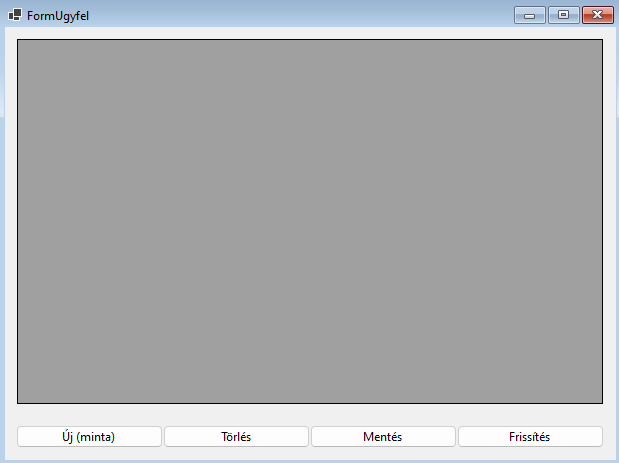

## Emlékeztető: Alapvető CRUD műveletek bemutatása Ügyfél táblán

Ebben a rövid emlékeztetőben áttekintjük az alapvető CRUD (Create, Read, Update, Delete) műveleteket egy egyszerű Ügyfél táblán keresztül. Ez segít felfrissíteni a tudásodat az adatbázis-műveletek terén, mielőtt bonyolultabb feladatokba kezdenél.

### 1. Űrlap létrehozása és beállítása

Először hozz létre egy új Windows Forms űrlapot "UgyfelForm" néven. Az űrlapon helyezz el egy DataGridView-t és négy gombot a CRUD műveletekhez.



### 2. DataGridView és BindingSource beállítása

1. Kattints a DataGridView jobb felső sarkában lévő kis háromszögre.
2. Válaszd a "Choose Data Source" opciót.
3. Kattints az "Add Project Data Source" gombra.
4. Válaszd ki az "Ugyfel" entitást az adatforrások közül.

Ez létrehoz egy `ugyfelBindingSource`-t és összeköti a DataGridView-val.


Érdemes törölni azokat az oszlopokat, amelyeket nem szeretnénk használni. Ezek a JOIN kapcsolatok miatt létrejött objektumok (Lakcim, Rendeles).


### 3. CRUD műveletek implementálása

Most nézzük meg, hogyan implementálhatjuk a CRUD műveleteket:

- **Create (Létrehozás)**: Az "Új" gomb létrehoz egy új Ugyfel objektumot alapértelmezett adatokkal, hozzáadja az adatbázishoz, majd frissíti a DataGridView-t.
- **Read (Olvasás)**: A `LoadData()` metódus betölti az összes ügyfelet az adatbázisból és megjeleníti őket a DataGridView-ban.
- **Update (Frissítés)**: A "Mentés" gomb egyszerűen elmenti a DataGridView-ban végrehajtott módosításokat az adatbázisba.
- **Delete (Törlés)**: A "Törlés" gomb eltávolítja a kijelölt ügyfelet az adatbázisból és frissíti a DataGridView-t.

```csharp
public partial class UgyfelForm : Form
{
    private RendelesDbContext _context;

    public UgyfelForm()
    {
        InitializeComponent();
        _context = new RendelesDbContext();
        LoadData();
    }

    private void LoadData()
    {
        ugyfelBindingSource.DataSource = _context.Ugyfel.ToList();
    }

    // Create
    private void btnHozzaadas_Click(object sender, EventArgs e)
    {
        var ujUgyfel = new Ugyfel { Nev = "Új Ügyfél", Email = "uj@pelda.com" };
        _context.Ugyfel.Add(ujUgyfel);
        _context.SaveChanges();
        LoadData();
    }

    // Update
    private void btnMentes_Click(object sender, EventArgs e)
    {
        _context.SaveChanges();
        LoadData();
    }

    // Delete
    private void btnTorles_Click(object sender, EventArgs e)
    {
        if (dataGridViewUgyfelek.CurrentRow != null)
        {
            var torlendoUgyfel = dataGridViewUgyfelek.CurrentRow.DataBoundItem as Ugyfel;
            if (torlendoUgyfel != null)
            {
                _context.Ugyfel.Remove(torlendoUgyfel);
                _context.SaveChanges();
                LoadData();
            }
        }
    }

    // Frissítés
    private void btnFrissites_Click(object sender, EventArgs e)
    {
        LoadData();
    }
}
```

### 4. Fontos megjegyzések

- Ez egy leegyszerűsített példa, minimális hibakezeléssel. Valós alkalmazásban sokkal robusztusabb hibakezelésre és validációra van szükség.
- A DataGridView-n belül közvetlenül szerkeszthetők az adatok. A módosítások nyomon követése automatikusan történik a BindingSource segítségével.
- A `_context.SaveChanges()` hívás menti a változtatásokat az adatbázisba. Ez egy fontos lépés, amit nem szabad kihagyni a műveletek végén.
- Új elemet a DGV-n keresztül nem tudsz hozzáadni, ahhoz komplexebb megoldásra lesz szükség.

Ez a rövid emlékeztető segít felfrissíteni a CRUD műveletek alapjait Windows Forms környezetben. A következő fejezetekben erre az alapra építve fogsz komplexebb funkciókat megvalósítani a rendeléskezelő rendszerben.