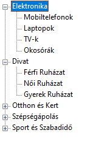
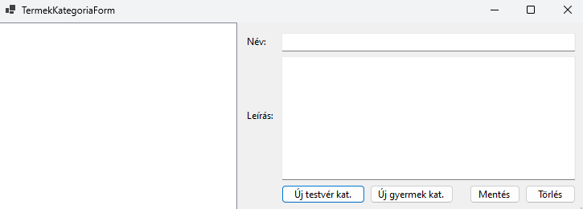

# 2.3 CRUD műveletek és DataBinding TreeView segítségével (Termékkategóriák adatainak kezelése)

Ebben a fejezetben a rendeléskezelő rendszerünk egy fontos részét fogjuk megvalósítani: a termékkategóriák kezelését. Ez a funkció lehetővé teszi, hogy a felhasználók megtekinthessék, szerkeszthessék a termékkategóriákat egy könnyen használható, fa struktúrájú felületen keresztül. A fejlesztés során megismerkedünk a Windows Forms alkalmazások több fontos koncepciójával, beleértve a többablakos alkalmazások létrehozását, a TreeView vezérlő használatát, valamint az adatkötést (data binding).

## Termék kategóriák az adatbázisban

Mielőtt belevágnánk a termékkategóriák kezelésének implementációjába, érdemes röviden áttekintenünk, hogyan is épül fel ez a struktúra az adatbázisunkban. Ez a visszatekintés segít abban, hogy jobban megértsük, miért is van szükségünk a TreeView vezérlőre a megjelenítéshez.

Emlékeztetőül, a termékkategóriákat a következő táblastruktúrával valósítottuk meg:

```sql
CREATE TABLE TERMEK_KATEGORIA (
    KategoriaID INT IDENTITY(1,1) PRIMARY KEY,
    Nev NVARCHAR(50) NOT NULL,
    Leiras NVARCHAR(MAX),
    SzuloKategoriaID INT,
    CONSTRAINT FK_TERMEK_KATEGORIA_SzuloKategoria FOREIGN KEY (SzuloKategoriaID) 
        REFERENCES TERMEK_KATEGORIA(KategoriaID)
);
```

Ez a táblastruktúra lehetővé teszi számunkra, hogy hierarchikus kapcsolatokat hozzunk létre a kategóriák között. A `SzuloKategoriaID` mező kulcsfontosságú ebben a szerkezetben: ez teremti meg a kapcsolatot egy kategória és annak szülőkategóriája között. Ha a `SzuloKategoriaID` értéke NULL, az azt jelenti, hogy az adott kategória főkategória.

Például, ha van egy "Elektronika" főkategóriánk, és alatta egy "Számítógépek" alkategória, akkor az adatbázisban ez így nézhet ki:

1. KategoriaID: 1, Nev: "Elektronika", SzuloKategoriaID: NULL
2. KategoriaID: 2, Nev: "Számítógépek", SzuloKategoriaID: 1

Ez a struktúra lehetővé teszi, hogy tetszőleges mélységű kategória hierarchiát hozzunk létre. Egy kategóriának lehet több alkategóriája, és egy alkategória tovább bontható még kisebb kategóriákra.

Most, hogy felidéztük az adatbázis struktúrát, láthatjuk, miért is ideális választás a TreeView vezérlő ennek a hierarchikus struktúrának a megjelenítésére. A TreeView természetes módon képes fa struktúrájú adatok megjelenítésére, ahol minden csomópontnak lehetnek gyermek csomópontjai. Ez tökéletesen illeszkedik a kategóriáink szerkezetéhez.



Fontos azonban megjegyezni, hogy bár a TreeView kiválóan alkalmas a hierarchikus adatok megjelenítésére, nem rendelkezik beépített adatkötési (data binding) funkcióval a BindingSource-hoz. Ez azt jelenti, hogy nem tudjuk egyszerűen hozzákötni az adatforrásunkat (például egy List<T>-t) a TreeView-hoz, és elvárni, hogy az automatikusan feltöltse és frissítse a tartalmát.

Ehelyett nekünk kell implementálnunk a TreeView feltöltését és frissítését. Ez több munkát igényel, de egyben nagyobb rugalmasságot is biztosít számunkra. Lehetőségünk van pontosan szabályozni, hogyan épül fel a fa struktúra, milyen adatokat jelenítünk meg a csomópontokban, és hogyan kezeljük a felhasználói interakciókat.

## A TermekKategoriaForm létrehozása

Most, hogy átismételtük az adatbázis struktúrát és megértettük, miért a TreeView a megfelelő választás a megjelenítésre, hozzákezdjünk a tényleges implementációhoz. Először is, hozzunk létre egy új űrlapot a termékkategóriák kezeléséhez.

1. A Visual Studio Solution Explorer-ében kattints jobb gombbal a projektre, majd válaszd az "Add" > "New Item" menüpontot.
2. A megjelenő ablakban válaszd a "Windows Form" opciót, és nevezd el "TermekKategoriaForm"-nak.
3. Kattints az "Add" gombra.

Most, hogy létrehoztuk az új űrlapot, adjuk hozzá a szükséges vezérlőelemeket:

1. Húzz egy TreeView vezérlőt az űrlapra, és nevezd el "treeViewKategoriak"-nak.
2. Adj hozzá két TextBox vezérlőt: egyet a kategória nevének ("txtNev"), egyet pedig a leírásának ("txtLeiras").
3. Helyezz el négy Button vezérlőt az űrlapon: "Mentés", "Új testvér", "Új gyermek" és "Törlés" feliratokkal.

Az űrlap most már nagyjából így kell kinézzen:



## A főmenü létrehozása (Form1)

Mielőtt továbblépnénk a TermekKategoriaForm funkcionalitásának megvalósítására, hozzunk létre egy főmenüt az alkalmazásunkban, ahonnan el tudjuk érni az új űrlapunkat.

1. Nyisd meg a Form1.cs fájlt (ez az alkalmazásunk főablaka).
2. Adj hozzá egy Button vezérlőt az űrlaphoz `Termékkategóriák kezelése` névvel.
3. Dupla kattintással add hozzá az eseménykezelőt a gombhoz, és írd be a következő kódot:

```csharp
private void button1_Click(object sender, EventArgs e)
{
    TermekKategoriaForm termekKategoriaForm = new TermekKategoriaForm();
    termekKategoriaForm.ShowDialog();
}
```

Ez a kód létrehoz egy új TermekKategoriaForm példányt és megjeleníti azt, amikor a felhasználó a menüpontra kattint.

## DbContext példány létrehozása

Most térjünk vissza a TermekKategoriaForm-hoz. Az adatbázisműveletekhez szükségünk lesz egy DbContext példányra. Adjuk hozzá a következő mezőt az osztályhoz:

```csharp
private RendelesDbContext _context;
```

Majd inicializáljuk ezt a konstruktorban:

```csharp
public TermekKategoriaForm()
{
    InitializeComponent();
    _context = new RendelesDbContext();
    LoadKategoriak();
}
```

## Kategóriák rekurzív betöltése

Most implementáljuk a `LoadKategoriak` metódust, amely betölti a kategóriákat az adatbázisból és megjeleníti őket a TreeView-ban.

Ez a metódus először lekérdezi az összes kategóriát az adatbázisból, majd kiválasztja azokat, amelyeknek nincs szülőkategóriájuk (azaz a főkategóriákat). Ezután minden főkategóriához létrehoz egy TreeNode-ot a `CreateTreeNode` metódus segítségével.

### Mintakód:

```csharp
private void LoadKategoriak()
{
    // Az összes kategória lekérdezése az adatbázisból
    var kategoriak = (from k in _context.TermekKategoria
                      select k).ToList();

    // TreeView tartalmának törlése
    treeViewKategoriak.Nodes.Clear();

    // Főkategóriák hozzáadása a TreeView-hoz
    var fokategoriak = from k in kategoriak
                       where k.SzuloKategoriaId == null
                       select k;

    foreach (var kategoria in fokategoriak)
    {
        var node = CreateTreeNode(kategoria, kategoriak);
        treeViewKategoriak.Nodes.Add(node);
    }
}
```


Ez a metódus létrehoz egy TreeNode-ot az adott kategóriához, majd megkeresi annak összes alkategóriáját. Minden alkategóriához rekurzívan meghívja saját magát, így építve fel a teljes fa struktúrát.

## CreateTreeNode implementálása

Most implementáljuk a `CreateTreeNode` metódust, amely rekurzívan létrehozza a TreeNode-okat a kategóriákhoz és azok alkategóriáihoz:

### Mintakód:

```csharp
private TreeNode CreateTreeNode(TermekKategoria kategoria, List<TermekKategoria> osszeKategoria)
{
    // TreeNode létrehozása az aktuális kategóriához
    var node = new TreeNode(kategoria.Nev) { Tag = kategoria };

    // Alkategóriák keresése és hozzáadása
    var alkategoriak = from k in osszeKategoria
                       where k.SzuloKategoriaId == kategoria.KategoriaId
                       select k;

    foreach (var gyerekKategoria in alkategoriak)
    {
        node.Nodes.Add(CreateTreeNode(gyerekKategoria, osszeKategoria));
    }

    return node;
}
```

Figyeld meg, hogy a TreeNode `Tag` tulajdonságát használjuk arra, hogy eltároljuk az adott csomóponthoz tartozó `TermekKategoria` objektumot. Ez lehetővé teszi számunkra, hogy később könnyen hozzáférjünk a kategória adataihoz, amikor a felhasználó kiválaszt egy csomópontot.

Ez a rekurzív megközelítés elegáns és hatékony módja a hierarchikus adatok kezelésének. Lehetővé teszi számunkra, hogy tetszőleges mélységű kategória struktúrát kezeljünk anélkül, hogy előre ismernünk kellene a hierarchia mélységét.
