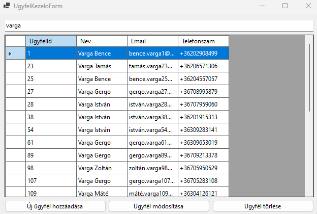

# 2.4 Felhasználói menedzsment

Ebben a fejezetben egy fontos funkciót fogunk megvalósítani a rendeléskezelő rendszerünkben: az ügyfelek kezelését. Létrehozunk két új űrlapot: az `UgyfelKezeloForm`-ot, amely az ügyfelek listázására és kezelésére szolgál, valamint az `UgyfelSzerkesztesForm`-ot, amely új ügyfelek hozzáadását és meglévők szerkesztését teszi lehetővé. Ez a fejezet végigvezet téged a felhasználói felület kialakításától kezdve az adatok megjelenítésén át a keresési funkció implementálásáig.

## UgyfelKezeloForm létrehozása

Először hozzuk létre az `UgyfelKezeloForm`-ot, amely az ügyfelek listázására és kezelésére szolgál.

1. A Visual Studio Solution Explorer-ében kattints jobb gombbal a projektre, majd válaszd az "Add" > "New Item" menüpontot.
2. A megjelenő ablakban válaszd a "Windows Form" opciót, és nevezd el "`UgyfelKezeloForm`"-nak.
3. Kattints az "Add" gombra.

Most adjuk hozzá a szükséges vezérlőelemeket az űrlaphoz:

1. Húzz egy `DataGridView` vezérlőt az űrlapra, és nevezd el "dgvUgyfelek"-nek.
2. Adj hozzá egy `TextBox` vezérlőt a szűréshez, és nevezd el "tbSzuro"-nak.
3. Helyezz el három `Button` vezérlőt az űrlapon: "Új ügyfél", "Módosítás" és "Törlés" feliratokkal.

Az űrlap most nagyjából így kell kinézzen:


Most állítsuk be a vezérlők anchorjait, hogy az űrlap átméretezésekor megfelelően viselkedjenek:

1. Válaszd ki a DataGridView-t (dgvUgyfelek), és a Properties ablakban állítsd az Anchor tulajdonságot "Top, Bottom, Left, Right"-ra. Ez biztosítja, hogy a DataGridView kitöltse az űrlap nagy részét és minden irányban növekedjen az űrlap átméretezésekor.

2. A szűrő TextBox (tbSzuro) Anchor tulajdonságát állítsd "Top, Left, Right"-ra. Így a szűrő mező az űrlap tetején marad, és szélessége az űrlap szélességével együtt változik.

3. Az "Új ügyfél" gomb Anchor tulajdonságát állítsd "Bottom, Left"-re, a "Módosítás" gombét "Bottom"-ra, a "Törlés" gombét pedig "Bottom, Right"-ra. Ezzel biztosítod, hogy a gombok az űrlap alján maradjanak, és megfelelően helyezkedjenek el az űrlap átméretezésekor.

Ezekkel a beállításokkal egy jól strukturált és reszponzív felhasználói felületet hoztál létre az ügyfelek kezeléséhez.

## BindingSource létrehozása a DataGridView-n keresztül grafikusan

A BindingSource egy nagyon hasznos komponens, amely közvetítőként szolgál az adatforrás (például egy adatbázis tábla) és a megjelenítő vezérlő (esetünkben a DataGridView) között. Használatával könnyebben kezelhetjük az adatok megjelenítését, szűrését és frissítését.

Következő lépésként hozzuk létre a BindingSource-t a DataGridView-hoz:

1. Kattints a DataGridView jobb felső sarkában lévő kis háromszög ikonra.
2. Válaszd a "Choose Data Source" opciót.
3. A megjelenő legördülő menüben kattints az "Add Project Data Source" gombra.
4. Válaszd az "Object" opciót, majd kattints a "Next" gombra.
5. A megjelenő listában keresd meg és válaszd ki az "Ugyfel" osztályt a projektedből.
6. Kattints a "Finish" gombra.

Ezzel létrehoztál egy új BindingSource komponenst, amely az Ugyfel osztályhoz van kötve. A Visual Studio automatikusan elnevezi ezt "ugyfelBindingSource"-nak.

Most, hogy létrehoztad a BindingSource-t, a DataGridView automatikusan hozzá lesz kötve ehhez az adatforráshoz. Ez azt jelenti, hogy amikor adatokat töltesz be a BindingSource-ba, azok automatikusan megjelennek a DataGridView-ban. A következő lépésekben ezt a BindingSource-t fogjuk használni az adatok betöltésére és megjelenítésére a DataGridView-ban.

Mielőbb továbbhaladnánk, módosítsd a DataGridView oszlopait úgy, hogy a táblakapcsolatok miatt létrejött objektumok (Lakcim, Rendeles) ne jelenjenek meg. Legegyszerűbben a DGV jobb felső sarkában található háromszögre kattintva, majd Edit columns opciót választva törölhetők a nem kívánt oszlopok. A LakcimId-ra sincs szükségünk.

Ezután fontos néhány további tulajdonságot beállítani a DataGridView-n a jobb felhasználói élmény és a megfelelő működés érdekében. Ezeket a beállításokat a Properties ablakban végezhetjük el:

1. Kattints a DataGridView-ra a Form Designer-ben, hogy kiválaszd.

2. Keresd meg a Properties ablakot (általában a jobb oldalon található). Ha nem látod, menj a View > Properties Window menüpontra vagy nyomd meg az F4 billentyűt.

3. A Properties ablakban keresd meg és állítsd be a következő tulajdonságokat:

   - Állítsd az `AllowUserToAddRows` tulajdonságot `False` értékre.
   - Állítsd az `AllowUserToDeleteRows` tulajdonságot `False` értékre.
   - Állítsd a `ReadOnly` tulajdonságot `True` értékre.
   - Állítsd az `AllowUserToOrderColumns` tulajdonságot `False` értékre.
   - A `SelectionMode` tulajdonságnál válaszd a `FullRowSelect` opciót a legördülő menüből.

Ezek a beállítások a következő előnyökkel járnak:

1. Az `AllowUserToAddRows` és `AllowUserToDeleteRows` kikapcsolása megakadályozza, hogy a felhasználó közvetlenül a DataGridView-ban adjon hozzá vagy töröljön sorokat.
2. A `ReadOnly` beállítás `True` értékre állítása meggátolja a cellák közvetlen szerkesztését.
3. Az `AllowUserToOrderColumns` kikapcsolása megelőzi a véletlen oszlop átrendezést.
4. A `SelectionMode` `FullRowSelect`-re állítása biztosítja, hogy amikor a felhasználó kiválaszt egy cellát, az egész sor kijelölésre kerül.

Ezekkel a beállításokkal a DataGridView most már jobban alkalmazkodik az alkalmazásunk igényeihez, és jobb felhasználói élményt nyújt. A felhasználók még mindig láthatják és kereshetik az ügyfeleket, de a módosításokat csak az erre a célra létrehozott űrlapokon keresztül végezhetik el, amit a következő lépésekben fogunk implementálni.

## Adatok betöltése és megjelenítése a DataGridView-ban

Most, hogy létrehoztuk a felhasználói felületet és beállítottuk a BindingSource-t, itt az ideje, hogy betöltsük az adatokat az adatbázisból és megjelenítsük őket a DataGridView-ban.

Először is, adjuk hozzá a szükséges using direktívákat az UgyfelKezeloForm.cs fájl tetejéhez:

```csharp
using Microsoft.EntityFrameworkCore;
using RendelesApp.Data;
using RendelesApp.Models;
```

Ezután hozzunk létre egy privát mezőt az adatbázis kontextus számára az `UgyfelKezeloForm` osztályban:

```csharp
public partial class UgyfelKezeloForm : Form
{
    private RendelesDbContext _context;

    // ... többi kód ...
}
```

Most módosítsuk a konstruktort, hogy inicializálja az adatbázis kontextust és betöltse az ügyfeleket:

```csharp
public UgyfelKezeloForm()
{
    InitializeComponent();
    _context = new RendelesDbContext();
    _context.Ugyfel.Load();
}
```

Az `_context.Ugyfel.Load()` metódushívás betölti az összes ügyfelet az adatbázisból a kontextus helyi gyűjteményébe. Ez lehetővé teszi, hogy később könnyen hozzáférjünk ezekhez az adatokhoz anélkül, hogy minden alkalommal újra kellene lekérdeznünk az adatbázist.

Ezután hozzunk létre egy új metódust az adatok betöltésére és a BindingSource beállítására:

```csharp
private void LoadData()
{
    ugyfelBindingSource.DataSource = _context.Ugyfel.Local.ToBindingList();
}
```

Ez a metódus beállítja a BindingSource adatforrását az Ugyfel entitások helyi gyűjteményére. A `ToBindingList()` metódus egy olyan listát hoz létre, amely automatikusan szinkronizálja a változásokat a kontextus és a felhasználói felület között.

Végül, hívjuk meg ezt a metódust az űrlap `Load` eseménykezelőjében:

```csharp
private void UgyfelKezeloForm_Load(object sender, EventArgs e)
{
    LoadData();
}
```

Ne felejtsd el hozzáadni ezt az eseménykezelőt az űrlaphoz! Ezt megteheted úgy, hogy dupla kattintasz az űrlapra a Form Designer-ben.

Most, ha futtatod az alkalmazást és megnyitod az `UgyfelKezeloForm`-ot, látni fogod, hogy a DataGridView feltöltődik az adatbázisban tárolt ügyfelek adataival.



Ez a megközelítés hatékony módja az adatok kezelésének és megjelenítésének. A BindingSource használatával könnyen szinkronizálhatod az adatbázis változásait a felhasználói felülettel, és egyszerűen implementálhatsz olyan funkciókat, mint a szűrés vagy rendezés.

## Szűrés implementálása

A nagy mennyiségű adat kezelésének egyik kulcsfontosságú aspektusa a hatékony keresési és szűrési funkció biztosítása. Ebben a részben implementálunk egy egyszerű, de hatékony szűrési mechanizmust az `UgyfelKezeloForm`-on. Célunk, hogy a szűrő segítségével mind a névre, az email címre és a telefonszámra is lehessen szűrni.

Először is, módosítsuk az `UgyfelKezeloForm` osztályt, hogy tartalmazzon egy BindingList<Ugyfel> típusú mezőt. Ez lehetővé teszi számunkra, hogy közvetlenül manipuláljuk a kötött adatokat:

```csharp
public partial class UgyfelKezeloForm : Form
{
    private RendelesDbContext _context;
    private BindingList<Ugyfel>? ugyfelBindingList;

    // ... többi kód ...
}
```

Most módosítsuk a LoadData metódust, hogy inicializálja ezt a BindingList-et:

```csharp
private void LoadData()
{
    ugyfelBindingList = _context.Ugyfel.Local.ToBindingList();
    ugyfelBindingSource.DataSource = ugyfelBindingList;
}
```

Ezután implementáljuk a szűrési logikát. Adjunk hozzá egy új eseménykezelőt a szűrő TextBox (tbSzuro) TextChanged eseményéhez:

```csharp
private void tbSzuro_TextChanged(object sender, EventArgs e)
{
    string filterString = tbSzuro.Text.ToLower();

    ugyfelBindingSource.DataSource = from u in ugyfelBindingList
                                     where u.Nev.ToLower().Contains(filterString) ||
                                           u.Email.ToLower().Contains(filterString) ||
                                           (u.Telefonszam != null && u.Telefonszam.Contains(filterString))
                                     orderby u.UgyfelId
                                     select u;
}
```

Ez a kód a következőket teszi:

1. Lekéri a szűrő szöveget és kisbetűssé alakítja.
2. Egy LINQ lekérdezést használ, hogy szűrje az ügyfeleket a név, email vagy telefonszám alapján.
3. Az eredményt rendezi UgyfelId szerint.
4. Beállítja a szűrt és rendezett eredményt a BindingSource új adatforrásaként.

Ne felejtsd el hozzáadni ezt az eseménykezelőt a szűrő TextBox-hoz! Ezt megteheted úgy, hogy dupla kattintasz a TextBox-ra a Form Designer-ben.

Ez a megközelítés lehetővé teszi a valós idejű szűrést, ahogy a felhasználó gépel a szűrő mezőbe. A DataGridView automatikusan frissül, hogy csak a szűrési feltételeknek megfelelő ügyfeleket mutassa.


Néhány fontos megjegyzés a szűrési implementációval kapcsolatban:

1. A `ToLower()` használata a szűrő szövegen és az összehasonlított mezőkön biztosítja, hogy a keresés ne legyen kis- és nagybetű érzékeny.

2. A `Contains()` metódus használata lehetővé teszi a részleges egyezések keresését, így a felhasználó nem kell, hogy a teljes nevet vagy email címet beírja a kereséshez.

3. A telefonszám esetében ellenőrizzük, hogy nem null-e, mielőtt a `Contains()` metódust használnánk rajta. Ez azért fontos, mert a telefonszám opcionális mező lehet, és null értéket is felvehet.

4. Az `orderby` használata biztosítja, hogy az eredmények mindig rendezetten jelenjenek meg, még szűrés után is.

Ez a szűrési mechanizmus hatékony módja annak, hogy a felhasználók gyorsan megtalálhassák a keresett ügyfeleket még nagy adathalmazokban is. A valós idejű frissítés pedig javítja a felhasználói élményt, azonnali visszajelzést adva a keresési eredményekről.

Ezzel befejeztük az `UgyfelKezeloForm` alapvető funkcionalitásának implementálását. Most már van egy működő felületünk az ügyfelek listázására és keresésére. A következő lépésekben az új ügyfelek hozzáadását, a meglévők szerkesztését és törlését fogjuk megvalósítani.

## UgyfelSzerkesztesForm létrehozása

Ebben az alfejezetben a fő célunk egy olyan űrlap létrehozása, amely lehetővé teszi új ügyfelek hozzáadását a rendszerhez. A fejezet végére egy olyan működő űrlapot fogunk létrehozni, amely:

1. Lehetővé teszi az ügyfél alapvető adatainak (név, email, telefonszám) megadását.
2. Biztosítja a lakcím kezelését, akár meglévő cím kiválasztásával, akár új cím megadásával.
3. Validálja a bevitt adatokat, hogy azok megfeleljenek az adatbázis követelményeinek.
4. Sikeresen menti az új ügyfél adatait az adatbázisba.

Lássunk hozzá az `UgyfelSzerkesztesForm` megvalósításához!

Az `UgyfelSzerkesztesForm` lesz az az űrlap, ahol új ügyfeleket adhatunk hozzá a rendszerhez. Első lépésként hozzuk létre ezt az űrlapot:

1. A Visual Studio Solution Explorer-ében kattints jobb gombbal a projektre.
2. Válaszd az "Add" > "New Item" menüpontot.
3. A megjelenő ablakban válaszd a "Windows Form" opciót.
4. Nevezd el az új űrlapot "`UgyfelSzerkesztesForm`"-nak.
5. Kattints az "Add" gombra.

Most, hogy létrehoztuk az üres űrlapot, adjuk hozzá a szükséges vezérlőelemeket. Ebben az esetben a legtöbb munkát a Form Designer-ben fogjuk elvégezni, hogy kihasználjuk a vizuális tervezés előnyeit.

### Vezérlőelemek hozzáadása

Húzd a következő vezérlőelemeket az űrlapra a Toolbox-ból:

1. Három Label és TextBox pár az ügyfél alapadatainak:
   - Név
   - Email
   - Telefonszám

2. Két RadioButton a cím kiválasztásához:
   - "Létező cím"
   - "Új cím"

3. Egy ComboBox a létező címek kiválasztásához.

4. Öt Label és TextBox pár az új cím adatainak:
   - Ország
   - Irányítószám
   - Város
   - Utca
   - Házszám

5. Két Button:
   - "Mentés"
   - "Mégse"

6. Egy ErrorProvider komponens a validációhoz.

Az űrlap nagyjából így nézzen ki:


### Vezérlőelemek tulajdonságainak beállítása

Most állítsuk be a vezérlőelemek tulajdonságait a Properties ablakban:

1. Állítsd be a megfelelő neveket a vezérlőelemeknek (pl. tbNev, tbEmail, tbTelefonszam, rbLetezoCim, rbUjCim, cbCimek, tbOrszag, stb.).

2. A "Létező cím" RadioButton legyen alapértelmezetten kiválasztva (Checked = True).

3. Az új cím TextBox-ok legyenek kezdetben letiltva (Enabled = False).

4. A ComboBox DropDownStyle tulajdonságát állítsd DropDownList-re, hogy a felhasználó ne tudjon bele írni.

5. A "Mentés" gomb DialogResult tulajdonságát állítsd OK-ra, a "Mégse" gombét Cancel-re. Így "értesíthetjük" az űrlapot létrehozó logikát az űrlapon történtekről.

6. Az ErrorProvider komponens BlinkStyle tulajdonságát állítsd NeverBlink-re a kevésbé zavaró megjelenítés érdekében.

### Eseménykezelők hozzáadása

Most adjunk hozzá néhány alapvető eseménykezelőt:

1. Dupla kattints a "Létező cím" RadioButton-ra, és add hozzá a következő kódot:

```csharp
private void rbLetezoCim_CheckedChanged(object sender, EventArgs e)
{
    cbCimek.Enabled = rbLetezoCim.Checked;
}
```

2. Dupla kattints az "Új cím" RadioButton-ra, és add hozzá a következő kódot:

```csharp
private void rbUjCim_CheckedChanged(object sender, EventArgs e)
{
    tbOrszag.Enabled = tbIranyitoszam.Enabled = tbVaros.Enabled = tbUtca.Enabled = tbHazszam.Enabled = rbUjCim.Checked;
}
```

Ezek a metódusok biztosítják, hogy a megfelelő beviteli mezők legyenek engedélyezve vagy letiltva a felhasználó választásától függően.

### Címadatok betöltése

Az űrlap betöltésekor be kell töltenünk a létező címeket a ComboBox-ba. A címeket az `Irányítószám-Város, Ország: Utca házszám` formátumban szeretnénk megjeleníteni. Ehhez adjunk hozzá egy Load eseménykezelőt az űrlaphoz:

1. Dupla kattints az űrlap üres részére a Form Designer-ben.
2. Add hozzá a következő kódot:

```csharp
private RendelesDbContext _context;

public UgyfelSzerkesztesForm()
{
    InitializeComponent();
    _context = new RendelesDbContext();
}

private void UgyfelSzerkesztesForm_Load(object sender, EventArgs e)
{
    cbCimek.DataSource = (from x in _context.Cim
                          orderby x.Varos
                          select new
                          {
                              CimId = x.CimId,
                              CimEgyben = $"{x.Iranyitoszam}-{x.Varos}, {x.Orszag}: {x.Utca} {x.Hazszam}"
                          }).ToList();

    cbCimek.DisplayMember = "CimEgyben";
    cbCimek.ValueMember = "CimId";
}
```

Ez a kód betölti az összes címet az adatbázisból, és egy könnyen olvasható formátumban jeleníti meg őket a ComboBox-ban.

### Validáció implementálása

A felhasználói bevitel validálása kulcsfontosságú a helyes adatok biztosításához. Implementáljunk néhány alapvető validációt:

1. Iratkozz fel a `tbNev` objektum `Validating` eseményére:

```csharp
private void tbNev_Validating(object sender, CancelEventArgs e)
{
    Regex rgxNev = new Regex(@"^[a-zA-Z\s]+$");

    if (!rgxNev.IsMatch(tbNev.Text))
    {
        errorProvider1.SetError(tbNev, "A név csak kis- és nagybetűket jeleníthet meg.");
        e.Cancel = true;
    }
    else
    {
        errorProvider1.SetError(tbNev, "");
    }
}

private void tbEmail_Validating(object sender, CancelEventArgs e)
{
    Regex rgxEmail = new Regex(@"^[^@\s]+@[^@\s]+\.[^@\s]+$", RegexOptions.IgnoreCase);

    if (!rgxEmail.IsMatch(tbEmail.Text))
    {
        errorProvider1.SetError(tbEmail, "Nem megfelelő e-mail formátum.");
        e.Cancel = true;
    }
    else
    {
        errorProvider1.SetError(tbEmail, "");
    }
}

private void tbTelefonszam_Validating(object sender, CancelEventArgs e)
{
    Regex rgxTelefonszam = new Regex(@"^\+36(?:20|30|31|50|70)(\d{7})$");

    if (!rgxTelefonszam.IsMatch(tbTelefonszam.Text))
    {
        errorProvider1.SetError(tbTelefonszam, "Helyes formátum: +36201234567");
        e.Cancel = true;
    }
    else
    {
        errorProvider1.SetError(tbTelefonszam, "");
    }
}
```

### Új cím mezők validációja

Az új cím mezőkhöz is adjunk hozzá validációt:

```csharp
private void tbCim_Validating(object sender, CancelEventArgs e)
{
    if (sender is TextBox textBox)
    {
        if (string.IsNullOrEmpty(textBox.Text))
        {
            errorProvider1.SetError(textBox, "Nem lehet üres string!");
            e.Cancel = true;
        }
        else
        {
            errorProvider1.SetError(textBox, "");
        }
    }
}
```

Ezt a metódust hozzá kell adnod minden új cím TextBox Validating eseményéhez a Form Designer-ben.

Ezekkel a módosításokkal az `UgyfelSzerkesztesForm` most már képes kezelni mind az új ügyfelek hozzáadását, mind a meglévő ügyfelek szerkesztését. A validáció is robusztusabb lett, így biztosítva, hogy csak helyes formátumú adatok kerüljenek az adatbázisba.

### Mentés implementálása

Végül, implementáljuk a mentés funkciót. Dupla kattintás a "Mentés" gombra, és add hozzá a következő kódot:

```csharp
private void btnMentes_Click(object sender, EventArgs e)
{
    if (!ValidateChildren())
    {
        MessageBox.Show("Kérjük, javítsa a hibás mezőket!", "Hiba", MessageBoxButtons.OK, MessageBoxIcon.Error);
        return;
    }

   Cim? cim;

    if (rbUjCim.Checked)
    {
        // ha új cím, akkor először hozzáadjuk a címet az adatbázishoz
        cim = new Cim()
        {
            Orszag = tbOrszag.Text,
            Iranyitoszam = tbIranyitoszam.Text,
            Varos = tbVaros.Text,
            Utca = tbUtca.Text,
            Hazszam = tbHazszam.Text
        };

        _context.Cim.Add(cim);

        try
        {
            _context.SaveChanges();
        }
        catch (Exception ex)
        {
            MessageBox.Show(ex.Message);
            return;
        }
    }
    else
    {
        int kivalasztottCimId = (int)cbCimek.SelectedValue!;
        cim = _context.Cim.Where(x => x.CimId == kivalasztottCimId).First();
    }

    if (cim != null)
    {
        Ugyfel ugyfel = new Ugyfel()
        {
            Nev = tbNev.Text,
            Telefonszam = tbTelefonszam.Text,
            Email = tbEmail.Text,
            LakcimId = cim.CimId
        };

        _context.Ugyfel.Add(ugyfel);
        
        try
        {
            _context.SaveChanges();
            MessageBox.Show("Sikeres mentés!");
            this.Close();
        }
        catch (Exception ex)
        {
            MessageBox.Show(ex.Message);
        }
    }
}
```

Ez a kód először ellenőrzi, hogy minden beviteli mező érvényes-e. Ha igen, létrehoz egy új Ugyfel objektumot a megadott adatokkal. Ha új címet adtak meg, azt is létrehozza és hozzáadja az adatbázishoz. Végül, hozzáadja az új ügyfelet az adatbázishoz és elmenti a változtatásokat.

## UgyfelSzerkesztesForm bővítése szerkesztés funkcióval

Az `UgyfelSzerkesztesForm` jelenlegi változata csak új ügyfelek hozzáadására alkalmas. Most úgy fogjuk módosítani, hogy képes legyen meglévő ügyfelek adatainak szerkesztésére is. Ehhez néhány változtatást kell végrehajtanunk az űrlap kódjában és felületén.

### 1. Konstruktor módosítása

Először módosítsuk az `UgyfelSzerkesztesForm` konstruktorát, hogy opcionálisan fogadjon egy Ugyfel objektumot. Ha kap ilyen objektumot, az azt jelenti, hogy egy meglévő ügyfelet szerkesztünk, ellenkező esetben új ügyfelet hozunk létre.

```csharp
private RendelesDbContext _context;
private readonly Ugyfel? _ugyfel;

public UgyfelSzerkesztesForm(Ugyfel? ugyfel = null)
{
    InitializeComponent();
    this._context = new RendelesDbContext();
    this._ugyfel = ugyfel;
}
```

### 2. Űrlap betöltésének módosítása

Most módosítsuk az űrlap betöltési eseménykezelőjét, hogy betöltse a meglévő ügyfél adatait, ha van ilyen:

```csharp
private void UgyfelSzerkesztesForm_Load(object sender, EventArgs e)
{
    cbCimek.DataSource = (from x in _context.Cim
                          orderby x.Varos
                          select new
                          {
                              CimId = x.CimId,
                              CimEgyben = $"{x.Iranyitoszam}-{x.Varos}, {x.Orszag}: {x.Utca} {x.Hazszam}"
                          }).ToList();

    cbCimek.DisplayMember = "CimEgyben";
    cbCimek.ValueMember = "CimId";

    if (_ugyfel != null)
    {
        tbNev.Text = _ugyfel.Nev;
        tbEmail.Text = _ugyfel.Email;
        tbTelefonszam.Text = _ugyfel.Telefonszam;
        cbCimek.SelectedValue = _ugyfel.LakcimId ?? _context.Cim.FirstOrDefault().CimId;
        btnMentes.Text = "Mentés";
    }
}
```

### 3. Mentés gomb eseménykezelőjének módosítása

Most módosítsuk a mentés gomb eseménykezelőjét, hogy kezelje mind az új ügyfél létrehozását, mind a meglévő ügyfél módosítását:

```csharp
private void btnMentes_Click(object sender, EventArgs e)
{
    if (!ValidateChildren())
    {
        MessageBox.Show("Kérjük, javítsa a hibás mezőket!", "Hiba", MessageBoxButtons.OK, MessageBoxIcon.Error);
        return;
    }

    Cim? cim;

    if (rbUjCim.Checked)
    {
        // ha új cím, akkor először hozzáadjuk a címet az adatbázishoz
        cim = new Cim()
        {
            Orszag = tbOrszag.Text,
            Iranyitoszam = tbIranyitoszam.Text,
            Varos = tbVaros.Text,
            Utca = tbUtca.Text,
            Hazszam = tbHazszam.Text
        };

        _context.Cim.Add(cim);

        try
        {
            _context.SaveChanges();
        }
        catch (Exception ex)
        {
            MessageBox.Show(ex.Message);
            return;
        }
    }
    else
    {
        int kivalasztottCimId = (int)cbCimek.SelectedValue!;
        cim = _context.Cim.Where(x => x.CimId == kivalasztottCimId).First();
    }

    if (cim != null)
    {
        if (_ugyfel == null)
        {
            Ugyfel ugyfel = new Ugyfel()
            {
                Nev = tbNev.Text,
                Telefonszam = tbTelefonszam.Text,
                Email = tbEmail.Text,
                LakcimId = cim.CimId
            };

            _context.Ugyfel.Add(ugyfel);
        }
        else
        {
            _ugyfel.Nev = tbNev.Text;
            _ugyfel.Email = tbEmail.Text;
            _ugyfel.Telefonszam = tbTelefonszam.Text;
            _ugyfel.LakcimId = cim.CimId;
            _context.Ugyfel.Update(_ugyfel);
        }

        try
        {
            _context.SaveChanges();
            MessageBox.Show("Sikeres mentés!");
            this.Close();
        }
        catch (Exception ex)
        {
            MessageBox.Show(ex.Message);
            return;
        }
    }
}
```

Most, hogy az `UgyfelSzerkesztesForm` készen áll, térjünk vissza az `UgyfelKezeloForm`-hoz, és módosítsuk úgy, hogy használni tudja az `UgyfelSzerkesztesForm`-ot mind új ügyfelek hozzáadására, mind meglévők szerkesztésére.

## UgyfelKezeloForm módosítása

Az `UgyfelKezeloForm`-ot most úgy fogjuk módosítani, hogy használja az újonnan létrehozott `UgyfelSzerkesztesForm`-ot mind új ügyfelek hozzáadására, mind meglévők szerkesztésére. Emellett implementálunk egy törlési funkciót is.

### 1. Új ügyfél hozzáadása

Módosítsuk az "Új ügyfél" gomb eseménykezelőjét:

```csharp
private void btnUjUgyfel_Click(object sender, EventArgs e)
{
    UgyfelSzerkesztesForm ujUgyfelForm = new UgyfelSzerkesztesForm();
    if (ujUgyfelForm.ShowDialog() == DialogResult.OK) 
    {
        _context.Ugyfel.Load();
    };
}
```

### 2. Meglévő ügyfél szerkesztése

Adjunk hozzá egy új gombot az űrlaphoz "Módosítás" felirattal, és implementáljuk az eseménykezelőjét:

```csharp
private void btnUgyfelMod_Click(object sender, EventArgs e)
{
    if (dgvUgyfelek.SelectedRows.Count > 0 && dgvUgyfelek.SelectedRows[0].DataBoundItem is Ugyfel ugyfel)
    {
        UgyfelSzerkesztesForm szerkesztesForm = new UgyfelSzerkesztesForm(ugyfel);
        if (szerkesztesForm.ShowDialog() == DialogResult.OK)
        {
            dgvUgyfelek.Refresh();
        }
    }
}
```

### 3. Ügyfél törlése

Adjunk hozzá egy új gombot az űrlaphoz "Törlés" felirattal, és implementáljuk az eseménykezelőjét:

```csharp
private void btnUgyfelTorles_Click(object sender, EventArgs e)
{
    if (dgvUgyfelek.SelectedRows[0].DataBoundItem is Ugyfel ugyfel)
    {
        _context.Ugyfel.Remove(ugyfel);
        try
        {
            _context.SaveChanges();
        }
        catch (Exception ex)
        {
            MessageBox.Show(ex.Message);
        }
    }
}
```

Most már teljes mértékben működőképes az ügyfélkezelő rendszerünk. Az `UgyfelKezeloForm` lehetővé teszi az ügyfelek listázását, szűrését, új ügyfelek hozzáadását, meglévők szerkesztését és törlését. Az `UgyfelSzerkesztesForm` pedig biztosítja, hogy mind az új ügyfelek hozzáadása, mind a meglévők szerkesztése ugyanazon a felületen történjen, validációval együtt.

Ez a megoldás jól demonstrálja, hogyan lehet hatékonyan kezelni az adatokat egy Windows Forms alkalmazásban, kihasználva az Entity Framework Core és a BindingSource előnyeit. A kód strukturált és könnyen bővíthető, így jó alapot nyújt további funkciók hozzáadásához a jövőben.

Összefoglalva, ebben a fejezetben a következőket valósítottuk meg:

1. Létrehoztuk az `UgyfelKezeloForm`-ot az ügyfelek listázásához és kezeléséhez.
2. Implementáltuk a valós idejű szűrési funkciót.
3. Létrehoztuk az `UgyfelSzerkesztesForm`-ot, amely képes mind új ügyfelek hozzáadására, mind meglévők szerkesztésére.
4. Robusztus validációt implementáltunk az ügyfél adatainak ellenőrzésére.
5. Módosítottuk az `UgyfelKezeloForm`-ot, hogy használja az `UgyfelSzerkesztesForm`-ot az ügyfelek kezelésére.
6. Implementáltuk az ügyfél törlési funkciót.

Ezzel a fejlesztéssel egy teljes körű ügyfélkezelő rendszert hoztunk létre, amely jól demonstrálja a Windows Forms alkalmazások fejlesztésének alapvető koncepcióit és technikáit.
