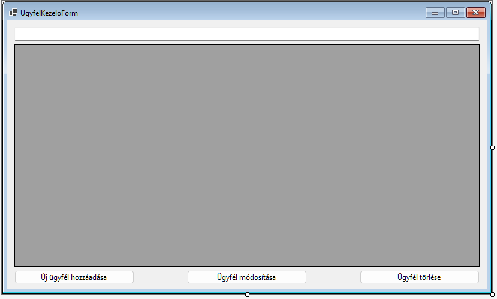
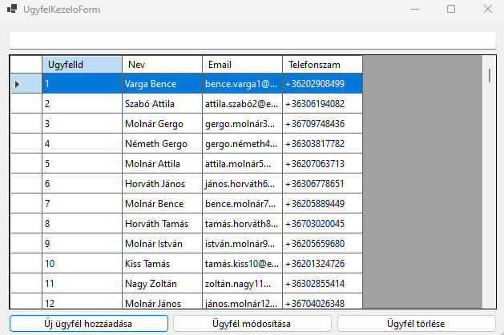
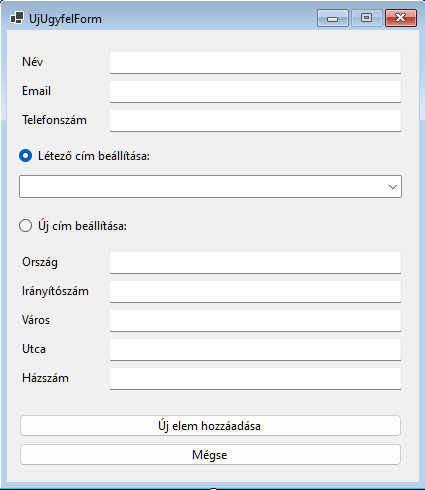

# Adatok validálása (Ügyfelek adatainak kezelése)

Ebben a fejezetben lépésről lépésre végigmegyünk azon, hogyan hozhatunk létre egy olyan felhasználói felületet, amely lehetővé teszi az ügyféladatok kezelését és validálását. A folyamat során megismerkedsz az adatkötés (data binding) alapjaival, a CRUD (Create, Read, Update, Delete) műveletek implementálásával, valamint az adatok validálásának módszereivel Windows Forms környezetben.

## 1. Az ügyféllistázó űrlap létrehozása

❶ Hozz létre egy új Windows Forms űrlapot `UgyfelListaForm` néven.

❷ Tervezd meg az űrlapot a következő vezérlőkkel:
- `DataGridView` az ügyfelek listázásához
- `TextBox` a kereséshez
- `Button` vezérlők az új ügyfél hozzáadásához, módosításához és törléséhez

A felületnek a következő képhez hasonlónak kell lennie. Gondoskodj róla, hogy az `UgyfelListaForm` megnyitható legyen a `Form1`-ről egy gomb hozzáadásával.



## 2. Adatkötés beállítása

❶ Hozz létre egy privát mezőt a `DbContext` példánynak:
```csharp
private RendelesDbContext _context;
private BindingList<Ugyfel> ugyfelBindingList;
```

❷ Inicializáld a `DbContext`-et az űrlap konstruktorában:
```csharp
public UgyfelListaForm()
{
    InitializeComponent();
    _context = new RendelesDbContext();
}
```

❸ Állítsd be az adatforrást a `DataGridView`-hoz a tervező nézetben:
- Kattints a `DataGridView` vezérlőre a tervező nézetben.
- A jobb felső sarokban megjelenő kis nyílra kattintva válaszd a "Choose Data Source" opciót.
- Az "Add Project Data Source" gombra kattintva hozz létre egy új BindingSource-ot a megjelenő ablakban az Ugyfel osztály kiválasztásával.

❹ Állítsd be az adatkötést a kódban:
```csharp
private void UgyfelListaForm_Load(object sender, EventArgs e)
{
    _context.Ugyfel.Load();
    ugyfelBindingList = _context.Ugyfel.Local.ToBindingList();
    ugyfelBindingSource.DataSource = ugyfelBindingList;
}
```

Ezzel megjelennek az ügyfelek adatai a táblázatban.



## 3. Keresés implementálása

Implementáld a keresőmező TextChanged eseménykezelőjét. A cél az, hogy a felhasználó által beírt szöveg alapján szűrjük az ügyfelek listáját. Ehhez a következő lépéseket érdemes követni:

- Használj LINQ lekérdezést SQL-szerű szintaxissal.
- A `where` záradékban vizsgáld meg, hogy a keresett szöveg szerepel-e az ügyfél nevében, email címében vagy telefonszámában. (`x.Nev.Contains(textBox.Text)`)
- Ügyelj arra, hogy a keresés ne legyen kis- és nagybetű érzékeny.
- Ne feledd, hogy a telefonszám lehet null értékű, ezt kezeld megfelelően. (`x.Telefonszam != null && x.Telefonszam.Contains(...)`)
- Az eredményt rendezd az ügyfelek azonosítója szerint növekvő sorrendben.
- A lekérdezés eredményét állítsd be a `ugyfelBindingSource` új adatforrásaként.

Segítségül:

``` csharp
string filterString = textBox1.Text.ToLower();
ugyfelBindingSource.DataSource = from u in ugyfelBindingList
                                    where u.Nev.ToLower().Contains(filterString) ||
                                    u.Email.ToLower().Contains(filterString) ||
                                    (u.Telefonszam != null && u.Telefonszam.Contains(filterString))
                                    orderby u.UgyfelId
                                    select u;
```

## 4. Az UgyfelSzerkesztesForm implementálása

#### 4.1 A űrlap felépítése

Hozz létre egy `UgyfelSzerkesztesForm nevű űrlapot, és helyezd el a következő vezérlőket:

- `TextBox`-ok a név, email és telefonszám megadásához
- `ComboBox` a meglévő címek kiválasztásához
- `RadioButton`-ok a meglévő cím választása és új cím megadása közötti váltáshoz
- `TextBox`-ok az új cím adatainak megadásához



#### 4.2 Implementáld az adatkötést az `UgyfelSzerkesztesForm`-on:
```csharp
public Ugyfel SzerkesztettÜgyfél {get;set;}

public UgyfelSzerkesztesForm(Ugyfel ugyfel)
{
    InitializeComponent();
    this.SzerkesztettÜgyfél = ugyfel;
    ugyfelBindingSource.DataSource = SzerkesztettÜgyfél;
}

public UgyfelSzerkesztesForm()
{
    InitializeComponent();
    this.SzerkesztettÜgyfél = new Ugyfel();
    ugyfelBindingSource.DataSource = SzerkesztettÜgyfél;
}
```

A konstruktornak két _túlterkelése_ (overload) van. A paraméter nélkülit majd akkur hívjuk, ha új ügyvelet szeretnénk létrehozni. Ha már meglévő ügyfelet akarunk szerkeszteni, paraméterként átadjuk a szerkesztendő ügyfélre mutató referenciát. 

#### 4.2b Alternatív megoldás az előző pontra

Feketeöveseknek :)

```csharp
public Ugyfel SzerkesztettÜgyfél {get;set;}

public UgyfelSzerkesztesForm(Ugyfel ugyfel = null)
{
    InitializeComponent();
    this.SzerkesztettÜgyfél = ugyfel ?? new Ugyfel();
    ugyfelBindingSource.DataSource = SzerkesztettÜgyfél;
}
```

Ez a konstruktor és az adatkötés beállítása több szempontból is előnyös:

1. Rugalmasság: A konstruktor paramétere opcionális (`Ugyfel ugyfel = null`), ami lehetővé teszi, hogy ugyanazt az űrlapot használjuk új ügyfél létrehozására és meglévő ügyfél szerkesztésére is.

2. Null-coalescing operátor használata: A `this.SzerkesztettÜgyfél = ugyfel ?? new Ugyfel();` sor biztosítja, hogy mindig legyen egy érvényes `Ugyfel` objektumunk. Ha `null`-t kap paraméterként (új ügyfél esetén), akkor egy új `Ugyfel` példányt hoz létre.

3. Közvetlen adatkötés: Az `ugyfelBindingSource.DataSource = SzerkesztettÜgyfél;` sor közvetlenül összeköti az űrlap vezérlőit az `Ugyfel` objektum tulajdonságaival. Ez automatikusan szinkronizálja a felhasználói felületet az adatokkal, mindkét irányban.

4.  Kód újrafelhasználhatóság: Ez a megközelítés lehetővé teszi, hogy ugyanazt az űrlapot és kódot használjuk mind az "Új ügyfél", mind az "Ügyfél szerkesztése" funkcióhoz, ami csökkenti a kód duplikációját és javítja a karbantarthatóságot.

   

#### 4.3 Szövegdobozok bekötése az `ugyfelBindingSource`-hoz

Kérj segítséget a gyakvezértől :)


#### 4.4 OK és Mégse gombok 

❶ A __Mégse__ gomb `DialogResult` tulajdonsága legyen `Cancel`, beállíthatod a _Properties_ ablakban.

❷ Az __Ok__ gombot egy kicsit trükkösebben oldjuk meg, ennek később lesz jelentősége, amikor hibás adatkitöltés esetén nem engedjük bezárni az ablakot:

```csharp
private void btnMentes_Click(object sender, EventArgs e)
{    
    ugyfelBindingSource.EndEdit();
    this.DialogResult = DialogResult.OK;
    this.Close();
}
```

Az  `ugyfelBindingSource.EndEdit();` sor különösen fontos, mert különben a szövegdobozokban végrehajtott változások nem frissülnek az adatforrásban.

Ezután készen állunk az új űrlap megnyitására szerkesztésre illetve új ügyfél hozzáadására!

## 5. CRUD műveletek implementálása

#### 5.1 Új ügyfél hozzáadása

Térjünk vissza az `UgyfelListaForm`-hoz!

❶ Implementáld az "Új ügyfél" gomb Click eseménykezelőjét:

```csharp
 private void buttonUjUgyfel_Click(object sender, EventArgs e)
 {
     UgyfelSzerkesztesForm ujUgyfelForm = new UgyfelSzerkesztesForm();
     if (ujUgyfelForm.ShowDialog() == DialogResult.OK)
     {
         ugyfelBindingList.Add(ujUgyfelForm.SzerkesztettÜgyfél);
         Mentés();
     }
 }
```

❷ Hozz létre egy `Mentés()` metódust a változások adatbázisba írásához:

```csharp
void Mentés()
{
    try
    {
        _context.SaveChanges();
    }
    catch (Exception ex)
    {
        MessageBox.Show(ex.Message);
    }
}
```

#### 5.2 Ügyfél módosítása

❸ Implementáld a "Módosítás" gomb Click eseménykezelőjét. A célod az, hogy lehetővé tedd egy kiválasztott ügyfél adatainak szerkesztését. Ehhez a következő lépéseket érdemes követni:

- Először ellenőrizd, hogy van-e kiválasztott ügyfél a `ugyfelBindingSource`-ban. (`BindingSource.Current`)
- Ha van, nyisd meg az `UgyfelSzerkesztesForm`-ot, és add át neki a kiválasztott ügyfél adatait.
- Ha a felhasználó az OK gombbal zárja be a szerkesztő űrlapot, mentsd el a változtatásokat a `Mentés()` metódus segítségével.
- Ha a felhasználó mégsem gombbal zárja be az űrlapot, gondoskodj róla, hogy az eredeti adatok visszaállításra kerüljenek. (`_context.Ugyfel.Load()`)

Tipp: Az `UgyfelSzerkesztesForm` konstruktorának átadhatsz egy `Ugyfel` objektumot paraméterként, így ugyanazt az űrlapot használhatod új ügyfél létrehozására és meglévő szerkesztésére is.

#### 5.3 Ügyfél törlése

❹ Implementáld a "Törlés" gomb Click eseménykezelőjét. A célod az, hogy lehetővé tedd egy kiválasztott ügyfél eltávolítását az adatbázisból. Ehhez a következő lépéseket érdemes követni:

- Először ellenőrizd, hogy van-e kiválasztott ügyfél a `ugyfelBindingSource`-ban.
- Ha van, fontold meg egy megerősítő üzenet megjelenítését a felhasználónak, hogy biztosan törölni szeretné-e az adott ügyfelet.
- Ha a felhasználó megerősíti a törlési szándékot, távolítsd el az ügyfelet a `ugyfelBindingSource`-ból.
- Végül hívd meg a `Mentés()` metódust, hogy a változások érvényesüljenek az adatbázisban is.

Tipp: A `BindingSource` osztály `RemoveCurrent()` metódusa hasznos lehet a kiválasztott elem eltávolításához.

## 6. Adatok validálása

Az ügyféladatok megfelelő kezelése érdekében fontos, hogy validáljuk a bevitt adatokat. Az `UgyfelSzerkesztesForm`-on a következő validációs követelményeket kell implementálnunk:

1. Név: 
   - Tartalmazhat kis- és nagybetűket, beleértve az ékezetes és egyéb Unicode karaktereket.
   - Tartalmazhat szóközöket (például többtagú neveknél).
   - Tartalmazhat aposztrófot (például O'Brien típusú neveknél).
   - Nem tartalmazhat számokat vagy egyéb speciális karaktereket.
   - Nem lehet üres.

2. Email: 
   - Érvényes email cím formátumnak kell lennie.
   - Tartalmaznia kell egy @ jelet, előtte és utána karakterekkel.
   - A @ jel után legalább egy pontnak kell lennie, ami nem közvetlenül a @ jel után áll.

3. Telefonszám: 
   - Magyar mobilszám formátumnak kell megfelelnie.
   - +36-tal kell kezdődnie.
   - Ezt követően 20, 30, 31, 50 vagy 70 előhívó egyikével kell folytatódnia.
   - Végül 7 számjegynek kell következnie.

Most nézzünk egy példát a név mező validációjának implementálására:

❶ Állítsd be a név TextBox Validating eseménykezelőjét:
```csharp
private void tbNev_Validating(object sender, CancelEventArgs e)
{
    Regex rgxNev = new Regex(@"^[\p{L} .'-]+$");

    if (!rgxNev.IsMatch(tbNev.Text))
    {
        errorProvider1.SetError(tbNev, "A név csak kis- és nagybetűket jeleníthet meg.");
        e.Cancel = true;
    }
    else
    {
        //Ha nincs hiba, eltüntetjük a hibaüzenetet
        errorProvider1.SetError(tbNev, "");
    }
}
```

Ez a kód a következőket teszi:
- `Regex` segítségével ellenőrizésre kerül a név helyessége
- Ha a név nem érvényes, hibaüzenetet jelenít meg az ErrorProvider segítségével, és megakadályozza a fókusz elhagyását (e.Cancel = true).
- Ha érvényes, törli az esetleges korábbi hibaüzenetet.

❷ Hasonló módon implementáld a validációt az email és telefonszám mezőkhöz is, a fent leírt követelmények alapján.

❸ Végül, a mentés gomb Click eseménykezelőjében ellenőrizd, hogy az űrlap érvényes-e:
```csharp
private void btnMentes_Click(object sender, EventArgs e)
{
    if (!this.ValidateChildren())
    {
        MessageBox.Show("Kérjük, javítsa a hibás mezőket!");
        return;
    }
    
    ugyfelBindingSource.EndEdit();
    this.DialogResult = DialogResult.OK;
    this.Close();
}
```

Ez a kód meghívja a `ValidateChildren()` metódust, ami elindítja az összes vezérlő validációját. Ha bármelyik validáció hibát jelez, a mentés nem történik meg, és a felhasználó értesítést kap.

❹ Segítség a többi reguláris kifejezéshez:

```csharp
 Regex rgxEmail = new Regex(@"^[^@\s]+@[^@\s]+\.[^@\s]+$", RegexOptions.IgnoreCase);
```

```csharp
 Regex rgxTelefonszam = new Regex(@"^\+36(?:20|30|31|50|70)(\d{7})$");
```


## 7. Házi feladat: Címek kezelésének implementálása

A címek kezelésének teljes implementálása házi feladatként szolgál. Íme a főbb lépések, amelyeket követned kell:

1. ComboBox feltöltése címadatokkal:
   - Az `UgyfelSzerkesztesForm` betöltésekor kérdezd le az összes címet az adatbázisból.
   - Töltsd fel a ComboBox-ot a lekérdezett címekkel.
   - Állítsd be a ComboBox DisplayMember és ValueMember tulajdonságait.

2. Új cím hozzáadásának kezelése:
   - Implementáld a RadioButton-ok CheckedChanged eseménykezelőit.
   - Ha az "Új cím" opciót választják, engedélyezd az új cím TextBox-ait.
   - Ha "Meglévő cím" opciót választják, engedélyezd a ComboBox-ot.

3. Cím mentésének kezelése:
   - A mentés gomb Click eseménykezelőjében ellenőrizd, hogy új címet adtak-e meg.
   - Ha új címet adtak meg, hozz létre egy új Cim objektumot, és mentsd el az adatbázisba.
   - Ha meglévő címet választottak, használd a kiválasztott cím ID-ját.

4. Validáció implementálása a címmezőkhöz:
   - Adj hozzá Validating eseménykezelőket az új cím TextBox-aihoz.
   - Ellenőrizd, hogy a kötelező mezők ki vannak-e töltve.
   - Használj reguláris kifejezéseket az irányítószám és egyéb mezők ellenőrzéséhez.

Ezekkel a lépésekkel egy komplex, adatkötést használó, validációval ellátott ügyfélkezelő rendszert hoztál létre. A házi feladat segít elmélyíteni a tanultakat és gyakorolni az összetettebb adatkezelési feladatokat. Ne feledd, hogy a valós alkalmazásokban még több hibakezelésre és felhasználói visszajelzésre lehet szükség!
