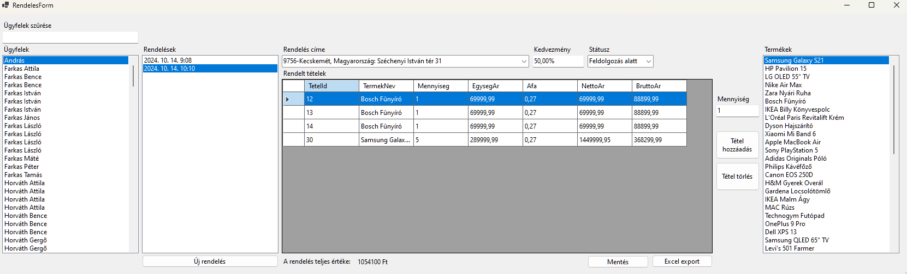
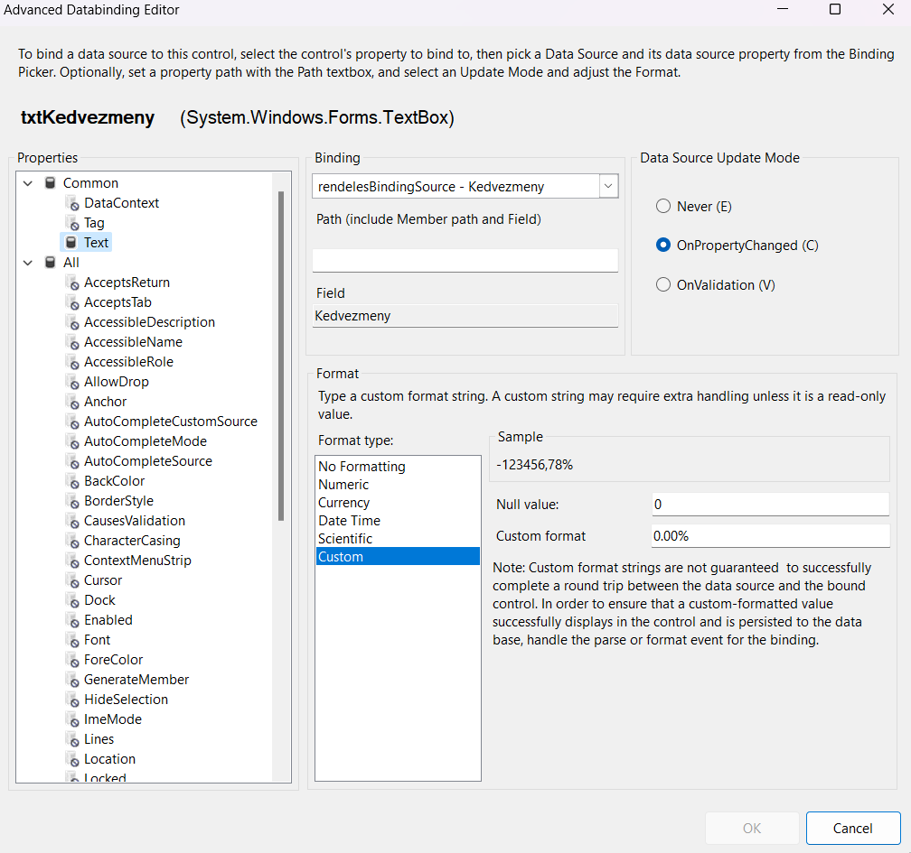

# 2.5 Rendeléskezelés (Rendeles és Rendeles_tetel táblák kezelése)

Ebben a fejezetben egy komplex rendeléskezelő felületet fogunk létrehozni, amely lehetővé teszi a felhasználók számára a rendelések kezelését, beleértve az ügyfelek kiválasztását, rendelések létrehozását, tételek hozzáadását és a rendelések módosítását. Ez a feladat kiváló lehetőséget nyújt arra, hogy az eddig tanult ismereteket egy összetettebb alkalmazásban használjuk fel.

## 1. A RendelesForm létrehozása és felépítése

❶ Első lépésként hozzuk létre a rendeléskezelő űrlapunkat:

1. A Visual Studio _Solution Explorer_-ében kattints jobb gombbal a projektre, majd válaszd az "**Add**" > "**New Item**" menüpontot.
2. A megjelenő ablakban válaszd a "**Windows Form**" opciót, és nevezd el "**RendelesForm**"-nak.
3. Kattints az "**Add**" gombra.

❷ Most, hogy létrehoztuk az új űrlapot, adjuk hozzá a szükséges vezérlőelemeket. A rendeléskezelő felületünk a következő főbb részekből fog állni:

- Ügyfél kiválasztása és szűrése
- Rendelések listázása
- Rendelés részleteinek megjelenítése és szerkesztése
- Termékek listázása és hozzáadása a rendeléshez

Helyezd el a következő vezérlőelemeket az űrlapon:

- 3 db `ListBox`: ügyfelek, rendelések és termékek listázásához
- 1 db `TextBox`: ügyfelek szűréséhez
- 1 db `DataGridView`: rendeléstételek megjelenítéséhez
- `ComboBox`-ok: szállítási cím és rendelés státuszának kiválasztásához
- `TextBox`-ok: kedvezmény és mennyiség megadásához
- Gombok: új rendelés létrehozásához, tétel hozzáadásához, törléshez, mentéshez

Az űrlap tervezett kinézete valahogy így nézhet ki:



## 2. Adatbázis kapcsolat létrehozása

A rendeléskezelő űrlapunknak szüksége lesz az adatbázishoz való kapcsolódásra. Ehhez használjuk az Entity Framework Core által generált `RendelesDbContext` osztályt.

❶ Adj hozzá egy privát mezőt az osztályodhoz a `DbContext` példány tárolására, majd példányosítsd a konstruktorban.

```csharp
public partial class RendelesForm : Form
{
    private readonly RendelesDbContext _context;

    public RendelesForm()
    {
        InitializeComponent();
        _context = new RendelesDbContext();
    }

    // ... további kód ...
}
```

## 3. Ügyfelek, címek és termékek listázása

Kezdjük az ügyfelek listázásával! Most, hogy van adatbázis kapcsolatunk, töltsük fel a listáinkat adatokkal. 

### 3.1 Ügyfelek listázása és szűrése

❶ Hozzunk létre egy `BindingSource`-ot az ügyfelekhez. Ezt a legegyszerűbben a tervező nézetben tehetjük meg a `ListBox` vezérlő jobb felső sarkában található háromszögre való kattintással, majd az `Ugyfel` osztály kiválasztásával. Állítsd be a következőket:
- `DataSource`: az imént létrehozott `ugyfelBindingSource`
- `DisplayMember`: "Nev"
- `ValueMember`: "UgyfelId"

❷ Implementáld az ügyfelek betöltését és szűrését a megfelelő `TextBox` tartalma alapján a `LoadUgyfelek()` metódus létrehozásával. A metódus fusson le a `Form` betöltését követően is, valamint akkor is, amikor a `TextBox` tartalma változik. Az ügyfelek legyenek nevük szerint sorrendbe rendezve. A szűrés név és e-mail cím alapján történjen.

```csharp
private void RendelesForm_Load(object sender, EventArgs e)
{
    LoadUgyfelek();
}

private void txtSzuro_TextChanged(object sender, EventArgs e)
{
    LoadUgyfelek();
}

private void LoadUgyfelek()
{
    var q = from x in _context.Ugyfel
            where x.Nev.Contains(txtSzuro.Text) || x.Email.Contains(txtSzuro.Text)
            orderby x.Nev
            select x;

    ugyfelBindingSource.DataSource = q.ToList();

    ugyfelBindingSource.ResetCurrentItem();
}
```

A `ResetCurrentItem()` metódus hívása fontos, mert ez biztosítja, hogy a felhasználói felület frissüljön, ha az adatforrás megváltozik. Ez különösen akkor hasznos, ha a kiválasztott ügyfél alapján szeretnénk további vezérlőket (például a rendelések dátumát tartalmazó `ListBox`-ot) frissíteni.

### 3.2 Termékek listázása

❸ Töltsd be a termékeket megjelenítő `ListBox`-ot az ügyfelekhez hasonló módon a következők figyelembevételével:
- `DataSource`: `termekBindingSource`
- `DisplayMember`: "Nev"
- `ValueMember`: "TermekId"

### 3.3 Címek listázása

❹ Töltsd fel a címeket tartalmazó `ComboBox`-ot. Figyelj arra, hogy a cím egyes komponensei (irányítószám, településnév, utca, házszám stb.) összefűzve jelenjenek meg a `ComboBox` vezérlőben. 

Az adatbázisban a cím több mezőre bontva szerepel, a `ComboBox` viszont rekordonként csak egy mező megjelenítésére képes. Sajnos olyan osztályunk, amely tulajdonságai között tartalmazza a teljes címet is, nincs.  Ez önmagában nem lenne baj, de ha adatkötést is szeretnénk használni, a tervezőben meg kell adni, hogy milyen lesz az adatkötött gyűjtemény adattípusa. Ezen a legegyszerűbben úgy lehet segíteni, ha egy un. DTO-t (Data Transfer Object) hozol létre. Az osztályt ne a `Form` osztályában hozd létre, hanem vele egy szinten, vagy ha igazán szépen szeretnéd, külön fájlban:

```csharp
public partial class RendelesForm : Form
{
    // ...
}

public class CimEgybenDTO
{
    public int CimId { get; set; }
    public string? CimEgyben { get; set; }
}
```

Fontos: az _access modifier_ legyen `public`, az osztály sablon alapértelmezett `internal` modifier-e nem jó, az ilyen osztályok nem jelennek meg az adatköthető vezérlők listájában. 

Miután a DTO osztályt elkészítetted, hozd létre a `LoadCimek()` metódust, amiben a következő LINQ-t segítségével töltsd fel a `ComboBox` tartalmát a lekérdezés eredményével:

```csharp
var q = from x in _context.Cim
        select new CimEgybenDTO
        {
            CimId = x.CimId,
            CimEgyben = $"{x.Iranyitoszam}-{x.Varos}, {x.Orszag}: {x.Utca} {x.Hazszam}"
        };

// ToDo: query ToList() meghívása és az eredmény bekötése a létrehozandó BindingSource-ba (cimEgybenDTOBindingSource)
```

Fontos: a `select new CimEgybenDTO {...}`  `CimEgybenDTO` típusú elemekből álló gyűjteményt hoz létre.

&#10106; Valósítsd meg az adatkötést! Ügyeljünk arra, hogy a `ComboBox`-ban a `CimEgyben` mező jelenjen meg, az értékmező pedig a `CimId` legyen.

## 4. Rendelések betöltése

### 4.1 Rendelések ListBox beállítása

❶ Állítsd be a rendeléseket megjelenítő ListBox tulajdonságait a tervező nézetben:

1. Nevezzük el `lbRendeles`-nek.
2. A `DataSource` tulajdonságot állítsd be egy új BindingSource-ra (`rendelesBindingSource`).
3. Állítsd be a `DisplayMember` tulajdonságot "RendelesDatum"-ra. Ez fogja biztosítani, hogy a rendelés dátuma jelenjen meg a listában.
4. A `ValueMember` tulajdonságot állítsd "RendelesId"-re.

### 4.2 Rendelések betöltése a kiválasztott ügyfélhez

❷ Hozd létre a `LoadRendelesek()` metódust a `RendelesForm` osztályban és valósítsd meg a következő lépéseket:
1. Ellenőrzi, hogy van-e kiválasztott ügyfél.
1. Töröljük a `DataGridView` adatforrását.
2. Ha van, lekérdezi az adott ügyfélhez tartozó rendeléseket.
3. Beállítja a `rendelesBindingSource` adatforrását a lekérdezett rendelésekre.
4. Frissíti a `lbRendeles` ListBox adatforrását.
5. Ha vannak rendelések, kiválasztja az elsőt.
6. Végül meghívja a `ResetCurrentItem()` metódust, hogy frissítse a felhasználói felületet.

Segítség:
```csharp
private void LoadRendelesek()
{
    // 1. Ha lbUgyfelek kiválasztott eleme null, akkor return.
    if (ugyfelBindingSource.Current == null) return;

    // 2. Töröljük a DataGridView adatforrását. (null értéket állítunk be az adatforrásának)
    dgvTetelek.DataSource = null;

    // 3. lbUgyfelben kiválasztott ügyfélhez tartozó rendeléseket leszűrjük LINQ segítségével
    var rendeles = from x in _context.Rendeles
               where x.UgyfelId == ((Ugyfel)ugyfelBindingSource.Current).UgyfelId
               select x;

    // 4. rendelesBindingSource adatforrásának beállítjuk az eredményt listáját
    rendelesBindingSource.DataSource = rendeles.ToList();

    // 5. újra bekötjük az lbRendeles adatforrását
    lbRendeles.DataSource = rendelesBindingSource;

    // 6. Ha vannak rendelések, akkor kiválasztjuk az elsőt.
    if (lbRendeles.Items.Count > 0)
    {
        lbRendeles.SelectedIndex = 0;
    }

    // meghívjuk a ResetCurrentItem() metódusát a releváns bindingsourcenak.
    rendelesBindingSource.ResetCurrentItem();
}
```

### 4.3 Ügyfél kiválasztásának kezelése

❸ Adj hozzá egy eseménykezelőt az ügyfelek `ListBox`-ához, hogy amikor egy új ügyfelet választanak ki, betöltődjenek a hozzá tartozó rendelések:

```csharp
private void lbUgyfelek_SelectedIndexChanged(object sender, EventArgs e)
{
    LoadRendelesek();
}
```

## 5. Rendeléstételek betöltése DataGridView-ba

### 5.1 DTO objektum létrehozása

Mielőtt a rendeléstételeket betöltenénk a DataGridView-ba, hozzunk létre egy újabb DTO (Data Transfer Object) osztályt. Az a célunk, hogy a `Rendeles` osztály egyik idegenkulcs mezőjét (Termék) lecseréljük és a termék ID-ja helyett annak neve jelenjen meg.

❶ Hozz létre egy új osztályt `RendelesTetelDTO` néven a `RendelesForm.cs` fájl végén:

```csharp
public class RendelesTetelDTO
{
    public int TetelId { get; set; }
    public string? TermekNev { get; set; }
    public int Mennyiseg { get; set; }
    public decimal EgysegAr { get; set; }
    public decimal Afa { get; set; }
    public decimal NettoAr { get; set; }
    public decimal BruttoAr { get; set; }
}
```

### 5.2 Rendeléstételek betöltése

❷ Implementáld a rendeléstételek betöltését. Add hozzá a következő új metódust a `RendelesForm` osztályhoz:

```csharp
private void LoadRendelesTetel()
{
    if (rendelesBindingSource.Current == null) return;

    var q = from rt in _context.RendelesTetel
            where rt.RendelesId == ((Rendeles)rendelesBindingSource.Current).RendelesId
            select new RendelesTetelDTO
            {
                TetelId = rt.TetelId,
                TermekNev = rt.Termek.Nev,
                Mennyiseg = rt.Mennyiseg,
                EgysegAr = rt.EgysegAr,
                Afa = rt.Afa,
                NettoAr = rt.NettoAr,
                BruttoAr = rt.BruttoAr
            };

    dgvTetelek.DataSource = q.ToList();
    // UpdateVegosszeg(); ez egyelőre maradjon kommentelve, később implementáljuk
}
```

Ez a metódus a következőket teszi:

1. Ellenőrzi, hogy van-e kiválasztott rendelés.
2. Ha van, lekérdezi az adott rendeléshez tartozó tételeket -- az eredmény `RendelesTetelDTO` típusú elemekből álló gyűjtemény.
3. Beállítja a DataGridView adatforrását a lekérdezett tételekre.

Fontos: itt most nem használunk `BindingSource`-ot, közvetlenül a `DataGridView` adatforrásába kötjük a LINQ eredményét. 
Az `UpdateVegosszeg()` metódust később implementáljuk, addig hagyjuk a meghívását kikommentelve.

### 5.3 DataGridView beállítása

❸ Állítsd be a DataGridView tulajdonságait, hogy megfeleljen az igényeinknek:
- `AllowUserToAddRows`: False
- `AllowUserToDeleteRows`: False
- `ReadOnly`: True
- `SelectionMode`: FullRowSelect

Ezek a beállítások megakadályozzák, hogy a felhasználó közvetlenül szerkessze a DataGridView tartalmát, és biztosítják, hogy egy egész sort lehessen kiválasztani.

### 5.4 Rendelés kiválasztásának kezelése

❹ Most hozzá kell adnunk egy eseménykezelőt a rendelések ListBox-ához, hogy amikor egy új rendelést választanak ki, betöltődjenek a hozzá tartozó tételek:

```csharp
private void lbRendeles_SelectedIndexChanged(object sender, EventArgs e)
{
    LoadRendelesTetel();
}
```

## 6. Rendelés részleteinek adatkötése

### 6.1 Rendelés címének adatkötése

❶ A rendelés címét már korábban beállítottuk, de most kössük össze a kiválasztott rendeléssel:

1. Válaszd ki a `cbCimek` ComboBox-ot a Form Designer-ben.
2. A Properties ablakban keresd meg a `DataBindings` tulajdonságot.
3. Kattints a "..." gombra a `DataBindings` mellett.
4. Az `SelectedValue` sorban válaszd ki a `rendelesBindingSource`-t, majd a `SzallitasiCimId` tulajdonságot.
5. Az `UpdateMode`-ot állítsd `OnPropertyChanged`-re.

### 6.2 Kedvezmény mértékének adatkötése

Az a célunk, hogy az értékek %-osan jelenjenek meg, azonban a kedvezmények mértéke az adatábizsban törtként, 0-1 közötti számként tároljuk ezt az értéket. 

❷ A kedvezmény `TextBox` vezérlőjét kijelölve, a *Properties* ablakban nyissuk meg a *(DataBindings)* mezőn (legfelül) belül található *(Advanced)* mezőt, majd a mellette jobbra található [...] gombra kattintsunk. Állítsuk be az alábbi képen szereplő mezők szerint az adatkötést.



### 6.3 Státusz adatkötése

❸ A státusz ComboBox-ot a következőképpen állítsd be:

1. Válaszd ki a `cbStatusz` ComboBox-ot a Form Designer-ben.
2. A Properties ablakban állítsd be az `Items` tulajdonságot a következő értékekkel:
   - "Feldolgozás alatt"
   - "Szállítás"
   - "Kiszállítva"
   - "Törölve"
3. A fentihez hasonló módon a `DataBindings` tulajdonságnál add hozzá a `Text` tulajdonságot a `rendelesBindingSource`-hoz, és kösd a `Statusz` mezőhöz.
4. Az `UpdateMode`-ot állítsd `OnPropertyChanged`-re.

## 7. Új rendelés hozzáadása

Most implementáljuk az új rendelés hozzáadását. Ehhez egy új gombot fogunk használni, amit nevezzünk el `btnUjRendeles`-nek.

### 7.1 Új rendelés gomb eseménykezelőjének implementálása

❶ Valósítsd meg a következőket:

1. Ellenőrizd, hogy van-e kiválasztott ügyfél.
2. Hozz létre egy új `Rendeles` objektumot az aktuális dátummal és alapértelmezett értékekkel.
3. Add hozzá az új rendelést az adatbázishoz.
4. Frissítsd a rendelések listáját és válaszd ki az új rendelést.
5. Hozz létre egy `Mentés()` metódust, amellyel `try-catch` blokk segítségével elmentheted az adatbázisba a változtatásokat.

```csharp
private void btnUjRendeles_Click(object sender, EventArgs e)
{
    if (ugyfelBindingSource.Current == null)
    {
        return;
    }

    // Ha van beállítva az ügyfélhez alapértelmezett lakcím, akkor azt adja vissza, egyéb esetben a címek közül a legelsőt.
    var cim = ((Ugyfel)ugyfelBindingSource.Current).Lakcim ?? _context.Cim.FirstOrDefault();

    if (cim == null)
    {
        MessageBox.Show("Nincs cím megadva.");
        return;
    }

    var ujRendeles = new Rendeles()
    {
        UgyfelId = ((Ugyfel)ugyfelBindingSource.Current).UgyfelId,
        SzallitasiCimId = cim.CimId,
        RendelesDatum = DateTime.Now,
        Kedvezmeny = 0,
        Vegosszeg = 0,
        Statusz = "Feldolgozás alatt"
    };

    _context.Rendeles.Add(ujRendeles);
    Mentés();

    lblRendelesLabel.Text = $"A rendelés teljes értéke: {ujRendeles.Vegosszeg} Ft";

    LoadRendelesek();

    lbRendeles.SelectedItem = ujRendeles;
}

private void Mentés()
{
    try
    {
        _context.SaveChanges();
    }
    catch (Exception ex)
    {
        MessageBox.Show(ex.Message);
    }
}
```

## 8. Tétel hozzáadása, törlése és végösszeg számítása

### 8.1 Új tétel hozzáadása

❶ Először implementáljuk az új tétel hozzáadását. Ehhez hozzunk létre egy új gombot `btnHozzaad` néven, és implementáljuk az eseménykezelőjét:

1. Ellenőrizzük, hogy érvényes-e a megadott mennyiség. (nem negatív)
2. Ellenőrizzük, hogy ki van-e választva rendelés és termék.
3. Hozzunk létre egy új `RendelesTetel` objektumot a megadott adatokkal.
4. Adjuk hozzá az új tételt az adatbázishoz és mentsük a változásokat.
5. Frissítsük a tételek listáját és a végösszeget. (utóbbi egyelőre kommentelve)

Az ÁFA értékét érdemes adatbázisban tárolni, azonban a projektben konstansként definiáljuk a `RendelesForm` osztály mezőjeként. A konstansok változójának nevét jellemzően csupa nagybetűvel írjuk. Típusa `decimal`. A megadott érték `0.27m`, amelynek végén található `m` a decimális típusra utal.

```csharp
private const decimal AFA = .27m;

private void btnHozzaad_Click(object sender, EventArgs e)
{
    if (!int.TryParse(txtMennyiseg.Text, out int mennyiseg) || mennyiseg <= 0)
    {
        MessageBox.Show("Rossz mennyiség!");
        return;
    }

    if (rendelesBindingSource.Current == null || termekBindingSource.Current == null)
    {
        MessageBox.Show("Nincs kiválasztva rendelés vagy termék!");
        return;
    }

    var kivalasztottTermek = (Termek)termekBindingSource.Current;

    decimal bruttoAr = kivalasztottTermek.AktualisAr * (1 + AFA);

    var ujTetel = new RendelesTetel
    {
        RendelesId = ((Rendeles)rendelesBindingSource.Current).RendelesId,
        TermekId = kivalasztottTermek.TermekId,
        Mennyiseg = mennyiseg,
        EgysegAr = kivalasztottTermek.AktualisAr,
        Afa = AFA,
        NettoAr = kivalasztottTermek.AktualisAr * mennyiseg,
        BruttoAr = bruttoAr
    };

    _context.RendelesTetel.Add(ujTetel);
    Mentés();

    LoadRendelesTetel();
}
```

### 8.2 Tétel törlése

❷ Most implementáljuk a tétel törlését. Rendeljünk a `btnTorol` gombhoz eseménykezelőt:

```csharp
private void btnTorol_Click(object sender, EventArgs e)
{
    if (dgvTetelek.SelectedRows.Count == 0)
    {
        MessageBox.Show("Nincs kiválasztva tétel!");
        return;
    }

    var selectedTetel = dgvTetelek.SelectedRows[0].DataBoundItem as RendelesTetelDTO;

    var tetel = (from rt in _context.RendelesTetel
                 where rt.TetelId == selectedTetel!.TetelId
                 select rt).FirstOrDefault();

    if (tetel != null)
    {
        _context.RendelesTetel.Remove(tetel);
        Mentés();

        LoadRendelesTetel();
    }
}
```

Ez a kód a következőket teszi:
1. Ellenőrzi, hogy ki van-e választva tétel a DataGridView-ban.
2. Megkeresi a kiválasztott tételt az adatbázisban.
3. Ha megtalálta, törli a tételt és menti a változásokat.
4. Frissíti a tételek listáját és a végösszeget.

### 8.3 Végösszeg számítása

❸ Most implementáljuk a végösszeg számítását. Hozzunk létre egy új metódust `UpdateVegosszeg` néven:

```csharp
private void UpdateVegosszeg()
{
    if (rendelesBindingSource.Current == null) return;

    var kivalasztottRendeles = (Rendeles)rendelesBindingSource.Current;

    var vegosszeg = _context.RendelesTetel
        .Where(rt => rt.RendelesId == kivalasztottRendeles.RendelesId)
        .Sum(rt => rt.Mennyiseg * rt.BruttoAr);

    kivalasztottRendeles.Vegosszeg = vegosszeg * (1 - kivalasztottRendeles.Kedvezmeny);

    Mentés();

    rendelesBindingSource.ResetBindings(false);
}
```

Ez a metódus a következőket teszi:
1. Ellenőrzi, hogy ki van-e választva rendelés.
2. Kiszámolja a rendelés tételeinek összértékét.
3. Alkalmazza a kedvezményt a végösszegre.
4. Menti a változásokat az adatbázisba.
5. Frissíti a felhasználói felületet.

# Összefoglalás

Ebben a fejezetben egy komplex rendeléskezelő alkalmazás fejlesztésének folyamatát mutattuk be Windows Forms és Entity Framework Core használatával. Az alkalmazás lehetővé teszi a felhasználók számára az ügyfelek, rendelések és rendeléstételek kezelését egy intuitív grafikus felületen keresztül.

A fejlesztés során a következő főbb funkciókat valósítottuk meg:

1. Adatbázis kapcsolat létrehozása és kezelése Entity Framework Core segítségével
2. Ügyfelek listázása és szűrése
3. Rendelések megjelenítése és kezelése a kiválasztott ügyfélhez
4. Rendeléstételek kezelése DataGridView segítségével
5. Új rendelés létrehozása
6. Tételek hozzáadása és törlése a rendelésekhez
7. Rendelés részleteinek (cím, kedvezmény, státusz) adatkötése és szerkesztése
8. Végösszeg dinamikus számítása a tételek és a kedvezmény alapján
9. Mentés funkció implementálása változáskövetéssel

Az alkalmazás fejlesztése során számos fontos koncepciót és technikát alkalmaztunk, többek között:

- Data Transfer Object (DTO) használata az adatok biztonságos és hatékony kezelésére
- Adatkötés (data binding) a felhasználói felület és az adatmodell összekapcsolására
- LINQ lekérdezések az adatok hatékony szűrésére és rendezésére
- Eseményvezérelt programozás a felhasználói interakciók kezelésére
- Hibakezelés és felhasználói visszajelzések a megbízható működés érdekében

Ez a projekt kiváló példa arra, hogyan lehet egy összetett üzleti folyamatot (rendeléskezelés) leképezni egy felhasználóbarát szoftveralkalmazásra. A fejlesztés során szem előtt tartottuk a kód újrafelhasználhatóságát, a moduláris felépítést és a megfelelő szintű absztrakciót.

Az alkalmazás további fejlesztési lehetőségeket is rejt magában, például:

- Részletesebb riportok és statisztikák generálása
- Fejlettebb keresési és szűrési lehetőségek implementálása
- Termékkezelés funkciók hozzáadása
- Felhasználói jogosultságok kezelése
- Adatok exportálása különböző formátumokba (pl. Excel)

Ez a projekt kiváló alapot nyújt a Windows Forms alkalmazásfejlesztés és az adatbázis-kezelés gyakorlati elsajátításához, valamint jó kiindulópont lehet további, összetettebb üzleti alkalmazások fejlesztéséhez.