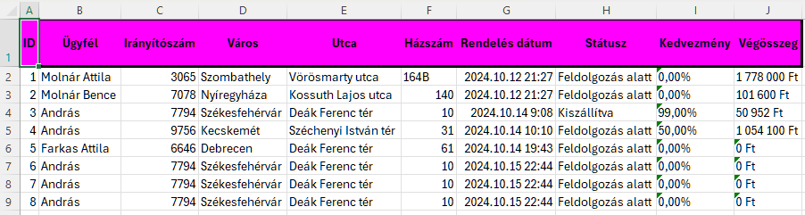
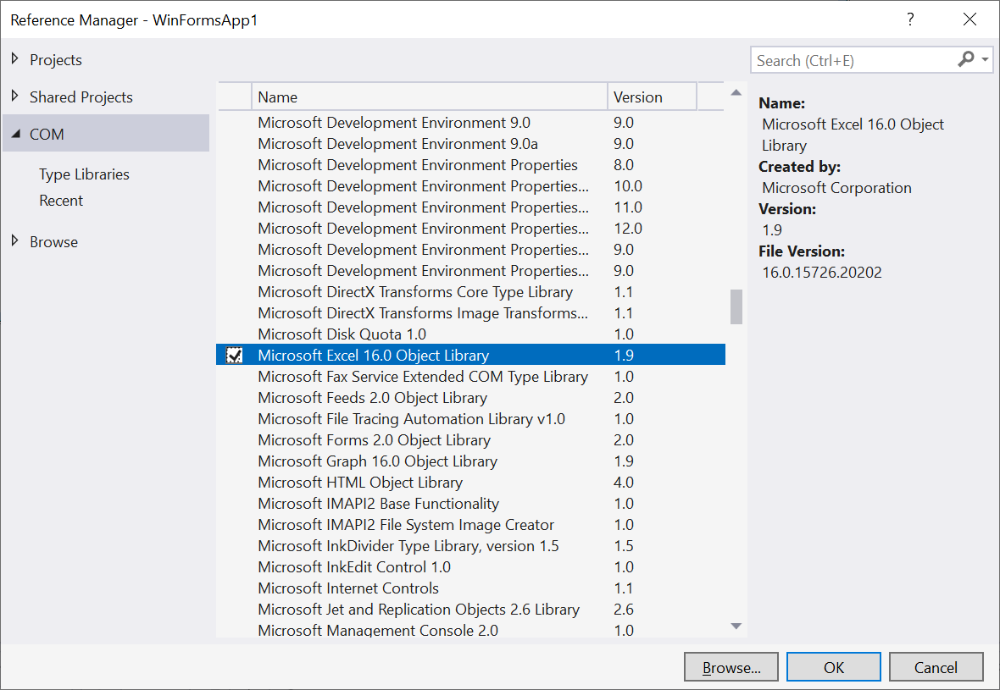

# Excel állomány generálása programból
## Gyakorlat célja
A vállalkozásokban gyakran felmerül az adatbázis adatok exportálásának igénye. A hagyományos csv kimenet viszont önmagában nehezen olvasható, elsősorban adatmentésre való. A Microsoft Excel viszont lehetőséget ad az adatok formázására, átláthatóbbá tételére, és a képletek segítségével a dinamikus számítások megvalósítására is. Ráadásul a felhasználók az Excel eszközökkel könnyen további műveleteket végezhetnek az adatokon. Ennek a gyakorlatnak a célja egy adattábla tartalmának exportálása egy formázott és részben dinamikus Excel fájlba.

## Háttérinformáció
Az ODF (Open Document Format) formátum (eredetileg: OASIS Open Document Format for Office Applications) egy nyílt formátumú _de facto_ formátum irodai programcsomagok dokumentumai számára. 2005 májusában jelent meg a szabvány, és már ugyanazon évben ez lett az OpenOffice.org 2.0 alapértelemzett formátuma.

A Microsoft Office programcsomag 2007-ig az eredeti OLE CF (Object Linking and Embedding Compound File) formátumát használta. Ez a komplex fájlstruktúra, és annak kiemelkedő előnyei tették annak idején az Office programcsomagot vezető irodai szoftverré.

Az eredeti office formátum egyik komoly újítása volt például a [gyors mentés][2] funkció. A kezdetekben jelentős erőforrásokat emésztett fel a nagyobb dokumentumok mentése a merevlemezre, ezért a Microsoft azt találta ki, hogy a verziókövetéshez hasonlóan csak deltákat (változásokat) tárol el a fájlban. A változások úgy 10-15 mentésig tárolódtak az egyedi tartalmak mellett, és ha elég sok gyűlt össze, akkor a következő mentésnél ténylegesen elmentődött az aktuális állapot. Ezzel néhány pillantra tudták gyorsítani az egyébként több másodperce mentési procedúrát. A megoldásban rejlő biztonsági kockázat miatt azonban 2003-ban megszűntették ezt a funkciót.

A Microsoft Office fájlformátumok nagy újítása 2007-ben történt meg. Ekkor jelentek meg a korábbi formátum megtartása mellet az új **x** végződésű (pl.: docx, xlsx) fájlkiterjsztések, melyek már ODF formátumon alapulnak. Az alap ODF formátum lényege, hogy valójában egy olyan tömörített (zip) állományt rejt el a felhasználó elől, amiben egy komplett fájlstruktúra található.

> Egy sima ODF formátumú fájl kiterjesztését átírva zip-re, megtekinthető a "mappa" tartalma. A kezdeti időkben ezzel a trükkel a fájlok jelszóvédelmét megkerülve így ki lehetett nyerni például a dokumentumban található ábrákat.

A Microsoft formátuma kibővíti az alap ODF fájlstruktúrát. Új mappákat és funkciókat vezet be, hogy az Office programcsomag egyedi megoldásait is elérhetővé tegye. A formátumokból adódóan egy Microsoft Office fájl viszonylag könnyen konvertálható ODF formátumra, a fordított irány viszont már nem triviális.

Ezek fényében alapvetően három féle megközelítés létezik a Microsoft Office, és ezen belül az Excel állományok kódból történő létrehozására:

* **Microsoft Excel Object Library**
Ez a legegyszerűbb megoldás, ezért fogjuk ezt alkalmazni a jelenlegi gyakorlaton. Ez a fejlesztő könyvtár csak a Microsoft Office programcsomag telepítése után érhető el a gépen, de ebből következően bármilyen Excel funkcionalitást könnyedén megvalósít. Az egyik legnagyobb hátránya, hogy viszonylag lassú, és nem alkalmas arra, ha több száz fájlt szeretnénk kigenerálni nagyobb adathalmazokból. Egy egyszerű jelentés elkészítésére azonban tökéletesen megfelel.

* **OLEDB**
Az eredeti Office formátumot alapul véve felépíthetők az új típusú Excel fájlok is. Ennek a formátumnak egyszerűbb a struktúrája, ezért nem igényel Office telepítést, nagyságrendekkel gyorsabb, de a pontos funckiók hiányában nem lehet vele formázni vagy a beépített Excel függvényeket használni.

* **ODF feldolgozás**
  Az ODF formátum megvalósításához sem kell Office telepítés. Ez a megközelítés is rendkívül gyors, hiszen lényegében egy **zip** fájl kibontását és **xml** tartalmak feldolgozását jelenti, de történeti okokból nem tud **xls** fájlokat kezelni.
  A tényleges kód megfelelő felépítése azonban nem triviális. Elvileg minden teljesítmény javító Excel mutatót is ki kell generálni hozzá. A formátum szerencsére enélkül is működik, mert az első megnyitás alkalmával az Excel kiegészíti a helyesen felépített, de hiányos formátumot. (Ezért fordul elő gyakran, hogy egy ilyen módon generált fájl első megnyitása után az Excel azt jelzi, hogy módosítások történtek.)

## A feladat leírása

**Bemenő adatok**

A `Rendeles` tábla adatait fogjuk alapul venni.

**Kimenet**

Formázott Excel táblázat, mely tartalmazza a bemeneti adattábla adatait.

A megoldás menete vázlatosan:
* Adatok letöltése az adatbázisból
* Excel Object Library behivatkozása a projektbe
* Excel, munkafüzet és munkalap megnyitása
* Adatok kiírása az Excel munkalapra
* Munkalap formázása



### Excel export osztály készítése

> A korábban használt projektben folytatjuk a munkát.

❶ Hozz létre egy új osztályt (Projekten jobb egér / Add / Class ) `ExcelExport` néven. A továbbiakban ebben az osztályban fogunk dolgozni.

### Excel eszközök behivatkozása

A Visual Studio több ezer előre megírt könyvtárral rendelkezik.
Ha mindegyiket lehivatkoznánk, akkor az automata kódkiegészítőben az összes létező osztály megjelenne.
Rettentően lelassulna, és nehezen lehetne megtalálni benne a szükséges elemeket.
Ezért a projektekben csak a szükséges könyvtárak vannak hivatkozva.
Az Excel moduljait viszonylag ritkán használják a programok, ezért külön be kell hivatkozni.

❷ Add hozzá az `Excel` objektumok könyvtárát a projektedhez
1. `Project` menü
2. `Add COM Reference`
3. Jelöld ki a legújabb verziójú `Microsoft Excel x.0 Object Library-t` majd hagyd jóvá a választást



Az Excel objektum könyvtár már része a projektnek, de még az aktuális fájlba is be kell hivatkozni a `using` kulcsszó segítségével.

❸ Add hozzá a `ExcelExport` osztályhoz a következő könyvtárak hivatkozásait.

```csharp
using Excel = Microsoft.Office.Interop.Excel;
using System.Reflection;
```

A using parancsban az `Excel =` egy úgynevezett __alias__. Erre azért van szükség, mert az Excel objektum könyvtár tartalmaz olyan osztályokat melyek már alapból szerepelnek a projektben. Egy ilyen például az `Application` osztály. Az alias nélkül a Visual Studio nem tudná eldönteni melyikre hivatkozik a kód. Az alias beállítása után az adott könyvtár nevével lehet hivatkozni az osztályra (pl.: `Excel.Application`), míg az alias nélküli megnevezés változatlanul az eredeti osztályra hivatkozik. 

A `System.Reflection` pedig egy technikai könyvtár. A `Missing.Value` enumeráció értékek miatt van rá szükség.  Az `Excel Object Library`-ban lehetőség van `Missing.Value`-t átadni az egyes függvény paraméterekben, ezzel jelezve a függvény számára, hogy ott megfelel nekünk az alapértelmezett beállítás.

### Excel munkafüzet létrehozása és megnyitása
❶ Hozd létre a következő üres változókat a `ExcelExport` osztály szintjén:
```csharp
public class ExcelExport
{
    Excel.Application xlApp; // A Microsoft Excel alkalmazás
    Excel.Workbook xlWB;     // A létrehozott munkafüzet
    Excel.Worksheet xlRendelesSheet; // Munkalap a munkafüzeten belül
}
```

❷ Hozz létre egy publikus metódust `CreateExcel` néven. A metódusnak nincs visszatérési értéke. `CreateTable()` egyelőre kommentelhető, következő lépésben implementáljuk.
```csharp
try
{
    // Excel elindítása és az applikáció objektum betöltése
    xlApp = new Excel.Application();

    // Új munkafüzet
    xlWB = xlApp.Workbooks.Add(Missing.Value);

    // Új munkalap
    xlRendelesSheet = xlWB.ActiveSheet;

    // Tábla létrehozása
    CreateTable(); // Ennek megírása a következő feladatrészben következik

    // Control átadása a felhasználónak
    xlApp.Visible = true;
    xlApp.UserControl = true;
}
catch (Exception ex) // Hibakezelés a beépített hibaüzenettel
{
    string errMsg = string.Format("Error: {0}\nLine: {1}", ex.Message, ex.Source);
    MessageBox.Show(errMsg, "Error");

    // Hiba esetén az Excel applikáció bezárása automatikusan
    xlWB.Close(false, Type.Missing, Type.Missing);
    xlApp.Quit();
    xlWB = null;
    xlApp = null;
}
```

Miután elkészültél a `CreateExcel()` metódussal, példányosítást követően hívd meg a `RendelesForm` űrlap 'Excel export' gombjának `Click` esemény kezelőjében:

```csharp
private void btnExcel_Click(object sender, EventArgs e)
{
    ExcelExport excelExport = new ExcelExport();
    excelExport.CreateExcel();
}
```

Így már ki is próbálhatod az eddigi kódodat, ami egy üres Excel táblát hoz létre.

### Cellák írása Excel táblában
❶ Hozd létre a privát `CreateTable` nevű metódust, amelyen belül hozz létre egy tömböt, mely tartalmazza a tábla fejléceit.
```csharp
void CreateTable()
{
    string[] fejlécek = new string[]
    {
    "ID",
    "Ügyfél",
    "Irányítószám",
    "Város",
    "Utca",
    "Házszám",
    "Rendelés dátum",
    "Státusz",
    "Kedvezmény",
    "Végösszeg"
    };
}
```

❷ Ezután egy `for` ciklus segítségével írd ki a tömb elemeit a munkalap első sorába.
A ciklus lépésszáma a tömb hosszáig (`Length` tulajdonság) tartson.
Az A1 cellába pedig az alábbihoz hasonló módon tudsz értéket írni.

> Vigyázat: A tömbök sorszáma nullától indul, az Excel mezőké viszont egytől!!!

```csharp
 xlRendelesSheet.Cells[1, 1] = fejlécek[0];
```

### Nagyméretű adattábla kiíírása Excel-be

Néhány adat fenti módon történő kiírása nem jelent problémát, de a teljes adattábla cellánkét írva nagyon lassan készülne el. Az Excel elsősorban cellatartományokon (`Range`) működik gyorsan, ezért nagyobb adathalmaz esetén jobb egyszerre exportálni az értékeket, mert minden cella hivatkozás is egy-egy `Range` betöltését jelenti, és közel ugyanannyi erőforrást emészt fel, mint egy ezer cellás tartomány betöltése. Emiatt az adatokat beletesszük egy nagy tömbbe, majd ezt a tömböt írjuk ki később az Excelbe.

Folytasd a `CreateTable()`-t a fejléc kiiratása után!

❶ Szerezd meg az adatbázis adatait a megszokott módon:

```csharp
RendelesDbContext _context;

public ExcelExport()
{
   this._context = new RendelesDbContext();
}

void CreateTable()
{
    //... fejlécek írása for ciklus segítségével, előbb kidolgoztad

    var rendelesek = _context.Rendeles
                    .Include(x => x.SzallitasiCim)
                    .Include(x => x.Ugyfel)
                    .ToList();
}
```

A `rendeles` változóba betöltött lista LINQ-ja egy kis magyarázatra szorul. A szokásoshoz képest kiegészült a kód még két lépéssel (`.Include(x => x.SzallitasiCim` és `.Include(x => x.Ugyfel)`). Az Entity Framework igyekszik a lehető legkevesebb adatforgalom mellett kommunikálni az adatbázis szerverrel, ezért csak a szükséges táblák adatait tölti be. (Mi számít szükségesnek? :) Amit pl. egy `ToList()` lekér.) 

`Include()` nélkül kizárólag a `Rendeles` tábla adatai kerülnének letöltésre, azonban később szükségünk van a `SzallitasiCim` és `Ugyfel` táblákra is, hiszen a címhez és az ügyfél nevéhez kapcsolódóan ott tároljuk az adatokat. Az `x => x.???` a *lambda kifejezés*, így fejezzük ki, hogy melyik kapcsolt táblát szeretnénk még betölteni.

❷ Ezután hozz létre egy `object` típusú két dimenziós tömböt az adatok tárolására. Ebbe fogjuk majd memásolni a LINQ által szolgáltatott adatokat, mert ilynen `object`  típusú elemekből álló tömböt tudunk csak egyben átani az Excelnek. 
```csharp
object[,] adatTömb = new object[rendelesek.Count(), fejlécek.Count()];
```

> **Miért object típus?** Az Excel maga próbálja detektálni az adatok típusait, amikor azok bekerülnek a cellákba. Ezt a funkciót semmilyen módon nem lehet kikapcsolni, ezért nincs szükség a pontos adattípusok megtartására. Ha pedig minden adatot `object`-ként kezelünk, akkor a C# oldalon megspóroljuk a típuskonverziókat, hiszen `object` típusú változóba bármilyen adatot betehetünk.

❸ Egy `for` ciklussal menj végig a `rendelesek` lista sorain, és tölts fel a tömböt a megfelelő adatokkal.

```csharp
for (int i = 0; i < rendelesek.Count(); i++)
{
    adatTömb[i, 0] = rendelesek[i].RendelesId;
    adatTömb[i, 1] = rendelesek[i].Ugyfel.Nev;
    adatTömb[i, 2] = rendelesek[i].SzallitasiCim.Iranyitoszam;
    adatTömb[i, 3] = rendelesek[i].SzallitasiCim.Varos;
    adatTömb[i, 4] = rendelesek[i].SzallitasiCim.Utca;
    adatTömb[i, 5] = rendelesek[i].SzallitasiCim.Hazszam;
    adatTömb[i, 6] = rendelesek[i].RendelesDatum.ToString("yyyy-MM-dd HH:mm:ss");
    adatTömb[i, 7] = rendelesek[i].Statusz;
    adatTömb[i, 8] = rendelesek[i].Kedvezmeny.ToString("P");
    adatTömb[i, 9] = rendelesek[i].Vegosszeg.ToString("C0");
}
```

A `RendelesDatum` (dátum és időpont), a `Kedvezmeny` (%) és a `Vegosszeg` (Ft) megfelelő formázása érdekében használjuk a `ToString()` metódus formázó paramétereit. [Bővebben itt olvashattok róla](https://learn.microsoft.com/en-us/dotnet/standard/base-types/standard-numeric-format-strings)

❹ A bemásolás előtt szükségünk lesz a tömb méretére:

```csharp
int sorokSzáma = adatTömb.GetLength(0);
int oszlopokSzáma = adatTömb.GetLength(1);
```

❺ Ezután létre kell hoznunk azt a `Range`-et, ahová az adatokat írni akarjuk. Először megadjuk a bal-felső sarkát, majd a `.get_Resize` segítségével átállítjuk a méretét:

```csharp
Excel.Range adatRange = xlRendelesSheet.get_Range("A2", Type.Missing).get_Resize(sorokSzáma, oszlopokSzáma);
adatRange.Value2 = adatTömb;   
```

❻ Ha szeretnénk, formázhathatjuk egy kicsit:

```csharp
adatRange.Columns.AutoFit();
```

### Kimenet formázása
A következő formázási beállítások is kerülhetnek a `CreateTable` függvénybe, de gyakorlásként tovább strukturálható ez a feladatrész egy `FormatTable` függvénybe.
Ebben az esetben viszont bizonyos változókat ki kell szervezni az osztály szintjére.

❶ Formázd a munkalap fejlécét az alábbi kód segítségével.
A kód először egy változóban tárolja a kérdéses cellák intervallumát, majd beállítja rá a különböző paramétereket.
Próbáld mindegyiket külön értelmezni.

```csharp
Excel.Range fejllécRange = xlRendelesSheet.get_Range("A1", Type.Missing).get_Resize(1, 10);
fejllécRange.Font.Bold = true;
fejllécRange.VerticalAlignment = Excel.XlVAlign.xlVAlignCenter;
fejllécRange.HorizontalAlignment = Excel.XlHAlign.xlHAlignCenter;
fejllécRange.EntireColumn.AutoFit();
fejllécRange.RowHeight = 40;
fejllécRange.Interior.Color = Color.Fuchsia;
fejllécRange.BorderAround2(Excel.XlLineStyle.xlContinuous, Excel.XlBorderWeight.xlThick);
```

❷ Az előző feladathoz hasonlóan állítsd be az alábbi formázásokat. (Érdemes több külön `Range` változót kreálni)
* Az egész táblának is legyen olyan körbe szegélye, mint a fejlécnek
* Az első oszlop adatai legyenek félkövérek és a háttér legyen halvány sárga
* Az utolsó oszlop adatainak háttere legyen halványzöld.
* Az utolsó oszlop adatai két tizedesre kerekített formában jelenjenek meg. (Google)

Segítség a tábla méretének megállapításához, ez gyakran jól jöhet:
```csharp
int lastRowID = xlSheet.UsedRange.Rows.Count;
```

## Extra

❶ Vess egy pillantást az alábbi függvényre, amely a cellák koordinátái alapján megajda az Excelben használatos betűből és számból álló címzést, mint pl. `A1`.

```csharp
 private string GetCell(int x, int y)
 {
     string ExcelCoordinate = "";
     int dividend = y;
     int modulo;

     while (dividend > 0)
     {
         modulo = (dividend - 1) % 26;
         ExcelCoordinate = Convert.ToChar(65 + modulo).ToString() + ExcelCoordinate;
         dividend = (int)((dividend - modulo) / 26);
     }
     ExcelCoordinate += x.ToString();

     return ExcelCoordinate;
 }
```

❷ Gyakorlásként egy külön munkalapra mentsd ki a `Rendeles` objektumokhoz tartozó `RendelesTetel`-eket.


[1]: <https://www.geeksforgeeks.org/c-sharp-method-overloading/> "Overload metódus leírása"
[2]: <https://www.cnet.com/news/microsoft-disabling-word-2003s-fast-save-feature/> "Office Fast Save"