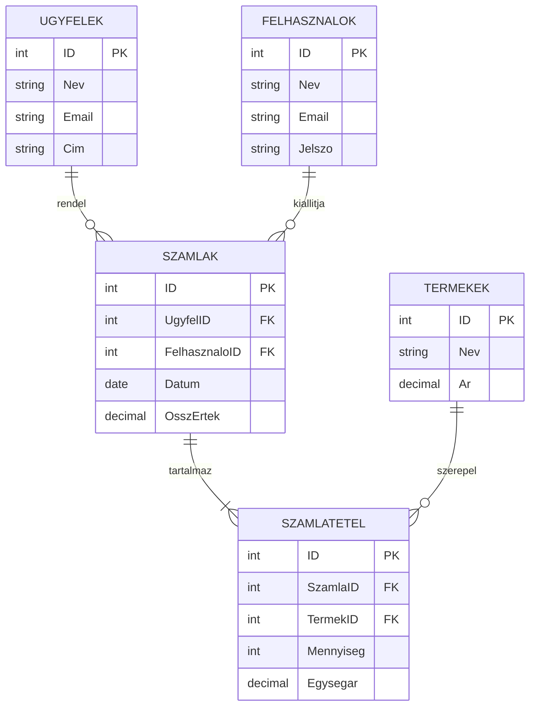

# 1.4 A számlázórendszer adatbázisának tervezése

Ebben a fejezetben végigvezetlek a számlázórendszerünk adatbázisának tervezési folyamatán. Az adatbázis tervezése kulcsfontosságú lépés az alkalmazásfejlesztés során, hiszen ez alapozza meg a rendszer hatékony működését és bővíthetőségét. Lépésről lépésre haladunk, hogy egy jól strukturált, normalizált adatbázist hozzunk létre.

## 4.1 Táblák (entitások) azonosítása és megnevezése

Az első lépés az adatbázis tervezése során a főbb entitások azonosítása. Ezek lesznek az adatbázisunk táblái. A számlázórendszerünk esetében a következő fő entitásokat azonosíthatjuk:

1. Ügyfelek
2. Termékek
3. Számlák
4. Számlatételek
5. Felhasználók (a rendszert használó alkalmazottak)

Ezek az entitások lefedik a számlázórendszer alapvető funkcióit. Most nézzük meg, miért van szükségünk ezekre a táblákra:

- **Ügyfelek**: Ebben a táblában tároljuk az ügyfelek adatait. Ez elengedhetetlen a számlák kiállításához és az ügyfélkapcsolatok kezeléséhez.
- **Termékek**: Itt tartjuk nyilván a vállalkozás által kínált termékeket vagy szolgáltatásokat. Ez a tábla segít a számlák tételeinek összeállításában.
- **Számlák**: Ez a tábla tartalmazza a kiállított számlák főbb adatait, mint például a számla azonosítója, dátuma, az ügyfél azonosítója.
- **Számlatételek**: Ebben a táblában tároljuk a számlák részletes tételeit. Egy számlához több tétel is tartozhat.
- **Felhasználók**: Itt tároljuk a rendszert használó alkalmazottak adatait. Ez segít a jogosultságok kezelésében és az audit nyomvonal vezetésében.

## 4.2 Táblák közötti kapcsolatok meghatározása

Most, hogy azonosítottuk a fő entitásokat, meg kell határoznunk a köztük lévő kapcsolatokat. A relációs adatbázisokban három fő kapcsolattípust különböztetünk meg: egy-az-egyhez (1:1), egy-a-többhöz (1:N) és több-a-többhöz (M:N). A számlázórendszerünkben a következő kapcsolatokat azonosíthatjuk:

1. Ügyfelek - Számlák: Egy-a-többhöz (1:N)
   - Egy ügyfélhez több számla tartozhat, de egy számla csak egy ügyfélhez.

2. Számlák - Számlatételek: Egy-a-többhöz (1:N)
   - Egy számlához több számlatétel tartozhat, de egy számlatétel csak egy számlához.

3. Termékek - Számlatételek: Egy-a-többhöz (1:N)
   - Egy termék több számlatételben is szerepelhet, de egy számlatétel csak egy terméket tartalmaz.

4. Felhasználók - Számlák: Egy-a-többhöz (1:N)
   - Egy felhasználó több számlát állíthat ki, de egy számlát csak egy felhasználó állít ki.

Nézzük meg ezeket a kapcsolatokat egy egyszerű ER (Entity-Relationship) diagramon:



## 4.3 Kulcsmezők (elsődleges és idegen kulcsok) kijelölése

A következő lépés a kulcsmezők meghatározása. Minden táblának szüksége van egy elsődleges kulcsra, amely egyedileg azonosítja a rekordokat. Az idegen kulcsok pedig a táblák közötti kapcsolatokat valósítják meg.

- **Elsődleges kulcsok**: Minden táblában létrehozunk egy `ID` nevű mezőt, amely egész szám típusú és automatikusan növekszik. Ez lesz az elsődleges kulcs.

- **Idegen kulcsok**:
  - A `SZAMLAK` táblában: `UgyfelID` és `FelhasznaloID`
  - A `SZAMLATETEL` táblában: `SzamlaID` és `TermekID`

Az idegen kulcsok biztosítják a referenciális integritást, ami azt jelenti, hogy nem lehet olyan számlát létrehozni, ami nem létező ügyfélhez vagy felhasználóhoz tartozik, illetve nem lehet olyan számlatételt létrehozni, ami nem létező számlához vagy termékhez kapcsolódik.

## 4.4 Fontosabb mezők és adattípusok meghatározása

Most, hogy megvannak a táblák és a kulcsmezők, határozzuk meg a többi fontos mezőt és azok adattípusait. Az adattípusok megválasztása kritikus fontosságú a hatékony adattárolás és a gyors lekérdezések szempontjából.

```mermaid
erDiagram
    UGYFELEK ||--o{ SZAMLAK : "rendel"
    SZAMLAK ||--|{ SZAMLATETEL : "tartalmaz"
    TERMEKEK ||--o{ SZAMLATETEL : "szerepel"
    FELHASZNALOK ||--o{ SZAMLAK : "kiallitja"

    UGYFELEK {
        int ID PK
        nvarchar(100) Nev
        nvarchar(100) Email
        nvarchar(200) Cim
        nvarchar(20) Telefon
        bit AktivE
    }
    TERMEKEK {
        int ID PK
        nvarchar(100) Nev
        decimal(10,2) Ar
        nvarchar(50) Cikkszam
        int Keszlet
    }
    SZAMLAK {
        int ID PK
        int UgyfelID FK
        int FelhasznaloID FK
        datetime Datum
        decimal(15,2) OsszErtek
        nvarchar(20) SzamlaSzam
        nvarchar(20) FizetesiMod
    }
    SZAMLATETEL {
        int ID PK
        int SzamlaID FK
        int TermekID FK
        int Mennyiseg
        decimal(10,2) Egysegar
        decimal(10,2) Osszesen
    }
    FELHASZNALOK {
        int ID PK
        nvarchar(50) Nev
        nvarchar(100) Email
        nvarchar(100) Jelszo
        nvarchar(20) Jogosultsag
    }
```

Nézzük meg részletesebben az egyes táblákat és mezőket:

### UGYFELEK tábla
- `ID`: int (elsődleges kulcs, automatikusan növekszik)
- `Nev`: nvarchar(100) (változó hosszúságú Unicode karakterlánc, max. 100 karakter)
- `Email`: nvarchar(100)
- `Cim`: nvarchar(200) (hosszabb, mert tartalmazza az irányítószámot, várost, utcát, házszámot)
- `Telefon`: nvarchar(20) (elegendő a különböző formátumú telefonszámokhoz)
- `AktivE`: bit (logikai érték, jelzi, hogy az ügyfél aktív-e)

### TERMEKEK tábla
- `ID`: int (elsődleges kulcs, automatikusan növekszik)
- `Nev`: nvarchar(100)
- `Ar`: decimal(10,2) (10 számjegy, ebből 2 tizedesjegy, pontos pénzügyi számításokhoz)
- `Cikkszam`: nvarchar(50) (egyedi termékazonosító)
- `Keszlet`: int (készleten lévő mennyiség)

### SZAMLAK tábla
- `ID`: int (elsődleges kulcs, automatikusan növekszik)
- `UgyfelID`: int (idegen kulcs az UGYFELEK táblához)
- `FelhasznaloID`: int (idegen kulcs a FELHASZNALOK táblához)
- `Datum`: datetime (dátum és idő együtt)
- `OsszErtek`: decimal(15,2) (nagyobb összegek kezelésére is alkalmas)
- `SzamlaSzam`: nvarchar(20) (egyedi számlaazonosító)
- `FizetesiMod`: nvarchar(20) (pl. készpénz, bankkártya, átutalás)

### SZAMLATETEL tábla
- `ID`: int (elsődleges kulcs, automatikusan növekszik)
- `SzamlaID`: int (idegen kulcs a SZAMLAK táblához)
- `TermekID`: int (idegen kulcs a TERMEKEK táblához)
- `Mennyiseg`: int
- `Egysegar`: decimal(10,2)
- `Osszesen`: decimal(10,2) (Mennyiség * Egysegar, de tároljuk az esetleges kedvezmények miatt)

### FELHASZNALOK tábla
- `ID`: int (elsődleges kulcs, automatikusan növekszik)
- `Nev`: nvarchar(50)
- `Email`: nvarchar(100)
- `Jelszo`: nvarchar(100) (tároljuk titkosítva!)
- `Jogosultsag`: nvarchar(20) (pl. admin, felhasználó, stb.)

## 4.5 Tervezési szempontok és rendszerkövetelmények

A fenti adatbázis struktúra tervezése során a következő szempontokat és követelményeket vettük figyelembe:

1. **Skálázhatóság**: Az `ID` mezők `int` típusúak, ami lehetővé teszi nagy mennyiségű adat kezelését (több mint 2 milliárd rekord táblánként).

2. **Adatintegritás**: Az idegen kulcsok biztosítják, hogy csak érvényes kapcsolatok jöhessenek létre a táblák között.

3. **Teljesítmény**: Az elsődleges és idegen kulcsok indexelése gyors lekérdezéseket tesz lehetővé.

4. **Rugalmasság**: A `nvarchar` típusú mezők lehetővé teszik különböző nyelvű adatok tárolását.

5. **Pontosság**: A pénzügyi adatokhoz `decimal` típust használunk, ami pontos számításokat tesz lehetővé.

6. **Biztonság**: A felhasználói jelszavakat titkosítva kell tárolni (ezt az alkalmazás szintjén kell majd megvalósítani).

7. **Audit**: A `SZAMLAK` táblában tároljuk, hogy melyik felhasználó állította ki a számlát, ami lehetővé teszi a tevékenységek nyomon követését.

8. **Üzleti logika támogatása**: Például a `SZAMLATETEL` táblában külön tároljuk az `Egysegar` és `Osszesen` mezőket, ami lehetővé teszi a kedvezmények kezelését.

Ez az adatbázis struktúra egy szilárd alapot biztosít a számlázórendszerünk számára. Természetesen a fejlesztés során felmerülhetnek új igények vagy kihívások, amelyek miatt módosítanunk kell a struktúrán, de ez a tervezet jó kiindulópontot jelent.

A következő lépés az lesz, hogy ezt az elméleti tervet átültetjük a gyakorlatba, létrehozva a táblákat az MS SQL Serverben. Ezt fogjuk megtenni a következő fejezetben, ahol megtanulod, hogyan kell SQL parancsokkal létrehozni az adatbázist és a táblákat.