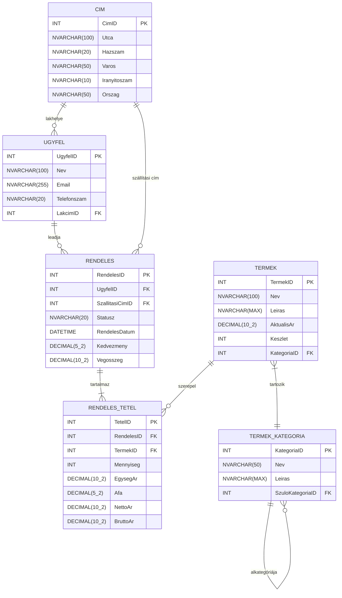

# 1.4 A számlázórendszer adatbázisának tervezése

Ebben a fejezetben végigvezetlek a rendeléskezelő rendszerünk adatbázisának tervezési folyamatán. Az adatbázis tervezése kulcsfontosságú lépés az alkalmazásfejlesztés során, hiszen ez alapozza meg a rendszer hatékony működését és bővíthetőségét. Lépésről lépésre haladunk, hogy egy jól strukturált, normalizált adatbázist hozzunk létre.

## Követelmények meghatározása

### Ügyfelek és termékek kezelése

Az egyik alapvető követelmény, hogy a rendszerünk képes legyen tárolni és kezelni az ügyfelek és termékek adatait. Emellett fontos, hogy nyomon tudjuk követni, hogy ki mit rendelt. Ez a követelmény több részletre bontható:

1. **Ügyféladatok tárolása**: Az ügyfelekről a következő információkat kell tárolnunk:
   - Név
   - Lakcím
   - Elérhetőségek:
     - Mobiltelefonszám
     - E-mail cím

   Ez lehetővé teszi, hogy pontosan azonosítsuk ügyfeleinket, és szükség esetén kapcsolatba léphessünk velük.

2. **Termékinformációk kezelése**: A termékekről tárolt adatok között szerepelnie kell:
   - A termék neve
   - Leírása
   - Ára
   - Készletinformáció (mennyi van raktáron)

3. **Rendelések nyilvántartása**: A rendszernek képesnek kell lennie rögzíteni, hogy melyik ügyfél milyen termékeket rendelt meg.

### Rendelések részletes kezelése

A rendelések kezelésével kapcsolatban további specifikus követelményeket is megfogalmazhatunk:

4. **Többtételes rendelések**: Egy rendelés több különböző tételből (termékből) is állhat. A rendszernek ezt rugalmasan kell kezelnie.

5. **Rendelés szintű kedvezmények**: A kedvezményeket nem tételenként, hanem a teljes rendelésre vonatkozóan kell tudnunk alkalmazni. Ez lehetővé teszi például a nagyobb összegű rendelések utáni kedvezmények egyszerű kezelését.

6. **Tételenkénti adókezelés**: Az adó (ÁFA) mértéke eltérhet az egyes rendelési tételeknél. Ezt a rendszernek rugalmasan kell kezelnie, lehetővé téve például a különböző adókulcsok alkalmazását különböző terméktípusokra.

7. **Aktuális státusz tárolása**: A rendelések státuszát szövegesen szeretnénk tárolni. Négy állapot lehetséges: "Feldolgozás alatt", "Szállítás", "Kiszállítva", "Törölve".

### Termékek kategorizálása és árazása

A termékek kezelésével kapcsolatban további követelményeket is megfogalmazhatunk:

7. **Hierarchikus termékkategorizálás**: A termékeket kategóriákba kell tudnunk sorolni, méghozzá hierarchikus módon. Ez azt jelenti, hogy lehetnek fő kategóriák és alkategóriák is. Például:
   - Elektronika
     - Számítógépek
       - Laptopok
       - Asztali számítógépek
     - Mobiltelefonok

   Ez a struktúra segíti a termékek rendszerezését és a könnyebb kereshetőséget.

8. **Készletnyilvántartás**: Minden termékről nyilván kell tartanunk, hogy mennyi van belőle készleten. Ez segíti a raktárkészlet-menedzsmentet és a rendelések teljesíthetőségének ellenőrzését.

9. **Kettős árnyilvántartás**: A rendszernek képesnek kell lennie külön kezelni:
   - Az aktuális árat: ez az a jelenlegi ár, amelyen a termék megvásárolható
   - A rendelés időpontjában érvényes árat: ez az az ár, amelyen az ügyfél ténylegesen megrendelte a terméket

   Ez a megoldás lehetővé teszi az árak változtatását anélkül, hogy az befolyásolná a már leadott rendelések árképzését.

### Címkezelés

10. **Rugalmas címkezelés**: A rendszernek külön kell tudnia kezelni a különböző címtípusokat:
    - Az ügyfél lakcíme
    - A rendelés szállítási címe (ami eltérhet a lakcímtől)

    Ez lehetővé teszi, hogy az ügyfelek rugalmasan választhassanak szállítási címet minden rendelésnél.

Ezek a követelmények együttesen egy komplex, de rugalmas rendszer alapjait fektetik le. A következő lépésekben ezeket a követelményeket fogjuk lefordítani konkrét adatbázis-struktúrává, táblaszerkezetekké és kapcsolatokká. 

Ne feledd, hogy a jó követelménymeghatározás a sikeres adatbázis-tervezés alapja. Minél pontosabban tudjuk megfogalmazni az igényeinket, annál hatékonyabb és használhatóbb rendszert tudunk majd létrehozni. A következő alfejezetekben lépésről lépésre fogjuk felépíteni az adatbázisunkat ezen követelmények alapján.

## Adatbázis tervezése

**1. feladat:** A követelmények alapján azonosítsd a rendszer főbb entitásait (tábláit). Ha felsoroltad, hasonlítsd össze megoldásodat a javasolt megoldással.

<details>
<summary>Javasolt megoldás</summary>

Főbb entitások:

* Ügyfelek
* Termékek
* Rendelések
* Rendelés tételek
* Termékkategóriák
* Címek

</details><br/>

**2. feladat:** Az azonosított entitásokhoz határozd meg a szükséges attribútumokat (mezőket). Gondold át, hogy melyik mezők lesznek elsődleges- és idegenkulcsok. Milyen adattípusokat használnál az egyes mezők esetén?

<details>
<summary>Javasolt megoldás</summary>

A mermaid miatt "," karakter helyett "_"-t használtam.


</details><br/>

**3. feladat:** A következő megkötések figyelembevételével hozd létre tervező vagy SQL script segítségével az adattáblákat:
* Minden tábla elsődleges kulcsa identitás mező legyen (automatikus számláló, IDENTITY).
* Minden százalékos érték (adó, kedvezmény) 0-100 közötti értéket vehet fel.
* Az **ügyfelek** neve, e-mailje, lakcime nem lehet üres, e-mail egyedi. Címekből nem hiányozhat semmi.
* A **termékek** neve, ára, készlete és kategóriája nem lehet üres. Az ár és a készlet nemnegatív szám. (CHECK (Ar >= 0))
* A **rendelések** dátuma nem lehet üres és alapértelmezetten az aktuális nap (DEFAULT GetDate()). A kedvezmény mértéke nem lehet üres, alapértelmezetten 0. A végösszeg felvehet NULL értéket.
* A **rendelés tételek** esetén egy mező sem lehet üres, illetve a mezők többségében nemnegatív értékeket vehetnek csak fel.

Példa az ügyfél táblára:
```sql
CREATE TABLE UGYFEL (
    UgyfelID INT IDENTITY(1,1) PRIMARY KEY,
    Nev NVARCHAR(100) NOT NULL,
    Email NVARCHAR(255) NOT NULL UNIQUE,
    Telefonszam NVARCHAR(20),
    LakcimID INT NOT NULL
);
```

További segítség:
```sql
-- Constraint létrehozása (Kedvezmény legyen 0 és 100 között)
CONSTRAINT CHK_RENDELES_Kedvezmeny CHECK (Kedvezmeny >= 0 AND Kedvezmeny <= 100)

-- Idegenkulcs beállítása
CREATE TABLE TERMEK_KATEGORIA (
    KategoriaID INT IDENTITY(1,1) PRIMARY KEY,
    -- ...
    SzuloKategoriaID INT,
    CONSTRAINT FK_TERMEK_KATEGORIA_SzuloKategoria FOREIGN KEY (SzuloKategoriaID) 
            REFERENCES TERMEK_KATEGORIA(KategoriaID)

-- Alapértelmezett érték beállítása
CREATE TABLE RENDELES (
    -- ...
    RendelesDatum DATETIME NOT NULL DEFAULT GETDATE()
    -- ...
)
```

<details>
<summary>Javasolt megoldás</summary>

```sql
-- CIM tábla létrehozása
CREATE TABLE CIM (
    CimID INT IDENTITY(1,1) PRIMARY KEY,
    Utca NVARCHAR(100) NOT NULL,
    Hazszam NVARCHAR(20) NOT NULL,
    Varos NVARCHAR(50) NOT NULL,
    Iranyitoszam NVARCHAR(10) NOT NULL,
    Orszag NVARCHAR(50) NOT NULL
);

-- TERMEK_KATEGORIA tábla létrehozása
CREATE TABLE TERMEK_KATEGORIA (
    KategoriaID INT IDENTITY(1,1) PRIMARY KEY,
    Nev NVARCHAR(50) NOT NULL,
    Leiras NVARCHAR(MAX),
    SzuloKategoriaID INT,
    CONSTRAINT FK_TERMEK_KATEGORIA_SzuloKategoria FOREIGN KEY (SzuloKategoriaID) 
        REFERENCES TERMEK_KATEGORIA(KategoriaID)
);

-- TERMEK tábla létrehozása
CREATE TABLE TERMEK (
    TermekID INT IDENTITY(1,1) PRIMARY KEY,
    Nev NVARCHAR(100) NOT NULL,
    Leiras NVARCHAR(MAX),
    AktualisAr DECIMAL(10,2) NOT NULL,
    Keszlet INT NOT NULL,
    KategoriaID INT,
    CONSTRAINT FK_TERMEK_TERMEK_KATEGORIA FOREIGN KEY (KategoriaID) 
        REFERENCES TERMEK_KATEGORIA(KategoriaID),
    CONSTRAINT CHK_TERMEK_AktualisAr CHECK (AktualisAr >= 0),
    CONSTRAINT CHK_TERMEK_Keszlet CHECK (Keszlet >= 0)
);

-- UGYFEL tábla létrehozása
CREATE TABLE UGYFEL (
    UgyfelID INT IDENTITY(1,1) PRIMARY KEY,
    Nev NVARCHAR(100) NOT NULL,
    Email NVARCHAR(255) NOT NULL,
    Telefonszam NVARCHAR(20),
    LakcimID INT,
    CONSTRAINT FK_UGYFEL_CIM FOREIGN KEY (LakcimID) 
        REFERENCES CIM(CimID),
    CONSTRAINT UQ_UGYFEL_Email UNIQUE (Email)
);

-- RENDELES tábla létrehozása
CREATE TABLE RENDELES (
    RendelesID INT IDENTITY(1,1) PRIMARY KEY,
    UgyfelID INT NOT NULL,
    SzallitasiCimID INT NOT NULL,
    RendelesDatum DATETIME NOT NULL DEFAULT GETDATE(),
    Statusz NVARCHAR(20) NOT NULL,
    Kedvezmeny DECIMAL(5,2) NOT NULL DEFAULT 0,
    Vegosszeg DECIMAL(10,2) NOT NULL,
    CONSTRAINT FK_RENDELES_UGYFEL FOREIGN KEY (UgyfelID) 
        REFERENCES UGYFEL(UgyfelID),
    CONSTRAINT FK_RENDELES_CIM FOREIGN KEY (SzallitasiCimID) 
        REFERENCES CIM(CimID),
    CONSTRAINT CHK_RENDELES_Kedvezmeny CHECK (Kedvezmeny >= 0 AND Kedvezmeny <= 100),
    CONSTRAINT CHK_RENDELES_Vegosszeg CHECK (Vegosszeg >= 0)
);

-- RENDELES_TETEL tábla létrehozása
CREATE TABLE RENDELES_TETEL (
    TetelID INT IDENTITY(1,1) PRIMARY KEY,
    RendelesID INT NOT NULL,
    TermekID INT NOT NULL,
    Mennyiseg INT NOT NULL,
    EgysegAr DECIMAL(10,2) NOT NULL,
    Afa DECIMAL(5,2) NOT NULL,
    NettoAr DECIMAL(10,2) NOT NULL,
    BruttoAr DECIMAL(10,2) NOT NULL,
    CONSTRAINT FK_RENDELES_TETEL_RENDELES FOREIGN KEY (RendelesID) 
        REFERENCES RENDELES(RendelesID),
    CONSTRAINT FK_RENDELES_TETEL_TERMEK FOREIGN KEY (TermekID) 
        REFERENCES TERMEK(TermekID),
    CONSTRAINT CHK_RENDELES_TETEL_Mennyiseg CHECK (Mennyiseg > 0),
    CONSTRAINT CHK_RENDELES_TETEL_EgysegAr CHECK (EgysegAr >= 0),
    CONSTRAINT CHK_RENDELES_TETEL_Afa CHECK (Afa >= 0),
    CONSTRAINT CHK_RENDELES_TETEL_NettoAr CHECK (NettoAr >= 0),
    CONSTRAINT CHK_RENDELES_TETEL_BruttoAr CHECK (BruttoAr >= 0)
);
```
</details><br/>

## Adatbázis feltöltése szintetikus adatokkal

Az adatbázisod struktúrájának kialakítása után a következő lépés, hogy feltöltsd azt tesztadatokkal. Egyelőre csak a *cím*, az *ügyfél*, a *termék kategória* és a *termék* táblákat szeretnénk feltölteni, a rendelések rögzítésére a Windows Forms alkalmazásunkat fogjuk használni.
A szintetikus adatok generálása azonban időigényes feladat lehet, különösen, ha sok táblád van, vagy nagy mennyiségű adatra van szükséged. Szerencsére a ChatGPT segítségével jelentősen felgyorsíthatod ezt a folyamatot. Lássuk, hogyan!

### 1. lépés: Adatgenerálási terv készítése

Mielőtt elkezdenéd az adatok generálását, készíts egy tervet. Határozd meg:

- Milyen sorrendben fogod feltölteni a táblákat (a külső kulcs kapcsolatok miatt)
- Hány rekordot szeretnél generálni minden táblába
- Milyen speciális követelményeid vannak az adatokra vonatkozóan (pl. egyedi értékek, értéktartományok)

<details>
<summary>Javasolt sorrend</summary>

1. CIM
2. UGYFEL
3. TERMEK_KATEGORIA
4. TERMEK


</details>

### 2. lépés: ChatGPT prompt összeállítása

Most, hogy megvan a terved, összeállíthatod a promptot a ChatGPT számára. Egy jó prompt tartalmazza:

- Az adatbázis struktúráját (táblanév, mezőnevek, adattípusok)
- A generálandó rekordok számát
- Bármilyen speciális követelményt vagy korlátozást
- A kívánt kimeneti formátumot (pl. SQL INSERT utasítások)

Íme egy példa prompt a CIM táblához:

```
Kérlek, generálj 100 rekordnyi szintetikus adatot a CIM táblához az alábbi struktúra alapján:

CREATE TABLE CIM (
    CimID INT IDENTITY(1,1) PRIMARY KEY,
    Utca NVARCHAR(100) NOT NULL,
    Hazszam NVARCHAR(20) NOT NULL,
    Varos NVARCHAR(50) NOT NULL,
    Iranyitoszam NVARCHAR(10) NOT NULL,
    Orszag NVARCHAR(50) NOT NULL
);

Követelmények:
- Az utcanevek legyenek változatosak és valósághűek
- A házszámok lehetnek számok vagy betű-szám kombinációk
- A városnevek legyenek valós magyar városnevek
- Az irányítószámok feleljenek meg a magyar formátumnak (4 számjegy)
- Az ország legyen "Magyarország" minden rekordnál

Kérlek, a kimenet SQL INSERT utasítások formájában legyen, például:

INSERT INTO CIM (Utca, Hazszam, Varos, Iranyitoszam, Orszag) 
VALUES ('Petőfi Sándor utca', '15', 'Budapest', '1052', 'Magyarország');
```

### 3. lépés: Adatok generálása ChatGPT-vel

Küldd el a promptot a ChatGPT-nek, és várd meg a válaszát. A ChatGPT általában gyorsan és pontosan teljesíti az ilyen kéréseket. Ha nem vagy elégedett az eredménnyel, vagy további adatokra van szükséged, nyugodtan kérheted, hogy generáljon többet vagy változtasson valamit.

### 4. lépés: Az adatok ellenőrzése és tisztítása

Bár a ChatGPT általában jó minőségű adatokat generál, mindig érdemes ellenőrizni az eredményt. Nézd át a generált SQL utasításokat, és figyelj az alábbiakra:

- Vannak-e szintaktikai hibák az SQL-ben?
- Megfelelnek-e az adatok a megadott követelményeknek?
- Vannak-e ismétlődő vagy nyilvánvalóan hibás értékek?

Ha hibákat találsz, javítsd ki őket manuálisan, vagy kérd meg a ChatGPT-t, hogy generáljon új adatokat a problémás részekre.

### 5. lépés: Adatok importálása az adatbázisba

Most, hogy megvannak a tisztított INSERT utasításaid, importálhatod az adatokat az adatbázisodba. Ezt megteheted közvetlenül az SQL Server Management Studio (SSMS) Query Editorában, vagy ha nagyobb mennyiségű adatról van szó, használhatsz SQL script fájlt.

1. Nyisd meg az SSMS-t és csatlakozz az adatbázisodhoz.
2. Nyiss egy új Query ablakot.
3. Másold be a generált és ellenőrzött INSERT utasításokat.
4. Futtasd a scriptet a "Execute" gombra kattintva vagy az F5 billentyű megnyomásával.

### 6. lépés: Ellenőrzés és iteráció

Miután importáltad az adatokat, futtass néhány SELECT utasítást, hogy megbizonyosodj arról, minden rendben ment-e. Például:

```sql
SELECT TOP 10 * FROM CIM;
SELECT COUNT(*) FROM CIM;
```

Ha bármilyen problémát észlelsz, vagy úgy érzed, hogy több adatra van szükséged, ismételd meg a folyamatot.

### 7. lépés: A többi tábla feltöltése

Ismételd meg a 2-6. lépéseket a többi táblára is, a korábban meghatározott sorrendben. Ne feledd, hogy a külső kulcsoknak már létező értékekre kell hivatkozniuk, ezért fontos a megfelelő sorrend betartása.

Amikor a TERMEK, RENDELES és RENDELES_TETEL táblákat töltöd fel, különösen figyelj oda a következőkre:

- A TERMEK táblában az árak és készletmennyiségek reálisak legyenek.
- A RENDELES táblában a dátumok egy értelmes időintervallumba essenek (pl. az elmúlt 1-2 év).
- A RENDELES_TETEL táblában a mennyiségek, árak és ÁFA értékek konzisztensek legyenek egymással és a kapcsolódó termékekkel.

### Példa a TERMEK tábla feltöltésére:

```
Kérlek, generálj 50 rekordnyi szintetikus adatot a TERMEK táblához az alábbi struktúra alapján:

CREATE TABLE TERMEK (
    TermekID INT IDENTITY(1,1) PRIMARY KEY,
    Nev NVARCHAR(100) NOT NULL,
    Leiras NVARCHAR(MAX),
    AktualisAr DECIMAL(10,2) NOT NULL,
    Keszlet INT NOT NULL,
    KategoriaID INT
);

Követelmények:
- A terméknevek legyenek változatosak és valósághűek
- A leírások legyenek 1-2 mondatosak
- Az árak 1000 és 500000 Ft között legyenek
- A készlet 0 és 1000 között legyen
- A KategoriaID 1 és 10 között legyen (feltételezve, hogy már léteznek kategóriák)

Kérlek, a kimenet SQL INSERT utasítások formájában legyen.
```

### Összefoglalás

A szintetikus adatok generálása a ChatGPT segítségével jelentősen leegyszerűsíti és felgyorsítja az adatbázisod feltöltését tesztadatokkal. Ez a módszer lehetővé teszi, hogy gyorsan létrehozz egy realisztikus adatkészletet az alkalmazásod fejlesztéséhez és teszteléséhez. 

Ne feledd, hogy bár a ChatGPT által generált adatok általában jó minőségűek, mindig érdemes átnézni és szükség esetén finomítani őket, hogy tökéletesen megfeleljenek a projektedben igényeidnek.

Miután feltöltötted az adatbázisodat szintetikus adatokkal, készen állsz arra, hogy elkezdd fejleszteni a rendeléskezelő alkalmazásod többi részét, tudva, hogy reális adatokkal dolgozol majd a fejlesztés és tesztelés során.

[Javasolt megoldás (script a fenti struktúrához)](script.txt)